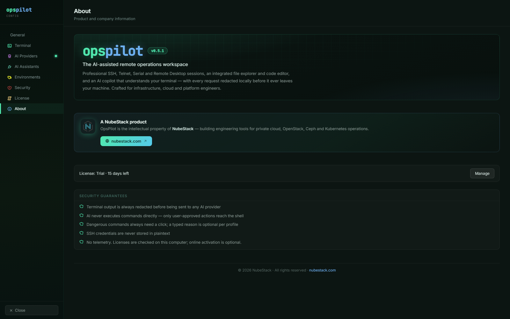

# Support

Support is included with an active subscription. Email NubeStack at
support@nubestack.com; the same address handles sales questions, invoices and
evaluation licenses. Below: the checks worth making first, what to include in a
report, and how to report a security vulnerability.

On a computer that runs on a deployment license, **Settings → License → Fix clock** also
has an **Email NubeStack support** button, which opens a message to the same address.

## Before you contact support

Most reports resolve against one of a handful of checks. Work through
[Troubleshooting](../operations/troubleshooting.md) first, and in particular:

- **A connection will not open.** Reproduce it outside OpsPilot — `ssh user@host` from a
  normal terminal. Confirm the VPN is up, the key format is supported, and a
  passphrase-protected key has had its passphrase entered.
- **AI is off, or a saved connection is locked.** Open **Settings → License** and read
  **What this means right now**, and point at the connection's badge in the side list
  for the reason. [Free trial and limits](../licensing/trial-and-limits.md) explains
  every badge and limit.
- **Activation fails.** The message under **Activate online** says why;
  [Activate OpsPilot](../licensing/activation.md#messages-during-activation) lists each
  one with what to do.
- **The AI panel says no provider is active.** Open **Settings → AI Providers**,
  configure a provider and click **Test Connection**. A provider that saves but fails
  the test is usually a wrong base URL or an expired key.
- **Ollama is not responding.** Confirm the service is running and the model is pulled
  with `ollama list`, then confirm the endpoint in OpsPilot matches, including the port.
- **An assistant does not see OpsPilot.** The connector must be enabled *and* the
  assistant connected. Restart Claude Desktop, or reload the VS Code window — both read
  MCP configuration at startup.
- **The ChatGPT tunnel will not start.** Use **Run Doctor** on the tunnel row. The tunnel
  forwards only to localhost, which is enforced rather than configurable. It also needs
  an active trial or subscription.
- **Commands are not auto-running.** Each Command Safety profile decides what runs
  without asking, in **Run commands without asking me**; on a new installation the
  **Default** profile is set to **Ask me every time**. If a command still waits under a
  looser setting, it was not classified read-only or it was treated as dangerous — the
  card states which.

Check [Requirements](../getting-started/requirements.md) too if the problem appeared on
a new machine or after an operating system upgrade.

## What to include when you contact support

- **Your version.** **Settings → About** shows it, for example **v0.5.1**.
- **Reproduction steps**, where possible — what you did, what you expected, what
  happened.
- The connection type and platform involved, since a few behaviours differ by
  platform. RDP in particular is an embedded in-app tab on Windows, and an external
  client on macOS and Linux — Microsoft's Windows App on macOS, FreeRDP on Linux.
- Whether the session had AI enabled, and which AI provider or AI Assistant was in use.
- **For a licensing problem:** the heading of the card at the top of **Settings →
  License**, and this computer's device code from **Settings → License → This device**.
  Never send a license key; the account name and the end of the key, as the portal shows
  it, are enough to find the seat.

_**Settings → About** shows the version next to the product name, and the license state
in one line; **Manage** opens **Settings → License**._

Application logs help support reproduce issues. Terminal scrollback is memory-only and
is never written to disk by OpsPilot, so if the problem is in session output you will
need to capture it yourself — and check it for secrets before you send it anywhere.

## Reporting a vulnerability

Email support@nubestack.com. Security reports are handled directly by the NubeStack
engineering team, and NubeStack responds from that address.

Do not post details of a suspected vulnerability anywhere public before NubeStack has
responded.

## See also

- [Troubleshooting](../operations/troubleshooting.md) — work through this first
- [Release notes](release-notes.md) — known limitations for the current version
- [Activate OpsPilot](../licensing/activation.md) — activation, renewals and licensing
  messages
- [Plans & subscription](plans.md) — support is included with an active subscription
