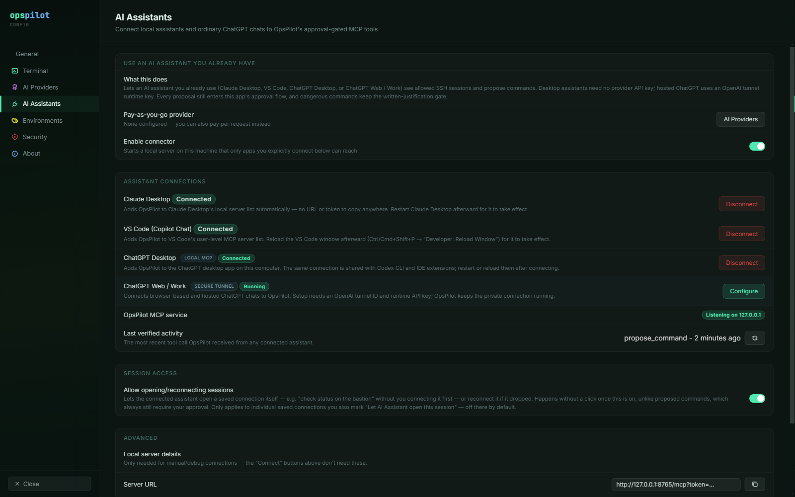

# AI Assistants (MCP)

If you already pay for Claude, ChatGPT or GitHub Copilot, you do not need an API
key as well. OpsPilot exposes itself as an MCP (Model Context Protocol) server on
`127.0.0.1`, and assistants you already use connect to it and gain a narrow set
of tools.

*The AI Assistants page. The connector is off until you enable it, and each
assistant is connected individually — nothing is reachable by default.*

## The four assistants

| Assistant | How it connects | Needs a provider API key? |
|---|---|---|
| Claude Desktop | One click, config written automatically | No |
| VS Code (Copilot Chat) | One click, user-level MCP config | No |
| ChatGPT Desktop | One click, shared with Codex CLI and IDE extensions | No |
| ChatGPT Web / Work | Secure tunnel, needs an OpenAI tunnel ID and runtime key | No |

## Connecting one

1. In **Settings → AI Assistants**, turn on **Enable connector**. This starts a
   local server that only the apps you explicitly connect can reach.
2. Click **Connect** on the assistant you want.
3. Restart the assistant.

For the desktop assistants, OpsPilot writes the configuration itself — there is
no URL and no token to copy anywhere. It edits the assistant's own MCP
configuration file in place and will not overwrite a file it cannot parse, so
other MCP servers you already have configured survive.

Step 3 is required: these assistants read their MCP configuration at startup.
Claude Desktop and the ChatGPT desktop app need a restart; VS Code needs a
window reload.

**ChatGPT Web / Work** is the exception — a browser or phone cannot reach your
loopback interface, so it uses a tunnel instead of a config file. That setup has
its own page: [Remote & mobile operation](remote-mobile.md).

**Last verified activity** on the same page shows the most recent tool call
OpsPilot received from any connected assistant, which is the quickest way to
confirm a connection is actually live without leaving OpsPilot.

## The six tools an assistant gets

| Tool | Access | Approval |
|---|---|---|
| `list_connections` | Saved connections you have allowed — and only when session access is on | None — read-only metadata |
| `list_sessions` | Currently open sessions | None |
| `open_session` | Opens or reconnects an allowed connection | None — pre-authorised per connection |
| `get_recent_output` | Terminal scrollback, **redacted** | None — read-only |
| `read_file` | A file over SFTP, **redacted** | None — read-only |
| `propose_command` | Proposes a shell command | **Yes — blocks until you decide** |

That is the entire surface:

- **No tool writes a file.** `read_file` reads; there is no counterpart.
- **No tool executes anything directly.** `propose_command` proposes.
- **No tool reads your credential store.** Passwords and private keys are not
  reachable through any of the six.

`propose_command` blocks until you approve it, dismiss it, or it times out after
five minutes. To the assistant it is a call that waits for a human, and it is
told when the wait runs out. If the same session gets a newer proposal while an
older one is still waiting, the older one is superseded.

The tools also re-check permission at the point of use rather than trusting the
assistant's cached view: `get_recent_output`, `read_file` and `propose_command`
all refuse a session whose **Enable AI** has since been turned off, and
`open_session` re-checks the per-connection permission even for an id
`list_connections` handed out earlier.

The full input schema for each tool is in
[MCP tools](../reference/mcp-tools.md).

## Letting an assistant open sessions

**Allow opening/reconnecting sessions** lets an assistant connect a saved
connection itself, so you can ask "check the status on the bastion" without
connecting first. Once enabled it happens without a click, unlike a proposed
command, which always still needs your approval.

It is therefore off by default and requires opting in twice:

| Control | Where | Default |
|---|---|---|
| **Allow opening/reconnecting sessions** | Settings → AI Assistants → Session access | Off |
| **Let AI Assistant open this session** | The connection dialog | Off |

Both have to be on for a given connection. With the master switch off,
`list_connections` and `open_session` both refuse and say so; with it on,
`list_connections` only ever returns connections you marked individually.

Opening a session and approving a command are separate decisions, with separate
controls.

## The safety model with an external assistant

Nothing about the safety model weakens when the AI is external. A command
proposed by Claude Desktop:

- enters the **same approval queue** as OpsPilot's own panel uses
- carries the **same risk tier**, from the same Command Safety profile
- hits the **same written-justification gate** for
  High risk
- has its context and its output passed through the **same redaction layer**,
  using the same Data Handling profiles

The approval card shows a *via Claude Desktop* badge — taken from the connecting
client's own self-reported identity — so the source of a proposal is never
ambiguous.

The connector binds to `127.0.0.1` only. No public listener is opened, including
in the ChatGPT tunnel case. Binding to loopback stops other *machines* rather
than other local processes, so every request must also carry the bearer token
OpsPilot generated, and only the apps you connected have it.

!!! note "The connector is off until you turn it on"
    It is a new local listener, so it ships disabled. Turning it off again stops
    the server and resolves anything still waiting on a human.

## See also

- [Remote & mobile operation](remote-mobile.md) — ChatGPT Web/Work over the
  secure tunnel
- [MCP tools](../reference/mcp-tools.md) — each tool's parameters and returns
- [Approvals & auto-run](../safety/approvals.md) — what happens to a proposal
  once it reaches the queue
- [What gets sent](what-gets-sent.md) — one redaction policy for every AI path
