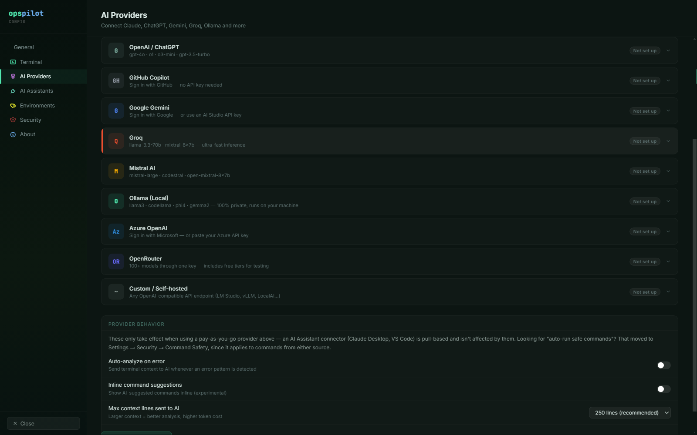

# AI Providers

An AI Provider is a model endpoint you supply the credential for. Configure one
and OpsPilot's own AI panel comes to life: terminal analysis, error diagnosis and
the chat panel all run through the provider you made active. Ten providers ship
built in, and one of them never leaves your machine.

*The AI Providers page. Ten providers ship; the credential fields differ per
provider, and **Test** verifies them before you save.*

## Configuring a provider

Open **Settings → AI Providers**. Each provider row expands to its own fields.
Enter the credential, pick a model, click **Test**, then **Save**. The active
provider is used for terminal analysis, error diagnosis and the AI chat panel.

**Test** checks the credential against the provider's own API and surfaces the
provider's error message verbatim, so an invalid key or a model you do not have
access to fails there rather than in the middle of an incident.

You can configure several providers and switch per session from the provider
dropdown at the top of the AI panel — a fast local model for routine questions, a
larger cloud model for hard ones. The choice is per session, so two tabs open
against two hosts can use two different providers at the same time.

## The ten providers

| Provider | Notes |
|---|---|
| Anthropic Claude | API key |
| OpenAI / ChatGPT | API key, custom base URL supported |
| GitHub Copilot | Sign in with GitHub, no API key |
| Google Gemini | Sign in with Google, or an AI Studio key |
| Groq | Very low latency inference |
| Mistral AI | API key |
| **Ollama (Local)** | **Runs on your machine. Nothing leaves it.** |
| Azure OpenAI | Sign in with Microsoft, or an Azure key; your own tenancy and deployment |
| OpenRouter | One key, 100+ models, free tiers for evaluation |
| Custom / Self-hosted | Any OpenAI-compatible endpoint, custom model name allowed |

Every provider's exact credential fields, base URL, authentication flow and model
list are tabulated in the [AI provider matrix](../reference/provider-matrix.md).
The notes below cover the providers with something to set up beyond a key.

### GitHub Copilot

No API key. OpsPilot uses a **device authorisation grant** (RFC 8628): it shows
you a code, you approve it in a browser against your GitHub account, and the
access token is filled into the credential field for you. Requests go to
GitHub's fixed Copilot API endpoint — there is no base URL to set.

Useful if your organisation already licences Copilot and would rather not
procure a second AI budget line.

### Azure OpenAI

Also a device authorisation grant, through the Microsoft identity platform, so it
works against any Azure AD tenant. You can paste an Azure API key instead if you
prefer.

Azure OpenAI is the one provider where the base URL carries real information: it
is an **endpoint plus deployment** URL, of the shape
`https://RESOURCE.openai.azure.com/openai/deployments/DEPLOYMENT`. The deployment
name is part of the path, not a separate field, so a new deployment means a new
URL. See [Self-hosted & enterprise](self-hosted.md) for why this provider matters
to regulated buyers.

### Google Gemini

Two ways in. **Sign in with Google** runs a full OAuth 2.0 authorisation code
flow with PKCE — a browser opens, you click Allow, and that is the whole setup.
Or paste an AI Studio API key into the API Key field if you would rather not use
the sign-in.

Gemini is reached through its OpenAI-compatible interface, so it behaves like
every other chat-completions provider.

### OpenRouter

One key, a large catalogue, and free-tier models marked *free* in the picker,
which makes it the cheapest way to evaluate OpsPilot end to end. The free
lineup changes often, so OpsPilot ships a static fallback list and refreshes the
live catalogue of free models when it can; if the refresh fails you keep the
cached list.

OpenRouter's model catalogue is public and answers successfully for any key,
including an invalid one, so **Test** checks the key against an endpoint that
requires authentication instead.

### Custom / Self-hosted

Accepts any OpenAI-compatible endpoint. Two fields: a **Base URL** and an
optional **API Key** — leave the key blank if your endpoint does not need one.
This is the only provider that allows a **custom model name**, because OpsPilot
cannot know what you have loaded; the catalogue ships no model list for it.

Use this for vLLM, LM Studio, a llama.cpp server, LocalAI, or an internal AI
gateway. See [Self-hosted & enterprise](self-hosted.md).

## What configuring a provider does not change

- The model still cannot execute anything. Its reply is a proposal, and a
  proposal becomes a command only when you approve it. No provider, model or
  setting changes that.
- Redaction still runs first, using the Data Handling profile resolved for the
  connection you asked about.
- AI access is still scoped per connection. **Enable AI** on the connection is
  what admits a session to the AI panel at all, and a connection with it off is
  invisible to every provider you have configured. Set it deliberately per
  connection and check it before you connect.

!!! note "A cloud provider is not an air-gapped deployment"
    Configuring any provider other than Ollama or a self-hosted endpoint means
    your workstation reaches that provider over the internet. Your *servers*
    still do not, which is what most regulated teams need — but call it private
    or VPN-only, not air-gapped.

## See also

- [Offline with Ollama](offline-ollama.md) — the configuration with no egress at
  all
- [What gets sent](what-gets-sent.md) — precisely what a provider receives
- [AI provider matrix](../reference/provider-matrix.md) — fields, base URLs, auth
  flows and models per provider
- [Using the AI panel](using-the-ai-panel.md) — what to do once a provider is
  saved
