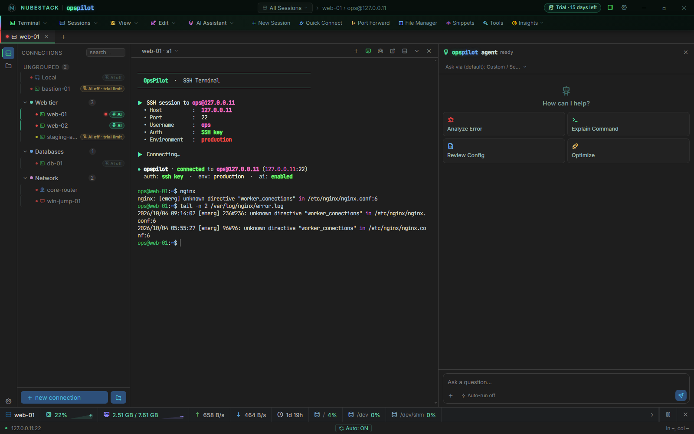
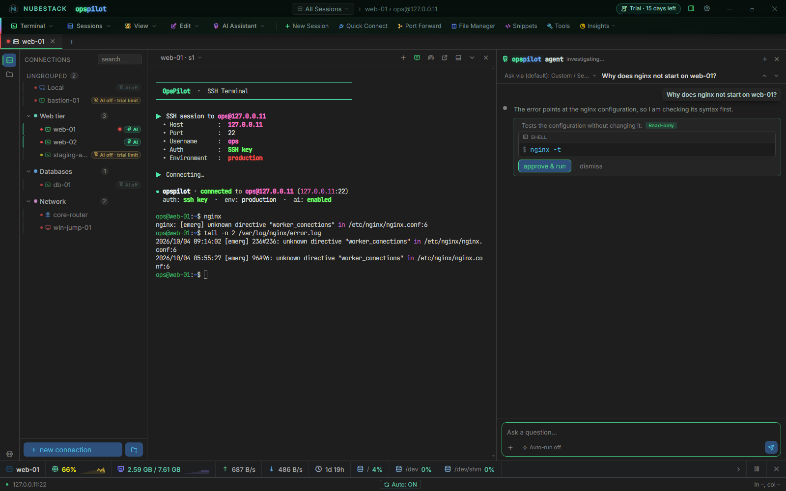
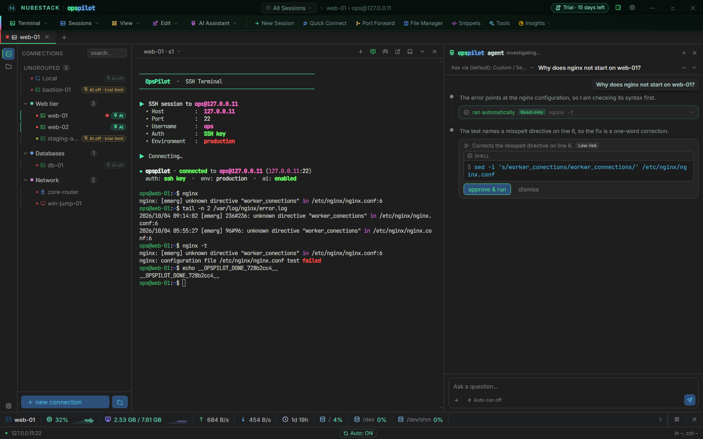
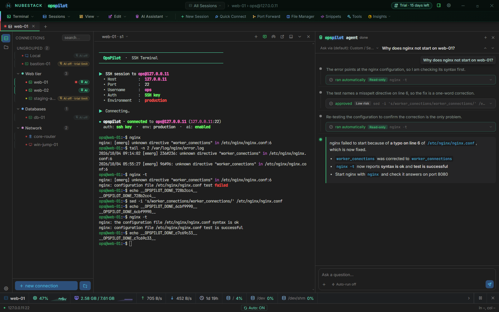

# Using the AI panel

The AI panel sits on the right of the workspace and works on the session in the active
tab. The steps below follow one investigation: ask, read the proposal, decide, and let
the AI carry on with the result. They assume you have configured at least one
[AI Provider](providers.md).

**Ctrl+\\** shows or hides the panel for every tab; the panel's own ✕ hides it for the
current session only.

## 1. Open a session with AI on

AI works on **SSH** and **Local Console** tabs. The session needs:

- **Enable AI** on for its connection (or turned on in the tab, from **AI Assistant → AI
  for This Host: toggle**)
- an active free trial or subscription. During the trial, AI is on for 2 of your
  connections at a time, which you choose; see
  [Free trial and limits](../licensing/trial-and-limits.md)

When the license keeps AI off in a tab, the composer shows the reason instead of the
input box — for example **AI off · free trial: AI on 2 connections at a time.** followed
by the connections that have it — with the button that helps: **Use AI here…**, **Turn
AI on here**, **Subscribe**, **License settings** or **Fix clock**.

On a Local Console tab the model is also told your operating system and shell, so it
proposes commands in the right syntax — PowerShell or `cmd` on Windows, `zsh` or `bash`
on macOS and Linux. Those commands run on your own workstation.

_web-01 has AI on: the connection banner says **ai: enabled** and the side list shows
**AI**. The empty panel offers the four quick actions, with the provider dropdown at the
top and the **Auto-run off** chip beside the composer. In the trial, web-02 holds the
other AI place, and bastion-01 and staging-app, which also have AI turned on, show
**AI off · trial limit**._

## 2. Choose the provider for this session

The provider dropdown at the top of the panel sets which configured provider answers
*this session's* questions. It starts on the provider that is active in **Settings → AI
Providers**.

The choice is per session rather than global: a fast local model on the tab where you
are reading logs, a larger cloud model on the tab where you are stuck. Switching does not
restart the conversation.

## 3. Ask a question, or use Analyze Error

Type into the composer at the bottom of the panel (**Ask a question…**) and press Enter.
The question is answered against the recent scrollback of the session you are in, so you
rarely need to paste anything — "why did that fail?" after a failed command is usually
the whole question.

Or start from a quick action. They appear as cards on an empty panel, and in the **+**
menu beside the composer once a conversation has started:

| Quick action | What it does |
|---|---|
| **Analyze Error** | Sends the recent scrollback for diagnosis straight away — use it when something just failed. **Ctrl+Shift+A** does the same |
| **Explain Command** | Starts the question with "Explain this command:" for you to finish |
| **Review Config** | Starts the question with "Review this config for issues:" |
| **Optimize** | Starts the question with "Suggest performance optimizations for:" |

The **+** menu also holds **Upload from computer** and **Browse remote files** for
attaching a file to the question. Attachments are redacted before they are attached, and
OpsPilot tells you how many secrets it removed; a large file is cut to its first part,
and OpsPilot says so.

Session content is redacted before it is sent. The question you type is sent as you
typed it, so do not paste a secret into it.

## 4. Read the note

The reply streams in as it is generated, and the panel header shows **thinking…** or
**investigating…** while it does. A reply is a short note — what the model sees and why
it wants the next step — plus, usually, **one** proposed command rather than a
multi-step plan. OpsPilot asks the model for a single next action, runs it if you
approve, and then asks again with the real result.

## 5. Read the proposal card

Each proposed command arrives as a card with:

- the model's reason for running it, and a risk badge —
  Read-only,
  Low risk or
  High risk
- the exact command text you are about to run, verbatim, in a **shell** block

The tier is not the model's word alone. The session's
[Command Safety profile](../safety/command-safety-profiles.md) applies your
dangerous-pattern list on top of the model's own self-assessment, and a pattern match
makes a command High risk. If the profile is set to **Only my list** and the model
flagged a command your list does not match, the card carries an amber note: *The AI
flagged this command as destructive. This connection's Command Safety profile only
treats your own patterns as dangerous, so that warning was not applied.*

What the card asks of you depends on the tier and on the profile's rules:

- **will run automatically** — the profile lets this command run without a click, so it
  runs at once (see the auto-run chip below).
- **approve & run** and **dismiss** — a click decides.
- a reason box and **confirm & run** — a High risk command in a profile that asks for a
  typed reason. The box names why the command was flagged: **Flagged dangerous by the
  AI.**, or the pattern it matched.

_The question, the AI's short note, and one proposal. `nginx -t` only tests the
configuration, so it is **Read-only**. The profile here asks every time, so it waits for
**approve & run**._

## 6. Approve and run, or dismiss

- **approve & run** — OpsPilot types the command into the real session, and you watch it
  run in the terminal.
- **dismiss** — nothing runs. The card collapses and the conversation continues.

_After the first approval the finished step folds to one line and its output is in the
terminal. The model reads the result and proposes the fix. Editing the file changes
something, so the card is **Low risk** and waits for a click._

For a High risk command with the typed reason on, type why you are running it.
**confirm & run** stays disabled until you have typed at least ten characters, then
needs a click or Enter. The reason stays with the command, shown as **Approved:**
followed by your words, in the session transcript. That transcript is in memory only, so
capture it yourself if you need the record kept — see
[Approvals & auto-run](../safety/approvals.md).

_A **High risk** proposal. The command contains `rm -rf`, one of the Default profile's
dangerous patterns, and the card says so. **confirm & run** works once a reason of at
least ten characters has been typed._

A dangerous command always needs this click. No setting runs one by itself.

## 7. Follow the next turn

Once a command runs, OpsPilot captures what it printed, strips terminal escape sequences,
redacts it, and feeds it back as the next turn. The model then explains what the output
shows and proposes the next step, so you do not have to re-ask after every command.

- A command that is still running when OpsPilot stops waiting shows **still running — ask
  a follow-up once it finishes**.
- After 12 follow-up turns since your last question, the panel pauses with **Paused
  after 12 automatic steps — ask a follow-up to keep going.**

## 8. Read the summary

When the model has an answer, the investigation ends with a summary card: the full
write-up, with a **Copy** button for pasting it into a ticket or a runbook. The panel
header shows **done**. If the model needs a decision only you can make, it says so and
the header shows **needs input**; ask a follow-up to continue.

_The whole loop: test, fix, test again, each step folded to one line, then the summary.
The header shows **done**._

The **New AI session** button (**+**) in the panel header starts afresh for the tab: it
clears the conversation and leaves the connection untouched.

## 9. Stop

While the model is answering, or while OpsPilot waits for a command's output, the send
button becomes a **Stop** button. Stopping cancels the answer (the turn reads
**Stopped.**) or stops waiting for the output. Typing wins over stopping: as soon as there
is something to send, the button goes back to Send, and sending starts a new turn.

## The auto-run chip

The chip beside the composer shows the rule for this tab's Command Safety profile:
**Auto-run off** (every command waits for your click), **Auto-run read-only** (read-only
commands run by themselves) or **Auto-run all** (every command runs by itself except
dangerous ones). Clicking it opens **Settings → Security**, where the rules are set per
profile. See [Approvals & auto-run](../safety/approvals.md).

## The redaction badge

If a 🔒 badge with a count appears on a turn or a command, redaction fired before
anything was sent. The number is how many items were replaced; hover it to see which
categories they came from.

The badge is an indicator, not a control. Turning it off in settings hides the indicator
only; redaction still happens on every turn either way.

## When AI goes off during an answer

If the license stops allowing AI in this session while the model is answering — the
trial or the subscription ends, for example — the answer already under way finishes.
Nothing it proposes runs: its card shows, for example, **Expired: AI is off.** New
questions are refused with the reason, and no session is closed.

If you turn AI off in the session yourself, or move the trial's AI to another
connection, the answer stops there and the turn says why. Either way, a proposal still
waiting for your decision expires.

## When a proposal came from an assistant

If a proposal came from a connected assistant rather than the panel, its turn carries a
**via …** badge naming the assistant, and the composer shows **Use … chat** with a
**Switch to AI Provider** button, because OpsPilot cannot type into the assistant's own
chat. Those proposals use the same cards, the same tiers, the same profile rules and the
same buttons — see [AI Assistants (MCP)](assistants.md).

## See also

- [AI Providers](providers.md) — configuring and testing providers
- [Execution boundary & risk tiers](../safety/risk-tiers.md) — how a tier is decided
- [Approvals & auto-run](../safety/approvals.md) — the rules that decide what runs
  without a click
- [What gets sent](what-gets-sent.md) — what leaves the machine on each turn
