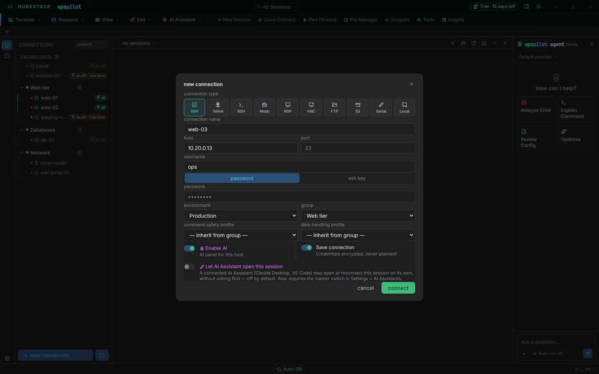

# Add a connection

Create one connection from scratch, end to end. You need OpsPilot installed and
running, and a target host you can already reach from your workstation —
OpsPilot installs nothing on the target.

## Create a connection

1. **Open the dialog.** Click **+ new connection** at the bottom of the
   connection list. The **+** at the end of the tab strip, and **New Session** and
   **Quick Connect** on the toolbar, open the same dialog. To create the
   connection inside a group, right-click the group and choose **New connection
   in group**.
2. **Pick a type** from the row of buttons under **connection type**. SSH is
   selected when the dialog opens.
3. **Name it.** Type a **connection name** — the label you will see in the list
   and in the tab bar. Name it after the machine's role rather than its address.
4. **Fill in the target.** Enter the **host** and, if your estate does not use the
   default, the **port**. Enter the **username** if the type asks for one.
5. **Choose how to authenticate.** For SSH, click **password** and type it, or
   click **ssh key** and pick a **private key file**, with its **passphrase (if
   any)**.
6. **Fill in any fields of the type**, such as a Windows domain for RDP or a
   bucket for AWS S3.
7. **Tag it.** Choose an **environment** and, if you use groups, a **group**.
8. **Set its profiles**, or leave both on **— inherit from group —**. This row
   appears for SSH and Local connections.
9. **Decide on AI.** Set **Enable AI** on or off, and leave **Let AI Assistant
   open this session** off unless you want an assistant to connect this host on
   its own.
10. **Keep or discard it.** Leave **Save connection** on to keep the connection
    in the list, or turn it off to connect once without saving it.
11. Click **connect**.

_A new SSH connection in the **Web tier** group, environment **Production**, with both
profiles inheriting from the group, **Enable AI** and **Save connection** on, and **Let
AI Assistant open this session** off. The fields change with the type you pick._

The session opens in a new tab. An SSH terminal starts with a banner that
repeats who you connected as, the environment and whether AI is on for this
session.

_A connected SSH session. The banner ends with `auth: ssh key · env: production · ai:
enabled`, the AI panel on the right is ready for a question, and the System Monitor bar
above the status bar shows the host's CPU, memory, network and disks._

The sections below explain each part of the dialog.

## Type

The type is the first decision, because it determines which of the remaining
fields exist at all. SSH is the primary path. The full set is in
[Connection types](connection-types.md); the short version is that a type opens
either an in-app terminal tab, an embedded desktop, a two-pane file view, or an
external application.

## Host, port and username

- **host** — an address or a hostname. Not shown for AWS S3, Serial or Local,
  none of which have a network host, nor for a VNC connection whose target is
  OpenStack.
- **port** — 22 for SSH and Mosh, 23 for Telnet, 3389 for RDP, 5900 for VNC and
  21 for FTP are used when you leave it empty. RSH has no port field.
- **username** — shown for SSH, Mosh, RSH, RDP and FTP. Telnet does not carry a
  username in the connection definition; you authenticate inside the session as
  the device prompts you.

## Authentication

How you authenticate depends on the type:

- **SSH and Mosh** show a **password** / **ssh key** choice. The key path takes
  a **private key file** and a **passphrase (if any)**.
- **RDP, VNC and FTP** show a single **password** field.
- **AWS S3** takes an access key ID and a secret access key.
- **Telnet, RSH, Serial and Local** need no credentials in the dialog at all.

Whatever you enter is encrypted with the operating system's own encryption, not
written to a plain-text file. See [Credentials](credentials.md).

Some types add their own fields below the authentication block — a Windows
domain for RDP, an initial path for FTP, a serial port and baud rate for Serial,
a shell for Local, and a target selector for VNC, which comes first because it
changes what the fields above it mean. Those are covered on the type's own page,
and every field in the dialog is listed in the
[connection fields reference](../reference/connection-fields.md).

## Environment and group

**environment** tags the connection with a colour-coded label, and it does two
things:

- It **colour-codes** the connection everywhere it appears — the list and the
  edge of its tab. A production host that is visibly red is harder to mistake for
  a staging host.
- It is how **safety policy gets scoped** in practice. Environments are the tag
  you organise the connection list around, and groups — which carry Command
  Safety and Data Handling profiles — are normally drawn along the same lines.

**production** and **staging** are seeded on a new install. You add, rename,
recolour and remove environments in **Settings → Environments**. The environment
field is not shown for AWS S3, Serial and Local connections.

**group** puts the connection in one of your groups, or leaves it ungrouped. See
[Groups & environments](organising.md).

## Profiles

**command safety profile** and **data handling profile** override the group's
profiles for this one connection. Leave them on **— inherit from group —** unless
this host needs its own policy. They appear for SSH and Local connections, the two
kinds that can use AI. Give a Local connection its own Command Safety profile,
because the commands the AI proposes there run on your own workstation. See
[Command Safety profiles](../safety/command-safety-profiles.md) and
[Data Handling profiles](../safety/data-handling-profiles.md).

## AI access

Two separate switches at the bottom of the dialog control what the AI may do with
this connection. They are not the same permission.

**Enable AI** — captioned *AI panel for this host* — decides whether AI may see
sessions of this connection at all. A connection with AI off is invisible to
every model and every assistant: its output is absent from AI context rather
than redacted or summarised, and no provider setting, prompt or assistant
reaches around it. Set the switch deliberately and check it before you connect.
What a connection with AI on does and does not send is covered in
[What gets sent](../ai/what-gets-sent.md).

AI works in SSH and Local tabs. The dialog also shows **Enable AI** for Serial
connections, but a Serial tab never has AI, and the other types do not offer the
switch.

AI needs an active free trial or subscription. During the free trial, AI can be on
for 2 of your connections at a time, and you choose which. On a new install the
first two connections you save with **Enable AI** on take those two places; after
that, a new connection with **Enable AI** on shows **AI off · trial limit** in
the side list until you choose it. See
[Free trial and limits](../licensing/trial-and-limits.md).

**Let AI Assistant open this session** is the stricter of the two, and it is off
by default. It allows an external assistant over MCP — Claude Desktop, VS Code —
to open or reconnect *this* connection on its own, without asking first.
Establishing a live connection to real infrastructure is a larger capability
than reading output from a session a person already opened, so it is gated
twice:

1. **Allow opening/reconnecting sessions** in **Settings → AI Assistants**, which
   is off until you turn it on. It is checked on every call, so switching it back
   off takes effect immediately.
2. This per-connection switch. An assistant is only ever offered the connections
   you have turned it on for, and the permission is checked again when the
   assistant actually asks — a stale connection ID from before you turned it off
   is refused.

During the free trial an assistant can open only a connection that holds one of
the two AI places. Neither switch gives the assistant a shell. Opening a session
is not running a command; commands still go through the approval gate.

## Save and connect

There is no Save button. The dialog's primary button is **connect**, and it
connects immediately. Whether the connection is *also* stored in the list is
decided by the **Save connection** switch beside **Enable AI** — captioned
*Credentials encrypted, never plaintext* — which is on unless you turn it off.

- **Save connection on:** the connection appears in the list and opens. From then
  on, double-click its row (or press Enter on it) to connect it again.
- **Save connection off:** the session opens but nothing is kept. This is a Quick
  Connect session, for a host you do not want to keep. See
  [Sessions and tabs](../workspace/sessions.md).

If a connection fails to open, the failure is reported with the target's own
error text rather than a generic message — see
[Troubleshooting](../operations/troubleshooting.md).

### When 10 connections are already saved

During the free trial and without a subscription, OpsPilot opens only your first
10 saved connections, the 10 you created first. The built-in **Local** connection
is not one of them. If you save a new connection when those 10 already exist,
OpsPilot keeps it but does not open it: it appears in the list greyed out with a
**Locked** badge. The first time, a dialog titled **Connection saved, but
locked** explains why; after that a short message says "Saved and locked: without
a subscription, OpsPilot uses your first 10 saved connections."

Nothing is lost. Subscribing unlocks every saved connection, and deleting one of
the first 10 unlocks the next. To reach a host once in the meantime, turn
**Save connection** off and connect. See
[Free trial and limits](../licensing/trial-and-limits.md).

## Edit, duplicate or delete a connection

Right-click a connection in the list for its menu: **Connect**, **Edit**,
**Duplicate**, **Turn AI on** or **Turn AI off**, **move to group** and
**Delete**.

**Edit** opens the same dialog, titled **edit connection**, with a **save**
button instead of **connect**. Saved secrets are never shown again: a credential
field left blank keeps what is stored, so you retype a password or passphrase
only when you change it. A duplicate is a new connection, created at that moment.

A locked connection can only be deleted; its other menu entries say why they are
not available.

## See also

- [Connection types](connection-types.md) — what each of the ten types opens
- [Groups & environments](organising.md) — the side list, its badges and where
  policy is applied
- [Credentials](credentials.md) — how secrets are stored
- [Free trial and limits](../licensing/trial-and-limits.md) — the first 10 saved
  connections and the trial's AI places
