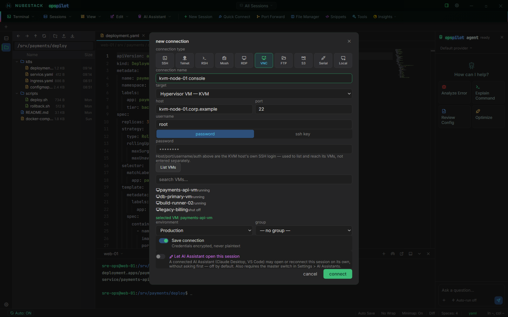
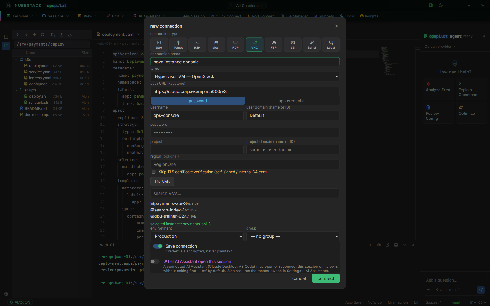

# Hypervisor consoles

A VNC connection can attach to a virtual machine's console *through its
hypervisor*, rather than to a VNC server running inside the guest. That is what
you need when a machine will not boot, has lost its network configuration, or has
no SSH at all. You get the console the same way you would from the hypervisor's
own dashboard, in the same workbench as everything else, and certificate trust is
decided in one place.

Two backends ship:

| Backend | How it reaches the console |
|---|---|
| **KVM / libvirt** | SSH to the host, then `virsh` |
| **OpenStack (Nova)** | REST over HTTPS — Keystone for authentication, Nova for instance listing and console tickets |

Both open as an embedded session inside OpsPilot, in a normal tab. Pick the
backend with the **target** selector at the top of a VNC connection, before you
fill anything else in, because the selector changes what the fields below it
mean.

## KVM and libvirt

Set the target to **Hypervisor VM — KVM**. The host, port, username and
authentication fields above the selector become the **KVM host's own SSH login**
— not a VNC endpoint. Password and private key authentication both work, exactly
as they do for an SSH connection.

Click **List VMs** and OpsPilot enumerates the host's guests through `virsh`,
running and stopped, with their state. Pick one and it is stored on the
connection, so reconnecting later does not mean listing again. Attaching then
resolves the guest's VNC display on the host and tunnels to it over SSH. The
guest's own network configuration is not involved, which is why this works on a
machine that has lost it.

*Target set to **Hypervisor VM — KVM**. The host and credentials above are the
KVM host's SSH login; **List VMs** has enumerated the guests through `virsh`,
including the ones that are shut off.*

Attaching can fail for three reasons, and each is reported with the hypervisor's
own error text rather than a generic message:

- `virsh` is not installed, or the SSH user is not permitted to talk to
  `qemu:///system`. The fix differs — install the libvirt client, add the user to
  the `libvirt` group, or connect as a user who already has access.
- The VM is not running. A console needs a running domain.
- The VM has no VNC console configured in its libvirt XML. There is nothing to
  attach to.

## OpenStack (Nova)

Set the target to **Hypervisor VM — OpenStack** and you get a separate
authentication panel, because Keystone credentials have nothing in common with an
SSH login.

Fill in:

- **auth URL (keystone)** — your Keystone v3 endpoint.
- **password** or **app credential** — the two authentication methods supported.
  Password authentication takes a username, a **user domain**, a **project** and
  a **project domain**. An application credential takes an ID and a secret, and
  needs no separate scope, because an application credential is already scoped
  when it is created. Both domain fields accept a domain name or a domain ID.
- **region** — optional. If you name a region and no compute endpoint matches it,
  the attempt fails rather than quietly showing a different region's instances.
- **Skip TLS certificate verification (self-signed / internal CA cert)** — one
  explicit checkbox, off by default. Self-signed and internal-CA certificates are
  common in a private OpenStack cloud, and this is the single place certificate
  trust for the connection is decided.

**List VMs** queries Nova for the project's instances and normalises their status
into the same vocabulary the KVM list uses. OpsPilot then requests the console
ticket from Nova itself and connects through that, so there is no URL to copy out
of Horizon and no token to paste anywhere.

*Target set to **Hypervisor VM — OpenStack**. Keystone authentication has its own
panel, the TLS checkbox is the single place certificate trust is decided, and
**List VMs** has queried Nova for the project's instances.*

OpsPilot re-authenticates to Keystone on each call rather than holding a token,
so a long-lived connection does not fail later because a token expired. If Nova
refuses the console request — the instance is gone, or the cloud does not offer
remote console access — the error comes back as Nova worded it.

!!! note "Guest console passwords"
    Reaching a console through the hypervisor authenticates you to the
    *hypervisor*. If the VM's graphical console has its own VNC password, that is
    separate, and you are prompted for it when the console asks.

## See also

- [Connection types](connection-types.md) — where VNC sits among the ten types
- [Remote desktop (RDP & VNC)](remote-desktop.md) — graphical sessions generally
- [Add a connection](adding-connections.md) — the fields above the target
  selector
- [Troubleshooting](../operations/troubleshooting.md) — when a console will not
  attach
