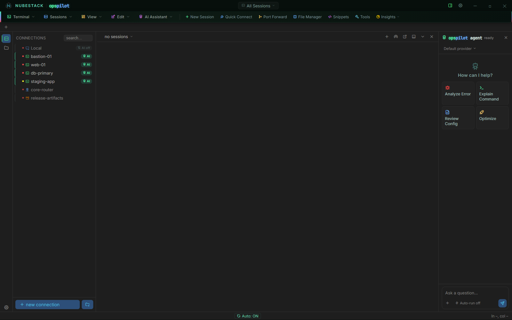

# Groups & environments

Three things organise the connection list, and each does something the others
cannot: **groups** carry policy, **environments** carry colour, and the
per-connection **AI** badge controls whether a model may see the connection at
all.

*The connection list. Connections sit in groups, a coloured dot on each row
marks its environment, and the green **AI** badge marks the connections the
assistant is allowed to see at all.*

## Groups

A group holds related connections, and it is where policy is applied most
efficiently. Right-click a group and you get two entries:

- **Command Safety profile…** — the profile that decides how commands proposed
  against connections in this group are classified and gated. See
  [Command Safety profiles](../safety/command-safety-profiles.md).
- **Data Handling profile…** — the profile that decides what is redacted out of
  terminal output before any of it leaves the machine. See
  [Data Handling profiles](../safety/data-handling-profiles.md).

Assigning a profile to a group applies it to everything inside it, so draw groups
along the lines your policy follows rather than by geography or hostname.

A profile assignment is a **replacement, not an addition**. A group's profile
replaces the Default profile for the connections in it; it does not merge with
it. That cuts both ways: a group profile can legitimately be *less* strict than
Default, so a permissive lab profile really is permissive. Resolution runs
connection → group → Default, so an individual connection can override its group,
and the dialog offers that for SSH connections directly.

## Environments

An environment is a colour-coded tag on a connection. **production** and
**staging** are seeded on a new install; you add, rename, recolour and remove
them in **Settings → Environments**.

The colour appears as a dot on the connection's row and on the session list, and
as the coloured edge of the session's own tab, so the environment you are working
in is visible before you type anything. Colour-coding a production host red
prevents running a correct command against the wrong host.

Renaming or recolouring an environment does not orphan the connections tagged
with it: a connection stores a stable key rather than the display name, so the
tag survives the edit.

## The AI badge

The **AI** badge on each row shows whether the assistant can see that connection.
It is per connection: a connection with AI off is invisible to every model and
every assistant, and its output is absent from AI context rather than redacted.
You can flip it from the row itself as well as in the connection dialog, so
revoking AI access from a host is one click and takes effect immediately.

The badge is only shown for connection types the assistant can work with at all:
not the external launchers, not the file browsers, and not Telnet or RSH. In
practice that means SSH, which is also the only type whose connections can carry
their own profile assignments.

Redaction, risk tiers and the approval gate are all downstream of the badge. If a
host must never be seen by a model, the badge is the control, and no provider,
prompt or assistant setting reaches around it. See
[What gets sent](../ai/what-gets-sent.md).

## A three-group setup

The session tab bar, the per-connection AI toggles and the per-group profiles
work together. A production estate usually ends up looking like this:

- A **Production** group with a strict Command Safety profile and a Data Handling
  profile that also scrubs hostnames and IP addresses.
- A **Staging** group with a moderate profile.
- A **Lab** group with a permissive profile and minimal redaction.

The same assistant then behaves differently in each group without anyone changing
a setting when they switch tabs: move from a lab tab to a production tab and the
classification tightens and the redaction widens, because both profiles resolve
from the session's own connection.

Auto-run is the exception. It is a single switch for the workstation rather than
part of either profile, so it does not vary by group. If you work in production
from the same machine as your lab, leave it off — see
[Approvals & auto-run](../safety/approvals.md).

Auto-run and dangerous-command confirmation themselves live in
**Settings → Security → Command Safety**, and auto-run ships off.

## See also

- [Command Safety profiles](../safety/command-safety-profiles.md) — what a group
  profile actually changes
- [Data Handling profiles](../safety/data-handling-profiles.md) — redaction, per
  group
- [Add a connection](adding-connections.md) — where environment, group and AI are
  set
- [Sessions & tabs](../workspace/sessions.md) — working across several hosts at
  once
