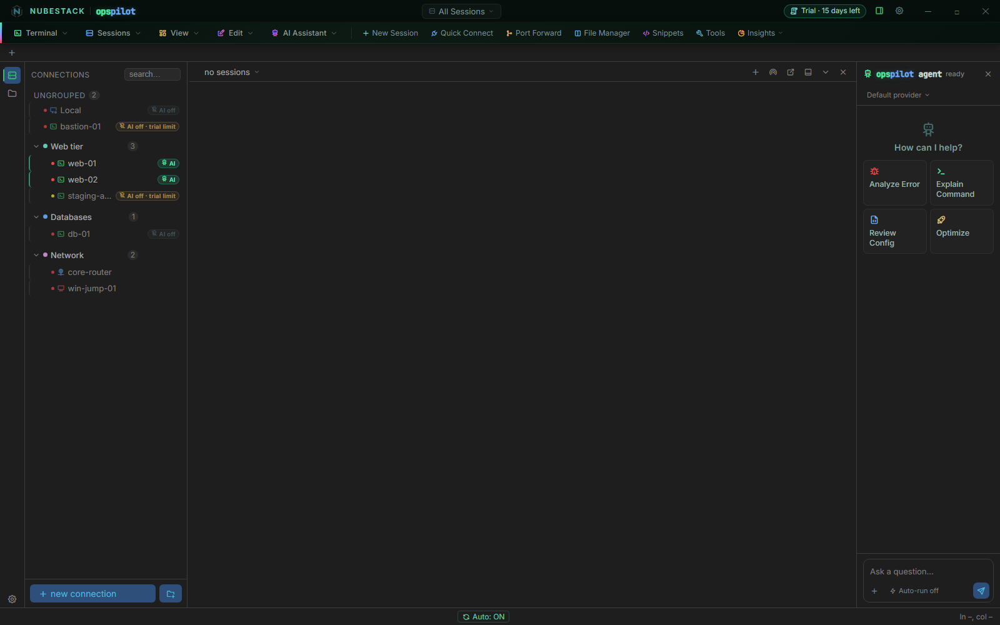
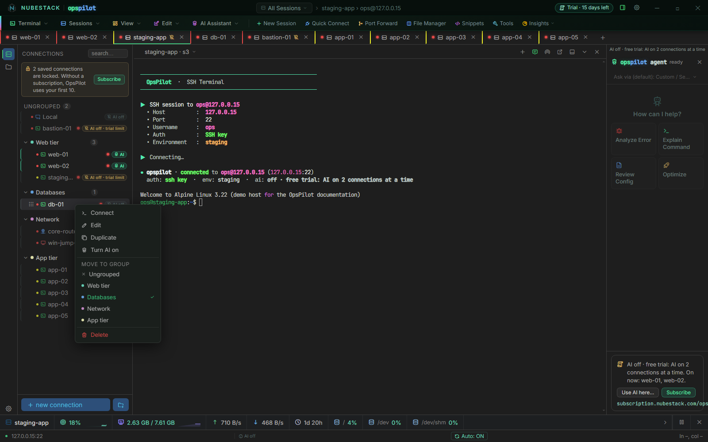
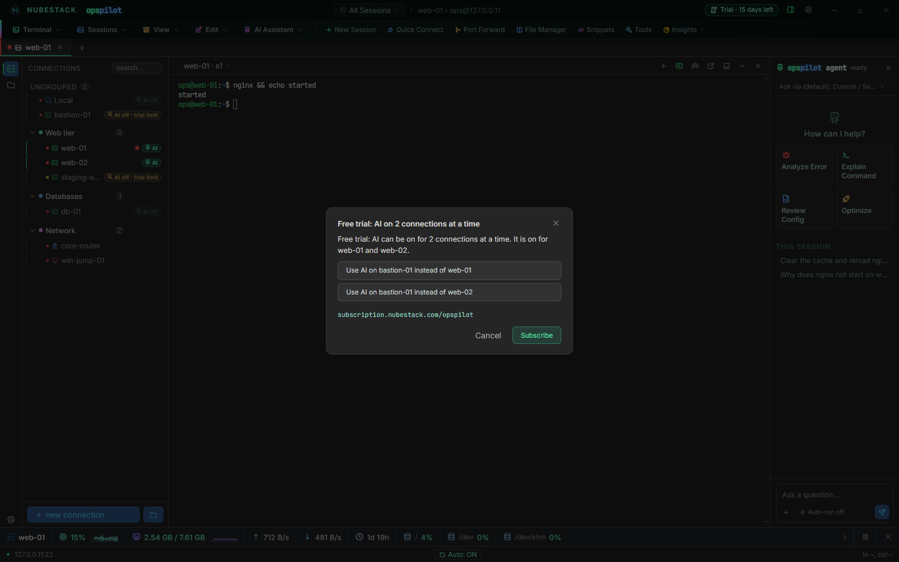
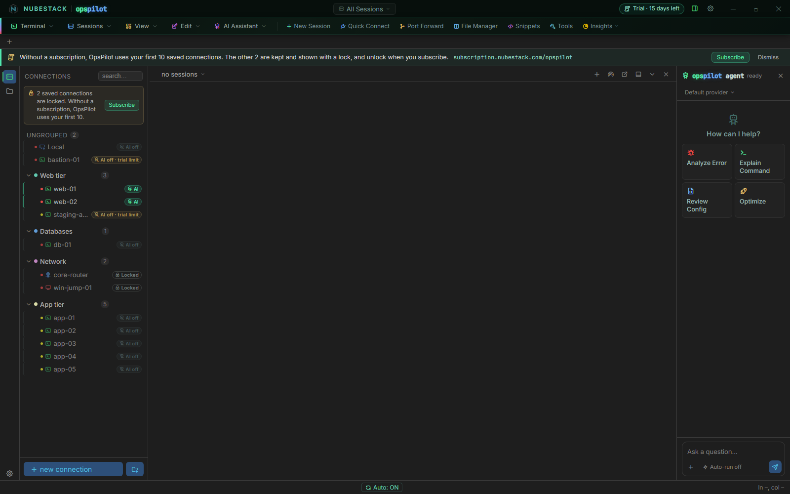

# Groups & environments

The side list on the left holds your saved connections. Three things organise it,
and each does something the others cannot: **groups** carry policy,
**environments** carry colour, and the per-connection **AI** badge shows whether
a model may see the connection at all.

_The side list on first launch in the free trial. web-01 and web-02 hold the trial's two
AI places and show **AI**; bastion-01 and staging-app have AI turned on and show **AI
off · trial limit**; Local and db-01 show **AI off**; core-router and win-jump-01 are
types that cannot use AI and show no badge._

## The side list

- **Search.** The **search…** box at the top filters the list by connection name
  or host.
- **Connect.** Double-click a connection, or press Enter on it. A small dot on the
  row shows that a session of it is open.
- **Add.** **+ new connection** at the bottom opens the connection dialog; the
  folder button beside it creates a group.
- **Move.** Drag a connection by its handle onto a group, or right-click it and
  pick a group under **move to group**. Moving a connection never changes its AI
  setting, its place in the free trial or which of your connections are locked.
- **Right-click** a connection for **Connect**, **Edit**, **Duplicate**, **Turn
  AI on** or **Turn AI off**, **move to group** and **Delete**.

_The menu of a saved connection. **Turn AI on** does what its **AI off** badge does, and
**Move to group** lists every group, with a tick on the current one._

## Groups

A group holds related connections, and it is where policy is applied most
efficiently. Right-click a group for its menu: **New connection in group**,
**Rename group**, **Command Safety profile…**, **Data Handling profile…**,
**Expand** or **Collapse**, a **group color** and **Delete group**. The entries that
carry policy:

- **Command Safety profile…** — the profile that decides how commands proposed
  against connections in this group are classified, and which of them may run
  without asking you. See
  [Command Safety profiles](../safety/command-safety-profiles.md).
- **Data Handling profile…** — the profile that decides what is redacted out of
  terminal output before any of it leaves the machine. See
  [Data Handling profiles](../safety/data-handling-profiles.md).

Assigning a profile to a group applies it to everything inside it, so draw groups
along the lines your policy follows rather than by geography or hostname.

A profile assignment is a **replacement, not an addition**. A group's profile
replaces the Default profile for the connections in it; it does not merge with
it. That cuts both ways: a group profile can legitimately be *less* strict than
Default, so a permissive lab profile really is permissive. Resolution runs
connection → group → Default, so an individual connection can override its group;
the connection dialog offers that for SSH and Local connections.

## Environments

An environment is a colour-coded tag on a connection. **production** and
**staging** are seeded on a new install; you add, rename, recolour and remove
them in **Settings → Environments**.

The colour appears as a dot on the connection's row and as the coloured left edge
of its session's tab, so the environment you are working in is visible before you
type anything. Colour-coding a production host red helps prevent running a
correct command against the wrong host.

Renaming or recolouring an environment does not orphan the connections tagged
with it: a connection stores a stable key rather than the display name, so the
tag survives the edit.

## AI badges

The badge on each SSH and Local connection says what applies to it, whether it is
open or not. It is per connection: a connection with AI off is invisible to every
model and every assistant, and its output is absent from AI context rather than
redacted. Point at a badge to read the full reason.

| Badge | Colour | Meaning | A control? |
|---|---|---|---|
| **AI** | Green | AI is on for this connection, or will be when you open it | Yes: turns AI off |
| **AI off** | Grey | You turned AI off for this connection | Yes: turns AI on |
| **AI off · trial limit** | Amber | Free trial: AI is on for 2 other connections | Yes: chooses this one |
| **AI off · tab limit** | Amber | Free trial: AI is already on in 2 other tabs | Yes: offers to move AI here |
| **AI off · no subscription** | Amber | The trial ended and there is no license | No |
| **AI off · subscription ended** | Amber | The subscription for this license is not active | No |
| **AI off · license expired** | Amber | A license file or your organisation's license ran out, or an online license ran out while this computer could not reach the license server | No |
| **AI paused** | Amber, with a pause sign | The clock needs fixing, OpsPilot is checking this computer's identity, or it is still reading its license after starting | No |
| **AI off · licensing problem** | Amber | Anything else, such as a suspended license or a computer your organisation released | No |

Clicking a badge that is a control does what the last column says, for the saved
connection and every open tab of it at once. During the free trial, choosing a
connection whose badge says **AI off · trial limit** takes a free place, or opens
a dialog that offers **Use AI on … instead of …** for each of the two connections
that have AI. A connection's right-click menu offers the same action as its badge:
**Turn AI on** or **Turn AI off**.

_Choosing bastion-01 while both places are taken. The dialog names the two connections
that have AI and moves the place in one step; **Cancel** keeps bastion-01 waiting for a
place._

A badge that only says why licensing keeps AI off is not a control: clicking it
does nothing, the keyboard skips it and the menu does not offer it. What each
licensing state means, and how the trial's two AI places move, is on
[Free trial and limits](../licensing/trial-and-limits.md).

Only SSH and Local connections have a badge, because they are the types that can
use AI. Redaction, risk tiers and the approval gate are all downstream of the
badge. If a host must never be seen by a model, the badge is the control, and no
provider, prompt or assistant setting reaches around it. See
[What gets sent](../ai/what-gets-sent.md).

## Locked connections

During the free trial and without a subscription, OpsPilot opens only your first
10 saved connections, the 10 you created first. The others stay in the list,
greyed out with a **Locked** badge in place of the AI badge, and a line above the
list says how many are locked, with **Subscribe** where subscribing is the
answer.

A locked connection cannot be opened, edited, duplicated, moved or given AI, and
an assistant cannot open it. Only **Delete** works in its menu; the other entries
say why when you choose them. Deleting one of your first 10 unlocks the
next, and subscribing unlocks them all. Moving or dragging a connection never
changes which ones are locked. See
[Free trial and limits](../licensing/trial-and-limits.md).

_Twelve saved connections besides **Local** in the free trial. The banner and the note at
the top of the list say two are locked, and core-router and win-jump-01 show **Locked**:
they were created last, wherever they sit in the list._

## From the keyboard

The side list is a single stop when you press Tab. Then:

| Key | What it does |
|---|---|
| Up, Down (Home, End) | Moves between connections and group headers |
| Enter | Opens the connection (a locked one says why), or opens or closes a group |
| Right, Left | On a group, opens or closes it. On a connection, Right moves to its AI badge and Left moves back to the connection, or to its group |
| Enter or Space on an AI badge | Does what clicking the badge does |
| Space | Selects the connection |
| Shift+F10, or the context-menu key | Opens the connection's or group's menu; Up and Down move, Enter chooses, Escape closes it |

Holding Enter on a badge uses it once. A dialog you close with Escape, **Cancel**
or its **x** opens again at once if you use the same control again.

## With a screen reader

A screen reader reads the side list as a tree. Each connection is named by its
name and what its badge says, for example "quay, AI off · trial limit", and each
group by its name, how many connections it holds and whether it is open. A badge
that is a control is a button named by its visible words and then what it does,
for example "AI off · trial limit, turn AI on for quay", so voice control works
with the words you see on screen.

## A three-group setup

The session tab bar, the per-connection AI badges and the per-group profiles work
together. A production estate usually ends up looking like this:

- A **Production** group with a strict Command Safety profile — **Run commands
  without asking me** set to **Ask me every time** — and a Data Handling profile
  that also scrubs hostnames and IP addresses.
- A **Staging** group with a moderate profile, set to run **Only read-only
  commands** without asking.
- A **Lab** group with a permissive profile, set to run **Everything except
  dangerous ones**, and minimal redaction.

The same assistant then behaves differently in each group without anyone changing
a setting when they switch tabs: move from a lab tab to a production tab and the
classification tightens, auto-run narrows and the redaction widens, because both
profiles resolve from the session's own connection. Dangerous commands always
need a click, whatever the profile. See
[Approvals & auto-run](../safety/approvals.md).

## See also

- [Command Safety profiles](../safety/command-safety-profiles.md) — what a group
  profile actually changes
- [Data Handling profiles](../safety/data-handling-profiles.md) — redaction, per
  group
- [Add a connection](adding-connections.md) — where environment, group and AI are
  set
- [Free trial and limits](../licensing/trial-and-limits.md) — the licensing badges,
  the trial's AI places and locked connections
