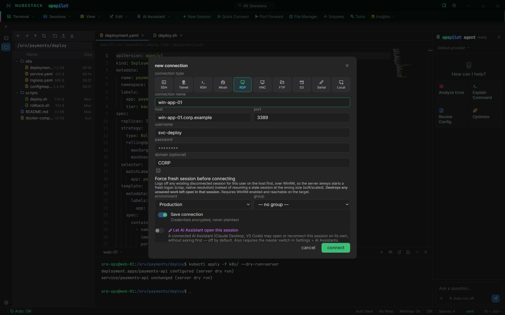

# Remote desktop (RDP & VNC)

RDP and VNC are the two graphical connection types. On Windows, an RDP session is
a tab: a Windows server sits in the same window and the same tab bar as your SSH
sessions, and you switch between them the way you switch between terminals. On
macOS and Linux an RDP session opens in a separate client application:
Microsoft's Windows App on macOS, and a FreeRDP client on Linux.

## Creating an RDP connection

Pick **RDP** and fill in host, port (3389 by default), username and password.
Two RDP-specific fields follow:

- **domain (optional)** — a Windows domain; the dialog's own example is `CORP`.
  Leave it empty for a local account on the target.
- **Force fresh session before connecting** — off by default, and a Windows-only
  path. With it on, OpsPilot first logs off any existing disconnected session for
  that user on the target, over WinRM, so the server starts a fresh logon at the
  exact resolution asked for instead of resuming a stale session at its old size.
  It needs WinRM enabled and reachable on the target, and it never blocks the
  connect: if the logoff fails, the connection proceeds anyway.

*An RDP connection. The domain field is optional, and **Force fresh session
before connecting** is the option to reach for when a resumed session comes back
at the wrong resolution.*

!!! danger "Force fresh session destroys unsaved work"
    Logging off a disconnected session discards anything left unsaved in it. If
    someone else's disconnected session is on that host under the same account,
    this takes it with them.

## RDP per platform

| Platform | What an RDP session is | What you need installed |
|---|---|---|
| **Windows** | An embedded in-app tab, positioned over the session stage. It can also be detached into its own window. | Nothing. FreeRDP ships with the Windows build. |
| **macOS** | A session in Microsoft's **Windows App**. OpsPilot writes a standard `.rdp` file for the connection and opens it with Windows App, which runs as its own application. | Windows App, from the Mac App Store. |
| **Linux** | A FreeRDP client (`xfreerdp3` or `xfreerdp`) launched as its own external window, the same pattern Mosh uses. | FreeRDP from your package manager. |

The window-embedding interface the Windows tab depends on has no counterpart on
macOS or Linux, so on those platforms the connection is handed to the best
available client instead. You keep the same saved connection, the same host and
the same domain; what differs is that the session is a separate window rather
than a tab. Everything else — SSH, Telnet, RSH, Mosh, FTP, S3, hypervisor VNC
consoles, MCP and the AI — behaves identically on all three platforms.

On macOS, Windows App renders natively and with hardware acceleration, and it
handles a server-side stuck-session case that the FreeRDP builds for macOS do
not.

Two credential notes follow from opening the session in an external client:

- **On macOS, the password is deliberately not written into the generated `.rdp`
  file.** Windows App prompts you for it instead, which keeps the credential out
  of a file in the clear.
- **On Linux, the password is passed to `xfreerdp` on its command line**, because
  that is the only non-interactive way the client accepts one. It is therefore
  visible to anything on that machine that can list your own processes. If that
  matters in your threat model, leave the password field empty and let the client
  prompt.

If the client is missing, the connect attempt fails with the install step rather
than a generic error — the Mac App Store for Windows App, or your package
manager's FreeRDP package on Linux.

!!! note "RDP certificate handling"
    Certificate handling for RDP is being finalised ahead of general
    availability. If an RDP connection will not open, confirm the target allows
    RDP and that your credentials are valid, then see
    [Troubleshooting](../operations/troubleshooting.md).

## VNC

VNC has a **target** selector, and it decides what kind of session you get:

- **Direct VNC host** — host, port (5900 by default) and a password. This opens
  your system's own VNC viewer as an external application.
- **Hypervisor VM — KVM** or **Hypervisor VM — OpenStack** — a virtual machine's
  console reached through its hypervisor. These *are* embedded, as a normal
  OpsPilot tab, on all three platforms, with the guest's clipboard bridged to
  yours. This is the path covered in
  [Hypervisor consoles](hypervisor-consoles.md), and it is the one to use for a
  VM that will not boot or has no SSH.

## See also

- [Hypervisor consoles](hypervisor-consoles.md) — VNC through KVM or OpenStack
- [Connection types](connection-types.md) — all ten types and what each opens
- [Sessions & tabs](../workspace/sessions.md) — tabs, detaching and reconnecting
- [Troubleshooting](../operations/troubleshooting.md) — when a desktop will not
  open
