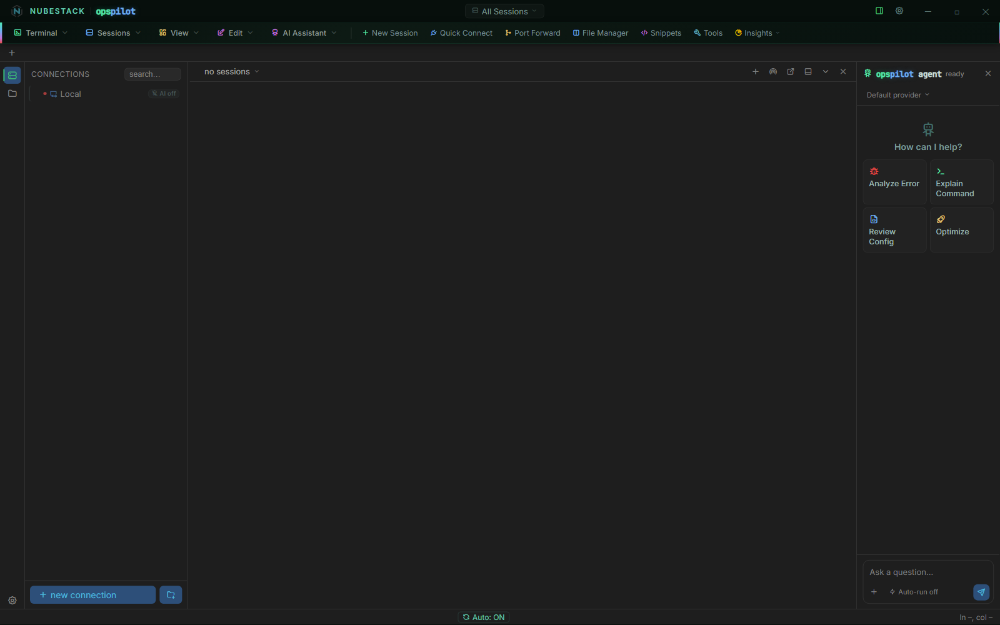

# First run

OpsPilot opens with nothing configured, nothing connected and nothing sent anywhere.
This page describes what is in front of you after the first launch, and what to do
with it.

*First launch. The only entry in the connections list is **Local**, and its badge
reads **AI off** — the seeded Local connection ships that way. The AI panel on the
right says **ready**, which means the panel is loaded, not that a model is
configured.*

## What you are looking at

- **An empty connections list.** No sample hosts, no imported profiles, no discovery
  scan.
- **A `Local` entry.** A shell on the machine you are sitting at, available without
  configuring anything. Use it to check that the terminal works, and for the
  local-side half of a task. It ships with its AI badge off.
- **The AI panel, in its ready state.** It offers **Analyze Error**, **Explain
  Command**, **Review Config** and **Optimize** as starting points, and the composer
  shows an **Auto-run off** chip. No provider is selected because none is configured.
- **No open sessions.** The session tab bar is empty until you connect to something.

Nothing has been sent anywhere, because there is nowhere to send it to and no session
to read from. There is also no account behind any of this — settings, connections and
profiles are local files on this workstation.

## What to do first

1. **Open a `Local` session.** Double-click **Local**. You get a real shell in a real
   terminal, which confirms the install is sound.
2. **Create your first real connection.** Use **+ new connection** at the foot of the
   list. See [Add a connection](../connections/adding-connections.md), or follow
   [Quickstart](quickstart.md) if you want the whole loop in one pass.
3. **Decide how the AI reaches you** — a provider you supply credentials for, a local
   model, or an external assistant you already pay for. All three are covered in
   [AI Providers](../ai/providers.md) and [AI Assistants](../ai/assistants.md).
4. **Set your safety policy** before you give the AI anything interesting to look at.
   **Settings → Security → Command Safety** is where auto-run and dangerous-command
   confirmation live.

## AI access is scoped per connection

Configuring a provider does not make the AI able to see your sessions. Each connection
carries its own **Enable AI** toggle, and a connection with it off is invisible to
every model and every assistant — no scrollback, no host details, nothing.

!!! warning "Set the toggle deliberately on each connection you care about"
    The new-connection dialog does not open with **Enable AI** in the off state, so
    check it on every connection rather than relying on an inherited value. The
    seeded **Local** connection ships with AI off.

Rollout can therefore be incremental and reversible, provided you set the toggle
actively. Turn AI off everywhere you are not ready to expose, enable it on a
development host, watch how the loop behaves, and only then widen it. A connection you
have confirmed as off never participates, whatever else you configure.

!!! note "Before any AI is configured"
    OpsPilot is a complete terminal, file manager and remote-desktop client on its
    own. If you never configure a provider, that is what you have, and it sends
    nothing anywhere.

## See also

- [Quickstart](quickstart.md) — first connection to first AI answer in about five
  minutes
- [Add a connection](../connections/adding-connections.md) — every field in the
  connection dialog
- [AI Providers](../ai/providers.md) — the providers that ship and how to configure
  one
- [Approvals & auto-run](../safety/approvals.md) — what happens when the AI proposes
  something
