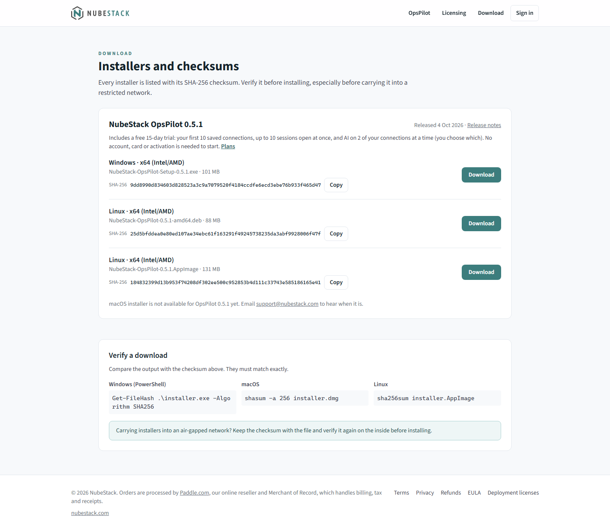

# Install

OpsPilot installs on your own workstation from the public download page. You need no
account to download or install it, the first launch starts a 15-day free trial, and
nothing is installed on the hosts you connect to. The current version is 0.5.1.

=== "Windows"

    1. **Open the download page.** Go to
       [subscription.nubestack.com/download](https://subscription.nubestack.com/download).
       No sign-in is needed. The page lists each installer with its file name, size and
       SHA-256 checksum.

        
        _The download page. Each installer has its own row with its SHA-256 and a **Copy**
        button for it; **Release notes** links to this site's release notes._

    2. **Download the installer.** Choose **Download** on the **Windows · x64
       (Intel/AMD)** row. The file is `NubeStack-OpsPilot-Setup-0.5.1.exe`.

    3. **Check its SHA-256.** Open PowerShell in the folder you saved the file to and
       run:

        ```powershell
        Get-FileHash .\NubeStack-OpsPilot-Setup-0.5.1.exe -Algorithm SHA256
        ```

        Compare the `Hash` value with the SHA-256 shown next to the installer on the
        download page; its copy button copies it. They must match exactly, apart from
        upper and lower case. To let PowerShell compare them, paste the checksum from
        the page between the quotes:

        ```powershell
        (Get-FileHash .\NubeStack-OpsPilot-Setup-0.5.1.exe -Algorithm SHA256).Hash -eq 'paste-the-sha-256-here'
        ```

        `True` means the file is the one NubeStack published. If the values differ,
        delete the file and download it again. If you carry the installer into a
        restricted network, keep the checksum with it and check it again there.

    4. **Run the installer.** The installer is signed with NubeStack's own
       code-signing certificate, which Windows does not trust by default. Once the
       SHA-256 has matched:

        - If SmartScreen shows **Windows protected your PC**, choose **More info**,
          then **Run anyway**.
        - The User Account Control prompt names the publisher as **Unknown
          publisher**. Choose **Yes**: OpsPilot installs for every user of the machine,
          which needs administrator rights.
        - Choose the installation directory, then finish the installer. If an older
          OpsPilot is running, the installer offers to close it first.

        Organisations that want the warning gone can trust NubeStack's certificate on
        their machines through Group Policy.

    5. **Start OpsPilot.** Launch **NubeStack OpsPilot** from the Start menu. The first
       launch starts the 15-day free trial: no account, no email and no activation. The
       title bar shows **Trial · 15 days left**. [First run](first-run.md) shows and
       describes the window.

    **What setup changes on Windows**

    - Installs OpsPilot for every user of the machine, in the directory you chose, with
      a Start menu entry.
    - Creates `%ProgramData%\NubeStack\OpsPilot`, with a `licenses` folder inside it.
      This is where your IT team can place an IT policy file (`policy.json`) and
      license files that apply to every user of the machine.
    - On every install, sets `%ProgramData%\NubeStack` so that only administrators and
      the system account can write to it, and other users can only read it. Any other
      write access added there is removed at the next install. Deployment tools that
      run as an administrator or as the system account, such as Group Policy, Intune
      or SCCM, keep working.

=== "macOS"

    !!! note "Not on the download page yet"
        The macOS installers are not on the download page yet. Email
        support@nubestack.com to hear when they are. The steps below apply once they
        are published.

    1. On the [download page](https://subscription.nubestack.com/download), download
       the build that matches the machine: DMG or ZIP, for Intel (x64) or for Apple
       Silicon (arm64).
    2. Check its SHA-256 against the one on the download page:

        ```bash
        shasum -a 256 <the-dmg-file>
        ```

    3. Open the DMG and drag **NubeStack OpsPilot** to **Applications**, or unpack the
       ZIP and move the application there.
    4. Launch it from **Applications**. The first launch starts the 15-day free trial.

    Install Microsoft's Windows App if you need remote desktop: on macOS an RDP
    session opens there in its own window rather than as an in-app tab. Everything
    else works as it does on Windows.

=== "Linux"

    OpsPilot for Linux (x64) comes in two forms on the
    [download page](https://subscription.nubestack.com/download): a `.deb` package for
    Debian, Ubuntu and their derivatives, and an AppImage that runs on most other
    distributions without installing anything. On Debian or Ubuntu, use the `.deb`.

    **The `.deb` package (Debian, Ubuntu)**

    1. Download `NubeStack-OpsPilot-0.5.1-amd64.deb` from the **Linux · x64** row.
    2. Check its SHA-256 against the one on the download page:

        ```bash
        sha256sum NubeStack-OpsPilot-0.5.1-amd64.deb
        ```

    3. Install it. `apt` also installs the few libraries it needs:

        ```bash
        sudo apt install ./NubeStack-OpsPilot-0.5.1-amd64.deb
        ```

    4. Start **NubeStack OpsPilot** from the applications menu, or run `opspilot-mvp`.
       The first launch starts the 15-day free trial.

    **The AppImage (other distributions)**

    1. Download `NubeStack-OpsPilot-0.5.1.AppImage` from the **Linux · x64** row.
    2. Check its SHA-256:

        ```bash
        sha256sum NubeStack-OpsPilot-0.5.1.AppImage
        ```

    3. Make it executable and run it. Nothing is installed system-wide.

        ```bash
        chmod +x NubeStack-OpsPilot-0.5.1.AppImage
        ./NubeStack-OpsPilot-0.5.1.AppImage
        ```

        An AppImage needs FUSE 2 to start (the `libfuse2` package; on Ubuntu 24.04 and
        later, `libfuse2t64`).

    4. The first launch starts the 15-day free trial.

    The Linux packages are not code-signed, so the SHA-256 check is how you know the
    file is the one NubeStack published.

    Install FreeRDP (`xfreerdp` or `xfreerdp3`) on your `PATH` if you need remote
    desktop: on Linux an RDP session opens in an external window rather than as an
    in-app tab.

## Installing on a machine with no internet

Every installer works on a computer with no network connection at all. The fonts and
icons are inside the application, nothing is downloaded during installation or at
start-up, and OpsPilot has no auto-updater. Each installer is checked for this when it
is built, and started once with the network off before it is published.

To install on an air-gapped computer, download the installer on a connected one, check
its SHA-256 there, carry the file in, and check the SHA-256 again on the inside before
running it. The free trial starts without a network; to license the computer, use
offline activation or a deployment license (see [Activate OpsPilot](../licensing/activation.md)).

## When the trial cannot start

The trial needs OpsPilot to be able to save its settings in your user profile, where
it keeps the trial's start; reinstalling OpsPilot does not restart it. On a locked-down
desktop where nothing can be saved there, no trial starts: the terminal still works
with up to 10 sessions open at once, and **Settings → License** says why. For such
machines, ask NubeStack (support@nubestack.com) for an evaluation license.

If the computer's date is wrong on the first launch, the trial waits until it is
corrected, so you still get all 15 days.

## After you subscribe

Subscribing does not mean installing again. Open **Settings → License** in the
OpsPilot you already have and activate it there: online with your license key, or
offline with a license file, which needs no network on this computer. Your
connections, profiles and settings stay as they are. See
[Activate OpsPilot](../licensing/activation.md), and
[Licensing for IT](../licensing/for-it.md) for rolling OpsPilot out to many computers
or to a network where nothing may leave.

## Updates

OpsPilot never updates itself. To upgrade, download the new installer from the same
page, check its SHA-256 and run it over the installed version; your connections,
profiles, settings and license are kept. [Backup & upgrade](../operations/backup-and-upgrade.md)
says what to back up first.

## What installation does not do

- **No account.** Nothing asks you to register or sign in to install OpsPilot or to
  start the trial.
- **No cloud tenancy.** There is no backend to provision.
- **No mandatory licensing connection.** OpsPilot does not phone home to be allowed to
  start. It contacts `license.nubestack.com` only if you choose online activation.
- **No telemetry.** Settings, connections and profiles stay on the workstation.
- **Nothing on your target hosts.** No agent, no daemon, no sidecar, no inbound
  firewall rule.

## What you have immediately

OpsPilot is fully functional as a terminal the moment it starts. You can create
connections, open sessions, transfer files and use the built-in tools without
configuring any AI at all. During the trial you can have up to 10 sessions open at
once, use your first 10 saved connections, and have AI on 2 of your connections at a
time, which you choose. See [Free trial and limits](../licensing/trial-and-limits.md).

The AI features activate once you either configure a provider under
**Settings → AI Providers** or connect an external assistant over MCP. Until then the
AI panel sits in its ready state and nothing is sent anywhere.

AI access is scoped per connection as well. A connection with **Enable AI** off is
invisible to every model and every assistant, so configuring a provider does not by
itself expose a session. Set the toggle deliberately on each connection you care
about rather than assuming a default.

## See also

- [System requirements](requirements.md) — check the workstation first
- [First run](first-run.md) — what you are looking at after the first launch
- [Quickstart](quickstart.md) — first connection to first approved command
- [Activate OpsPilot](../licensing/activation.md) — what to do after you subscribe
