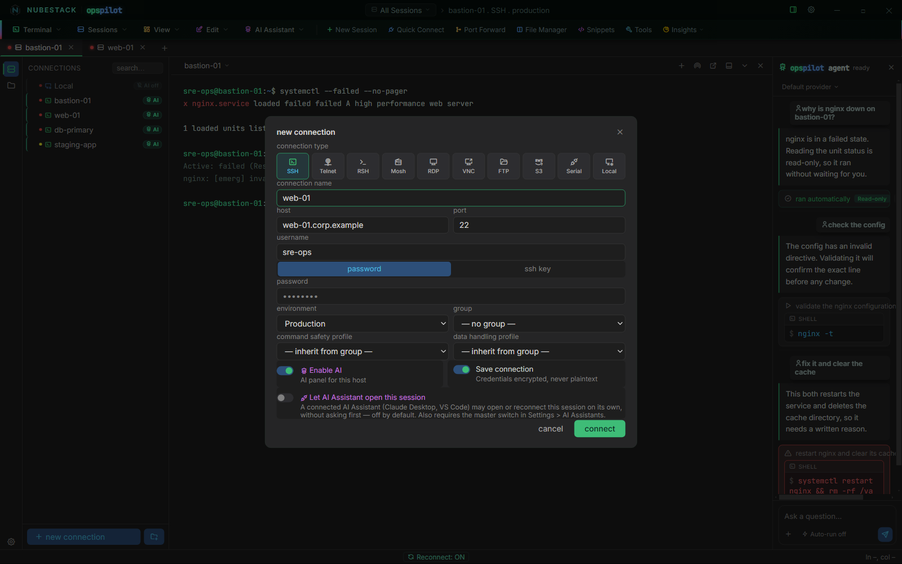

# Quickstart

From a fresh install to a diagnosed failure and an approved command, in roughly five
minutes. You need one host you can log into and nothing else — no account, no API key
yet, and no changes on the host.

If you have not installed OpsPilot yet, start with [Install](install.md).

## Step 1 — Create a connection

Click **+ new connection**. Pick **SSH**, then fill in the host, port, username and
either a password or an SSH key.



*The new connection dialog. **Enable AI** is the toggle that decides whether the AI
panel may see this host at all, and **Let AI Assistant open this session** — off by
default — is a separate, stricter permission for external assistants.*

Set two fields deliberately before you click **connect**:

- **environment** tags the connection (production, staging, development, or your own).
  Environments drive the colour-coding in the connections list, and they are how you
  scope safety policy later. Tag each connection for what it really is, so you do not
  have to reclassify a fleet afterwards.
- **Enable AI** controls whether the assistant may see this session at all. Leave it
  off for anything you are not ready to expose. A connection with it off is invisible
  to every model and every assistant.

Leave **Save connection** on so the entry persists — credentials are stored encrypted,
never in plaintext. Click **connect**, and from then on double-click the saved
connection to open it again.

## Step 2 — Work normally

You now have a real terminal: full xterm emulation, GPU-accelerated rendering, search,
copy and paste, and a session tab bar for working across several hosts at once.

Nothing about your normal workflow changes, and nothing in this step involves the AI.
OpsPilot is a complete terminal before any AI is configured.

## Step 3 — Choose how the AI reaches you

The AI can reach you by one of three routes, suiting different constraints. Open
**Settings → AI Providers** for the first two.

- **Fastest to try: OpenRouter.** It has free tiers suitable for evaluation, so you
  can see the loop working before committing to a provider.
- **Best for a locked-down environment: Ollama.** Install Ollama, run
  `ollama pull llama3.3`, then point OpsPilot at `http://localhost:11434`. Nothing
  leaves the machine. Small local models are less precise at diagnosis than the large
  cloud models.
- **If you already pay for Claude, ChatGPT or Copilot:** skip providers entirely and
  connect it as an [AI Assistant](../ai/assistants.md) over MCP. No second
  subscription, no API key.

For a provider, click **Test** to confirm the credentials work, then **Save**.

## Step 4 — Ask something

Break something harmless first. This produces a real failure with no consequences:

```bash
systemctl status a-service-that-does-not-exist
```

Then type in the AI panel:

> *why did that fail?*

You get a diagnosis and, usually, a proposed next command carrying a risk badge. Read
it — the exact text you are about to run is shown to you. Click **approve & run** and
watch it execute in the real terminal.

The command did not run until you clicked. A model's output is a proposal, and it
becomes a real command only through an explicit approval event raised by your action.
No provider, prompt, assistant or setting changes that.

If a 🔒 badge appears on the turn, redaction fired before anything left the machine.
The number beside the padlock is how many values were replaced; hover it to see which
categories were scrubbed.

## Step 5 — Set your safety policy

Open **Settings → Security → Command Safety** and decide the following.

1. **Auto-run safe commands** — off by default. Leave it off until you have watched
   the assistant work for a while. When you do turn it on, it applies only to
   <span class="tier tier-readonly">Read-only</span> steps.
2. **Dangerous command confirmation** — on by default. Keep it on. It is what forces a
   typed, written reason on a
   <span class="tier tier-high">High risk</span> command rather than a single click.
3. **Dangerous patterns** — the strings that must never run unnoticed on your estate.
   A shipped default list already covers the obvious ones (`rm -rf`, `dd if=`, `mkfs`,
   `drop table`, `shutdown` and more), so your job is to add what is specific to your
   estate.

??? example "Estate-specific patterns worth adding"
    Start from the things that are irreversible in *your* environment rather than in
    general:

    ```text
    terraform destroy
    ```

    Then your own: the cluster-wipe script, the deployment tool's teardown
    subcommand, the storage command that reinitialises an array. Patterns are plain,
    case-insensitive substrings — not regexes — so a fragment of the command is
    enough.

Matching a pattern can only promote a command to
<span class="tier tier-high">High risk</span>. Nothing on your list can demote a
command the model already flagged, so adding patterns can only make the gate stricter.

## Where to go next

You have the loop working on one host. The next decisions are about scope: which
connections get AI enabled, which groups carry which
[Command Safety profile](../safety/command-safety-profiles.md), and whether a
[Data Handling profile](../safety/data-handling-profiles.md) needs tightening for your
data.

## See also

- [Execution boundary & risk tiers](../safety/risk-tiers.md) — read this before
  rolling OpsPilot out to a team
- [AI Providers](../ai/providers.md) — every provider that ships, and what each needs
- [Offline with Ollama](../ai/offline-ollama.md) — the fully offline route in detail
- [Connection types](../connections/connection-types.md) — the other nine things you
  can connect to
