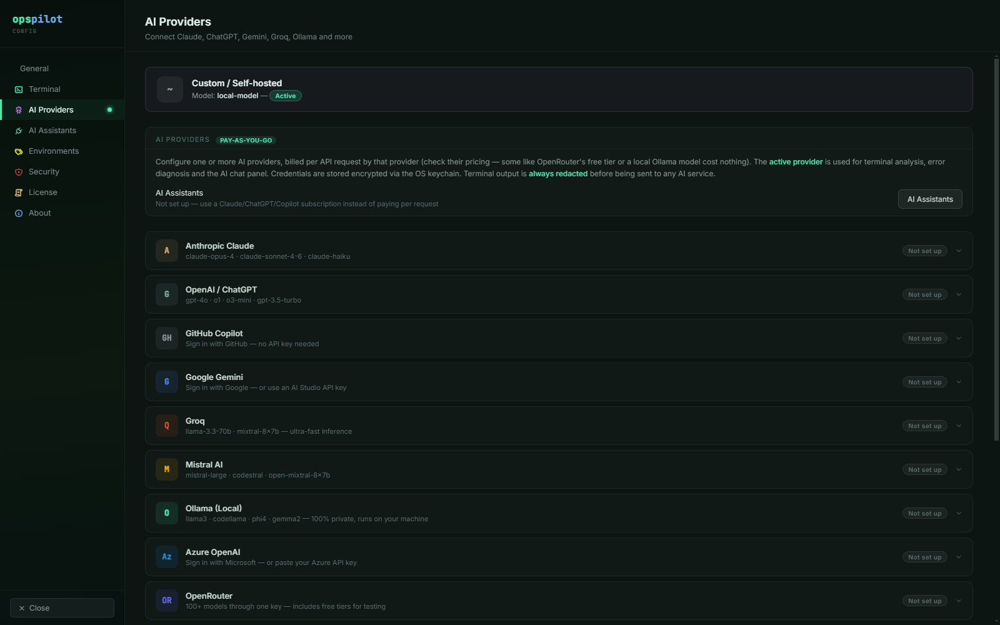

# Quickstart

From a fresh install to a diagnosed failure and an approved command, in roughly five
minutes. You need one host you can log into over SSH and nothing else — no account, no
API key yet, and no changes on the host. Everything here works during the 15-day free
trial.

## Step 1 — Install and start OpsPilot

1. Download the installer from
   [subscription.nubestack.com/download](https://subscription.nubestack.com/download).
2. Check its SHA-256 against the one on the download page, then run it.
   [Install](install.md) has the commands and explains the Windows publisher warning.
3. Start **NubeStack OpsPilot**. The first launch starts the free trial with no
   account and no email, and the title bar shows **Trial · 15 days left**.


_The trial chip sits at the right of the title bar and opens **Settings → License**.
The **+ new connection** button you need next is at the foot of the connections list;
on a new install the list holds only **Local**._

## Step 2 — Create a connection

Click **+ new connection** at the foot of the connections list. Pick **SSH**, then
fill in a connection name, the host, port and username, and either a password or an
SSH key.


_The new connection dialog. **Enable AI** decides whether the AI may see this host at
all, and **Let AI Assistant open this session** is a separate, stricter permission for
external assistants. The two profile fields can stay on **— inherit from group —**._

Set these before you click **connect**:

- **environment** tags the connection as **production** or **staging**, or as an
  environment you add under **Settings → Environments**. Environments drive the
  colour-coding in the connections list, and they are how you scope safety policy
  later. Tag each connection for what it really is, so you do not have to reclassify a
  fleet afterwards.
- **Enable AI** controls whether the AI may see this session at all. Turn it on for
  this connection, since it is the one you will try the AI on. A connection with it off
  is invisible to every model and every assistant.
- **Let AI Assistant open this session** — leave it off for now.
- **Save connection** — leave it on so the entry persists. Credentials are stored
  encrypted, never in plaintext.

Click **connect**. From then on, double-click the saved connection to open it again.

## Step 3 — Work normally

You now have a real terminal: full xterm emulation, GPU-accelerated rendering, search,
copy and paste, and a session tab bar for working across several hosts at once. During
the trial you can have up to 10 sessions open at once.

Nothing about your normal workflow changes, and nothing in this step involves the AI.
OpsPilot is a complete terminal before any AI is configured.


_A connected SSH session. The banner confirms the connection, its environment and
**ai: enabled**. Here nginx fails to start, which is the kind of failure to hand to
the AI in the next steps. The bar along the bottom is the system monitor for this
host._

## Step 4 — Turn AI on

First choose how the AI reaches you. Open **Settings** (the gear in the title bar),
then **AI Providers**:

- **Fastest to try: OpenRouter.** It has free tiers suitable for evaluation, so you
  can see the loop working before committing to a provider.
- **Best for a locked-down environment: Ollama.** Install Ollama, run
  `ollama pull llama3.3`, then point OpsPilot at `http://localhost:11434`. Nothing
  leaves the machine. Small local models are less precise at diagnosis than the large
  cloud models.
- **If you already pay for Claude, ChatGPT or Copilot:** skip providers and connect
  it as an [AI Assistant](../ai/assistants.md) over MCP instead. Model usage is
  covered by that plan, with no API key; connecting it needs your OpsPilot trial or a
  subscription.

For a provider, click **Test Connection** to confirm the credentials work, then
**Save & Activate**.


_Settings → AI Providers. The provider in use sits at the top, marked **Active**. The
others are listed below, each **Not set up** until you open it and enter its
credentials._

Then check that AI is on for your connection. Its badge in the connections list should
read **AI**. During the trial, AI can be on for 2 of your connections at a time, and
the first two connections you save with **Enable AI** on take those two places, so
your first SSH connection has AI. If its badge reads **AI off · trial limit**, click
the badge: it takes a free place at once, or a dialog offers
**Use AI on … instead of …** one of the two connections that have it. See
[Free trial and limits](../licensing/trial-and-limits.md).

## Step 5 — Ask the AI panel

Break something harmless first. In the SSH session, run a command that fails with no
consequences:

```bash
systemctl status a-service-that-does-not-exist
```

Then type in the AI panel's **Ask a question…** box and press Enter:

> *why did that fail?*

You get a diagnosis and, usually, a proposed next command on a card carrying a risk
badge — <span class="tier tier-readonly">Read-only</span>,
<span class="tier tier-low">Low risk</span> or
<span class="tier tier-high">High risk</span>.

If a 🔒 badge appears on the turn, redaction fired before anything left the machine.
The number beside the padlock is how many values were replaced; hover it to see which
categories were scrubbed.


_Asked why nginx does not start, the AI says what it will check and proposes
`nginx -t`, which tests the configuration without changing it. The card carries a
**Read-only** badge and waits for **approve & run** or **dismiss**._

## Step 6 — Approve the proposal

Read the command on the card: it is the exact text that will be typed into the
session. Click **approve & run** to run it, or **dismiss** to drop it. The command runs
in the real terminal, and its output, redacted, feeds the next turn of the
conversation.

A <span class="tier tier-high">High risk</span> card says why the command was flagged
and asks why it is needed. Type a reason of at least ten characters, then click
**confirm & run**. The reason is kept with the command.


_A **High risk** card. The note under the command says why it was flagged: it matches
the `rm -rf` pattern in the Default profile. **confirm & run** works only once a reason
is typed in the box._

The command did not run until you clicked. A model's output is a proposal, and only
OpsPilot's own code types it into the session: after your click, or under a rule you
set in advance in your Command Safety profile, which is the next step. No provider,
prompt or assistant can make it run any other way.

## Step 7 — Set your safety policy

Open **Settings → Security → Command Safety**. Clicking the **Auto-run off** chip in
the AI panel's composer opens the same page. The three rows there set the rules for
the **Default** profile, which every group and connection uses until you give it a
profile of its own:

1. **Run commands without asking me** — ships as **Ask me every time**, so nothing
   runs until you click. Leave it there until you have watched the AI work for a
   while. **Only read-only commands** lets commands that only look at things run by
   themselves; **Everything except dangerous ones** runs whatever the AI suggests
   unless it counts as dangerous.
2. **What counts as a dangerous command** — ships as **The AI's warning and my list**.
   Keep it: a command is then dangerous if the AI says it is destructive or if it
   contains one of your patterns. **Only my list** ignores the AI's warning and makes
   your list the only judge.
3. **Make me type a reason for dangerous commands** — on as shipped. Keep it on. A
   dangerous command always needs a click; this adds the typed reason.

Under the rows, **What this means right now** spells out the result in plain
sentences. Click **Save Security Settings** to keep your choices; saving a looser
combination first shows **Check these rules before saving**.


_Command Safety as it ships. **What this means right now** turns the three rows into
plain sentences, here: nothing runs by itself, a command is dangerous if the AI warns
about it or it matches one of the 21 shipped patterns, and a dangerous command needs a
click and a typed reason. **How OpsPilot runs a command** is marked **Always
enforced**: it is not a setting._

Then check the dangerous patterns: choose **Manage profiles…** and edit the Default
profile's list of dangerous words. The shipped list already covers the obvious ones
(`rm -rf`, `dd if=`, `mkfs`, `drop table`, `shutdown` and more), so your job is to add
what is specific to your estate.

??? example "Estate-specific patterns worth adding"
    Start from the things that are irreversible in *your* environment rather than in
    general:

    ```text
    terraform destroy
    ```

    Then your own: the cluster-wipe script, the deployment tool's teardown
    subcommand, the storage command that reinitialises an array. Patterns are plain,
    case-insensitive substrings — not regexes — so a fragment of the command is
    enough.

With **The AI's warning and my list**, matching a pattern can only promote a command
to <span class="tier tier-high">High risk</span>. Nothing on your list can demote a
command the model already flagged, so adding patterns can only make the rules
stricter.

## Step 8 — Subscribe when you are ready

The trial runs for 15 days from the first launch, and the title bar counts them down.
When you are ready:

1. **Subscribe** at
   [subscription.nubestack.com/opspilot](https://subscription.nubestack.com/opspilot),
   or choose **Subscribe** under **1 Get a subscription** in **Settings → License**.
   Each person gets a license key that works on up to 2 devices.
2. **Activate this computer** in **Settings → License**, under **2 Activate this
   computer**: **Activate online** with your license key, or **Activate offline** with
   a request code and a license file, which needs no network on this computer.

Subscribing lifts the trial's limits, and AI comes back by itself in your open
sessions, except where you turned it off. If you do not subscribe, nothing is lost:
after the trial the terminal keeps working with your first 10 saved connections and up
to 10 sessions open at once, AI is off, and all your configuration is kept. See
[Subscribe](../licensing/subscribe.md) and
[Activate OpsPilot](../licensing/activation.md).


_**Settings → License** during the trial. The card at the top gives the trial's limits
and the day it ends. **1 Get a subscription** has **Subscribe** and the address to
open on another computer; **2 Activate this computer** offers **Activate online**,
**Activate offline** and **Import license file**._

## Where to go next

You have the loop working on one host. The next decisions are about scope: which
connections get AI enabled, which groups carry which
[Command Safety profile](../safety/command-safety-profiles.md), and whether a
[Data Handling profile](../safety/data-handling-profiles.md) needs tightening for your
data.

## See also

- [Execution boundary & risk tiers](../safety/risk-tiers.md) — read this before
  rolling OpsPilot out to a team
- [AI Providers](../ai/providers.md) — every provider that ships, and what each needs
- [Offline with Ollama](../ai/offline-ollama.md) — the fully offline route in detail
- [Licensing](../licensing/index.md) — the trial, subscribing and activation in full
