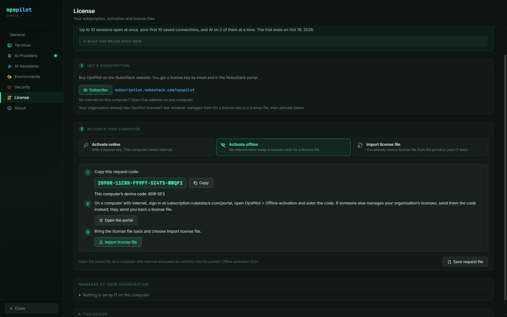
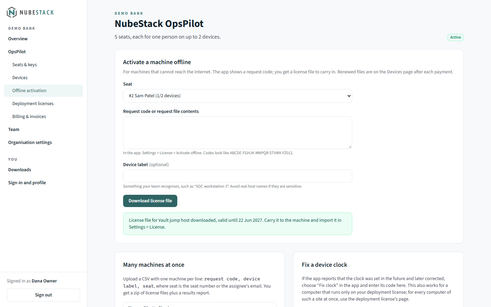
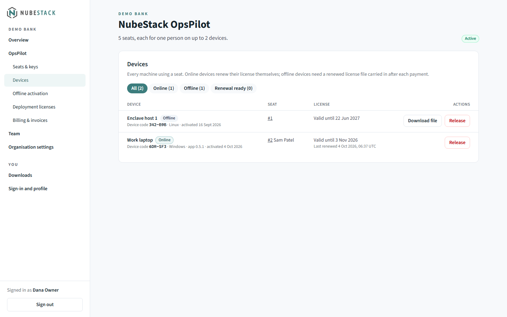

# Activate OpsPilot

After you subscribe, you activate each computer in **Settings → License**: online with a
license key, offline with a license file, or with an organisation-wide deployment
license installed by IT. Each is described below, with renewals, moving to another
computer, released computers, clock problems and the messages activation can show.

Activation is optional during the trial; the trial needs none.

## How licensing works

- **One seat per person.** Each seat has a license key (`OPSP-` followed by five groups
  of five characters) that works on up to 2 of that person's devices.
- **Licenses are signed and checked locally.** Every license OpsPilot accepts is signed
  by NubeStack and checked on your computer against keys built into OpsPilot, so a
  license works without a network connection and cannot be forged or altered on the
  way.
- **No network is required.** Only online activation talks to the license server.
  Offline activation and deployment licenses make no network connection at all.

| | Activate online | Activate offline | Deployment license |
|---|---|---|---|
| What you need | Your license key | A request code out, a license file in | One file for the whole organisation, from IT |
| Network on this computer | HTTPS to `license.nubestack.com` | None | None |
| Renewal | Automatic, about once a day | Import a renewed file after each payment | IT installs the renewed file |
| Best for | Laptops and desktops with internet | Air-gapped and isolated computers | Sites where nothing may leave |

You reach the license settings from **Settings → License**, from **View → License** in
the menu, from the license chip in the titlebar, or from **Manage** on the License row
of **Settings → About**.

## Settings → License

The page reads from top to bottom:

- **The state card**: what you have now, such as **Free trial · 12 days left** or
  **Licensed to Demo Bank PLC**, with **What this means right now**.
- **Fix clock**, only when the computer's clock needs fixing.
- **1 Get a subscription**, in the trial and without a subscription: **Subscribe** and
  the address to open on another computer, `subscription.nubestack.com/opspilot`.
- **Your license**, once something is activated or imported: how this computer is
  licensed, the license files, this computer's device code and, where they apply, **Check
  now**, **Deactivate this device**, **Import license file** for renewed files, and
  **Open the portal**.
- **2 Activate this computer**, with three ways to choose from: **Activate online**,
  **Activate offline** and **Import license file**. Once the computer is licensed, this
  folds under **Use a different license key or file**.
- **Managed by your organisation**: what IT has set on this computer, with **Check
  again**. See [Licensing for IT](for-it.md).
- **This device**: platform, device identity, device code, OpsPilot version and
  revocation list.

_Once the computer is licensed, the state card names the organisation and the seat
holder, **Your license** shows the online activation and this computer's device code,
and the ways to activate fold under **Use a different license key or file**._

## Activate online

1. Open **Settings → License**.
2. Under **2 Activate this computer**, choose **Activate online**.
3. Enter your **License key**. Spaces, dashes and lower case do not matter.
4. Optionally enter a **Device label**, such as "Work laptop", to tell your devices apart
   in the portal. Avoid real host names if they are sensitive.
5. Choose **Activate**.

_The card says what activation sends before you choose **Activate**. The key field is
masked; the eye button shows what you typed._

OpsPilot says "Activated. This computer is licensed to" followed by your organisation's
name. The steps fold away, and **Your license** shows the online activation. OpsPilot
does not keep the key: it clears the field, and stores only an activation secret,
encrypted by the operating system.

### What is sent, and how often

| When | What OpsPilot sends to `license.nubestack.com` |
|---|---|
| Once, at activation | The license key, a one-way device ID, the device label you chose, the platform, the app version, and whether the key was set by IT |
| Every 5 minutes while the computer is in use, and a few seconds after OpsPilot starts, the computer wakes or the screen is unlocked | The activation ID, the device ID, the app version and a proof made with the activation secret, asking only whether this computer is still licensed. The license server does not record this check |
| About once a day | The same, to renew the 30-day license and fetch the latest revocation list. The renewal records when this device last renewed, which your organisation's license managers see in the portal as **Last renewed** |

"In use" means someone has used the keyboard or mouse in the last 15 minutes and the
screen is not locked, or AI is being used on this computer through an AI Assistant or
the ChatGPT tunnel. OpsPilot never sends terminal content, host names, user names,
IP-derived data or anything about your work.

There is no setting for fewer checks. To keep a computer from contacting the license
server at all, use **Activate offline**, or ask IT to turn online activation off (see
[Licensing for IT](for-it.md)).

If the computer cannot reach the license server, its license keeps working until the
30-day online license ends. After that, AI turns off and OpsPilot asks you to check the
network and choose **Check now**, or to use **Activate offline**.

### Proxies, firewalls and TLS inspection

OpsPilot uses HTTPS on TCP port 443, with the operating system's proxy settings and
certificate store, so proxies and TLS inspection work. Licenses are checked by their
signature, so a proxy cannot change them. Allow `license.nubestack.com` on your firewall
or proxy if you use online activation.

### Secure storage on Linux

Online activation keeps its activation secret in the operating system's secure storage.
Windows and macOS always have it. On Linux it needs an unlocked keyring, such as GNOME
Keyring or KWallet. Without one, OpsPilot says "Online activation is off because this
computer has no secure storage for it" and offers **Activate offline** instead, since
license files need no secret. To use online activation, install and unlock a keyring,
then restart OpsPilot.

## Activate offline

Offline activation works with no network on the computer. You carry a short request
code out, and a license file back in.

1. Open **Settings → License**, and under **2 Activate this computer** choose
   **Activate offline**.
2. Choose **Copy** next to the request code: 25 characters in five groups. This
   computer's device code is shown under it.

    
    _The request code carries no license key and nothing about your work. **Save request
    file**, at the bottom, saves the same request as a file._

3. On any computer with internet, sign in at <https://subscription.nubestack.com/portal>
   and open **OpsPilot → Offline activation**. If someone else manages your
   organisation's licenses, send them the code instead; they send you back a license
   file.
4. Under **Activate a machine offline**, choose the **Seat**, paste the code into
   **Request code or request file contents**, optionally enter a **Device label**, and
   choose **Download license file**.

    
    _The **Seat** list shows how many of each seat's 2 devices are in use. **Many
    machines at once** and **Fix a device clock** are further down the same page._

5. Bring the `.opslic` file to the computer, and in **Activate offline** choose **Import
   license file**.

    
    _The portal confirms which device the file is for and the date it is valid until._

OpsPilot says "License file imported:", with the name it is licensed to and the date it
is valid until. Nothing on this computer touched the network.

- **Request file instead of a code.** Where a file may leave the site but typing a code
  is impractical, choose **Save request file**. On a computer with internet, paste the
  file's contents into the same portal form.
- **Pasting instead of a file.** Under **Import license file**, **Paste license text
  instead** accepts the text of a license file, and **Import pasted text** imports it.
- **Copies made on Windows work.** A license file saved by Notepad as "Unicode", or by
  PowerShell 5.1's `>`, imports like any other.
- **Many computers at once.** The portal's **Many machines at once** form takes a CSV of
  request codes; see [Licensing for IT](for-it.md#large-offline-fleets).

### Renew a license file

A license file covers the period paid for, plus 14 days of grace in which every feature
keeps working and OpsPilot shows **Renewal due**. After each payment:

1. In the portal, open **OpsPilot → Devices**. Computers with a renewed file show
   **Renewal available**.
2. Choose **Download file** for one computer, or **Download N renewed files** for a zip
   of all of them.
3. On the computer, open **Settings → License → Your license** and choose **Import
   license file**.

A renewal needs no new request code. The organisation's license managers get reminder
emails 30, 14 and 3 days before the newest license files expire.

### New annual subscriptions

For a subscription bought by card, the first license file covers about 74 days: the
first 60 days of the subscription plus 14 days of grace. From day 60 a full-term file is
available, and the portal says from which date when you download the first file. Renew
the file once in that window, as above.

## Deployment licenses

A deployment license is one license file for a whole organisation, for sites where
nothing may leave, not even a request code. It is bound to no single computer: IT
installs it in a machine-wide folder, and every computer that holds it is licensed.

1. In the portal, open **OpsPilot → Deployment licenses** and fill in **Request a
   deployment license**: **Seats to cover** (taken from unassigned seats with no
   devices), **Licensed to** (the legal name shown in OpsPilot) and **Environment**.
   Accept the deployment license terms and choose **Request deployment license**.
2. NubeStack reviews the request. Its status moves from **Awaiting NubeStack review** to
   **Approved**.
3. Open the deployment license and choose **Download license file**. This needs a
   sign-in within the last 12 hours.
4. IT places the file in the machine-wide `licenses` folder on each computer, or a user
   imports it with **Import license file**. **Check again** under **Managed by your
   organisation** reads the folder at once.

The seat count in a deployment license is contractual. Renewed files are under
**OpsPilot → Deployment licenses** in the portal. For the folder locations and
deployment with GPO, Intune or Ansible, see [Licensing for IT](for-it.md).

## Move to another computer

Each seat holds up to 2 devices. Uninstalling OpsPilot does not free a device's place.

- **Online:** on the old computer, open **Settings → License** and choose **Deactivate
  this device**, then activate on the new one.
- **Offline, or a computer you no longer have:** in the portal, open **OpsPilot →
  Devices** and choose **Release** on the old computer.
- **Remove from this computer only** removes the online activation without telling the
  license server. The place stays in use until you release the device in the portal, or
  until it frees itself after 45 days without contact.

Reimaging a computer or moving to new hardware gives it a new device identity, so it
needs activating again.

### Device codes

Several computers often have the same name, such as "OpsPilot on Windows". The **device
code**, six characters such as `R59-EFG`, tells them apart. OpsPilot shows it under
**Your license**, next to the request code in **Activate offline**, and under **This
device**. The portal shows the same code next to each device on the **Devices** page and
in the release confirmation. Match the code before you release a device. The code only
identifies the computer; it licenses nothing.

_Each device shows its device code, Online or Offline, and the seat it uses. Online
devices show when they last renewed; offline devices have **Download file** for their
renewed file._

When a key is already in use on 2 devices, activation says so and lists the two devices
with their device codes, with **Manage devices in the portal**.

_The list gives each device's label, device code and whether it is online or offline,
and for a released device the date its place frees._

### When a released place frees

A released device's place usually frees at once. Immediate releases are limited each
month; once they are used up, the place frees when that device's current license would
have ended, and the portal says on which date. An online device that has not
renewed for 45 days is released automatically.

## Released computers

When a computer is released in the portal, the license server cannot reach it, so how
soon it stops using that license depends on the computer:

| The computer | When it stops using the license |
|---|---|
| Activated online, OpsPilot open and the computer in use | Within about 5 minutes |
| Activated online, idle or locked | Soon after someone uses it again, or seconds after it wakes or is unlocked |
| Activated online, OpsPilot closed or the computer off | Seconds after OpsPilot next starts with a network |
| Activated online, but offline or with the license server blocked | When its 30-day online license ends |
| A license file or deployment license | When a revocation list reaches it (with an OpsPilot update, or imported by IT), or when the file expires |

AI then turns off, unless the computer is still in its trial or holds another license.
The terminal keeps working, no session is closed, and an AI answer already being written
finishes.

OpsPilot then says who released the computer, in a notice below the tabs that never
takes the keyboard from your terminal, and in **Settings → License**:

| Notice | What happened | What to do |
|---|---|---|
| **This computer was released from its subscription** | You, or whoever manages licenses in your organisation, released it in the portal | Activate it again with a license key to use AI here |
| **This computer's license key was replaced** | Your organisation gave the seat a new key; the old one no longer works | Ask for the new key |
| **NubeStack support released this computer** | For example after it was reported lost | Ask whoever manages licenses in your organisation |
| **Released after 45 days without renewal** | The computer was switched off or offline all that time | Activate it again with your key |

If the subscription had already ended when the computer was released, OpsPilot goes on
saying that the subscription ended, with the same limits, until it is paid again; then
it says that the computer was released, and why.

**Dismiss** on the notice hides it. The explanation stays in **Settings → License** until
you choose **Dismiss** there.

A computer whose key IT set in `policy.json` does not activate again with that key by
itself after such a release; see [Licensing for IT](for-it.md#policyjson).

## Clock problems

OpsPilot compares the computer's clock with the times in its signed licenses and with
the latest time it has seen. If the clock was set back, or was once set far ahead and
then corrected, it cannot tell how long a license or the trial has really run, so AI
pauses. The terminal keeps working, with up to 10 sessions open at once and every saved
connection usable. The titlebar shows **Clock problem · AI paused**, and a banner offers
**Fix clock**.

1. Correct the computer's date and time. OpsPilot checks again every minute; **Check
   again** under **Fix clock** checks at once.
2. If the clock is right and the problem stays, it was once set to a later date. Then:
    - **Online activation:** choose **Check now**. An answer from the license server
      repairs the clock record.
    - **License file:** use a clock-reset file. Copy the code shown under **Fix clock**
      (or choose **Save clock-reset request file**). In the portal, open **OpsPilot →
      Offline activation → Fix a device clock**, enter the code and choose **Download
      clock-reset file**. Back on the computer, choose **Import clock-reset file**. The
      file works once, on that computer, within 7 days.
    - **Deployment license only:** whoever manages licenses opens the deployment license
      in the portal and uses **Repair a computer's clock**: one file for every computer
      of the site, or one for this computer from its code. **Email NubeStack support**
      under **Fix clock** reaches support@nubestack.com, who can issue either file. See
      [Licensing for IT](for-it.md#clock-repair-on-a-deployment-license-site).
    - **Trial:** AI comes back once that later date has passed. Activating a license
      online also repairs it.

A clock-reset file licenses nothing, and it can never set the clock record earlier than
the day the file was made. Small corrections need no repair: OpsPilot accepts setting
the clock back by up to 48 hours in total.

## Messages during activation

| OpsPilot says | Meaning | What to do |
|---|---|---|
| That license key is not valid. Check it for typos. | The key is mistyped or does not exist | Check the key; ask whoever manages licenses in your organisation for it |
| This license key belongs to a different NubeStack product. | The key is for another product | Use your OpsPilot key |
| This license is already in use on 2 of 2 devices. | Both of the seat's device places are taken | Release a device in the portal, or deactivate it on that device; match the device codes OpsPilot lists |
| This seat is suspended. | The seat is suspended, for example after seats were reduced | Ask whoever manages licenses in your organisation |
| The subscription for this license is not active. | The subscription ended or a payment failed | The account owner renews it or updates the payment method in **Billing & invoices**; activated computers pick up the renewal by themselves |
| Licensing for this organisation is on hold. | NubeStack has paused licensing for the organisation | The account owner contacts NubeStack support |
| Too many requests. Wait and try again. | Too many attempts in a short time | Wait a few minutes and try again |
| Your organisation has turned off online activation on this computer. | IT set `"networkActivation": "disabled"` | Use **Activate offline** |
| OpsPilot could not read the IT policy file | `policy.json` exists but cannot be read, so online activation is off | Use **Activate offline**, and ask IT to check the file |
| Online activation is off because this computer has no secure storage for it | No keyring on Linux, or no operating system encryption | Use **Activate offline**, or install and unlock a keyring and restart OpsPilot |
| The license key on this computer is set by your organisation's IT policy | The key comes from `policy.json`, so it cannot be deactivated or removed here | Ask IT to remove it from `policy.json` |

## See also

- [Free trial and limits](trial-and-limits.md): what a license changes
- [Subscribe](subscribe.md): buy seats and send each person a key
- [Licensing for IT](for-it.md): policy files, deployment licenses and large fleets
- [Network requirements](../reference/network-requirements.md): firewall rules
