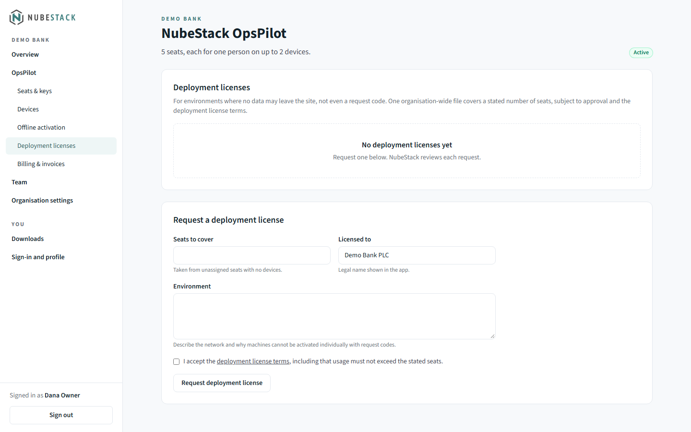
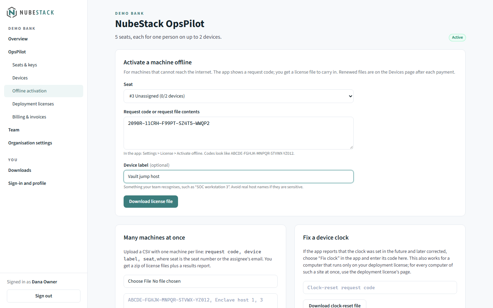

# Licensing for IT

For IT teams rolling OpsPilot out to many computers: the machine-wide folder IT
controls, `policy.json`, license files installed for every user, deployment licenses,
large offline fleets, roaming profiles and VDI, and the files OpsPilot keeps per user.

## Choosing a method

| Your computers | Use |
|---|---|
| Have internet access, one person each | Online activation, with the key typed by the user or set in `policy.json` |
| Isolated, but a request code may be carried out | Offline activation, in bulk with a CSV |
| On a site where nothing may leave | A deployment license, installed in the machine-wide folder |

A fully air-gapped installation needs two things: a local model for AI (see
[Offline with Ollama](../ai/offline-ollama.md)), and offline activation or a deployment
license. Set `"networkActivation": "disabled"` as well, so no computer tries the license
server.

## The managed folder

| Operating system | Folder |
|---|---|
| Windows | `%ProgramData%\NubeStack\OpsPilot\` |
| macOS | `/Library/Application Support/NubeStack/OpsPilot/` |
| Linux | `/etc/nubestack/opspilot/` |

Everything in this folder applies to every user of the computer, so only administrators
may be able to write it. Users need only read access.

- **Windows.** Any user can create folders under `ProgramData`, so the OpsPilot
  installer, which installs per machine with elevation, creates
  `%ProgramData%\NubeStack\OpsPilot\licenses` and sets `%ProgramData%\NubeStack` on every
  install: owner Administrators, full control for SYSTEM and Administrators, read-only
  for Users, no inherited entries. Deployment tools that run as SYSTEM or an
  administrator (GPO, Intune, SCCM) keep working; any other write access you added there
  is removed at the next install. The folder stays when OpsPilot is uninstalled.
- **macOS and Linux.** The locations above are writable only by administrators already.

If you deploy OpsPilot on Windows without its installer, set the same rights:

```text
icacls "%ProgramData%\NubeStack" /setowner *S-1-5-32-544 /T
icacls "%ProgramData%\NubeStack" /inheritance:r /grant:r *S-1-5-18:(OI)(CI)F *S-1-5-32-544:(OI)(CI)F *S-1-5-32-545:(OI)(CI)RX
```

OpsPilot reads the folder at start and every 10 minutes of its running time, so a
corrected clock never delays it. To apply a new file or policy at once, open **Settings
→ License → Managed by your organisation** and choose **Check again**. That section
shows the **IT policy folder** and what it sets:

| Row | Values |
|---|---|
| **Online activation** | **Allowed**, **Turned off by IT**, or **Off (policy file could not be read)** |
| **Device identity** | **This computer**, or **Roaming (virtual desktops)** |
| **License key** | **Set by IT**, or **Released on this computer** after a release (see below) |

When nothing is set, it reads "Nothing is set by IT on this computer."

## `policy.json`

Place `policy.json` in the managed folder. Every field is optional:

```json
{
  "networkActivation": "disabled",
  "licenseKey": "OPSP-XXXXX-XXXXX-XXXXX-XXXXX-XXXXX",
  "deviceIdentity": "roaming",
  "licenseServer": "https://license.nubestack.com"
}
```

| Field | Effect |
|---|---|
| `networkActivation` | `"disabled"`: OpsPilot never contacts the license server. Users activate offline or run on a deployment license. This is the only switch for licensing traffic: an online activation always makes its check every 5 minutes while the computer is in use, and there is no setting for fewer checks |
| `licenseKey` | A license key OpsPilot activates online with, automatically, on first start. See [A key set by IT](#a-key-set-by-it) |
| `deviceIdentity` | `"roaming"`: for non-persistent virtual desktops. See [Roaming profiles and VDI](#roaming-profiles-and-vdi) |
| `licenseServer` | Another license server address. Only an `https://` address is accepted, and **Settings → License** then names that server where it describes online activation, so users can see where their key goes |

- **A broken file turns online activation off.** A `policy.json` that exists but cannot
  be used (no permission to read it, invalid JSON, not a JSON object, or larger than
  64 KB) turns online activation off, and **Settings → License** says the policy file
  could not be read. A broken file never lets licensing traffic through. It does not
  change the device identity a computer already uses.
- **Any common encoding works.** UTF-8 with or without a byte-order mark, and UTF-16, so
  a file written by Notepad or by PowerShell 5.1's `>` reads correctly.

### A key set by IT

With `licenseKey`, OpsPilot activates online by itself and tells the license server the
key came from IT; the portal marks such devices **Key set by IT**. Each key is one
person's seat and works on up to 2 devices, so a key in `policy.json` suits computers
used by one person. On a shared computer, each operating system account counts as its
own device.

- **Users cannot deactivate it.** **Settings → License** says "The license key on this
  computer is set by your organisation's IT policy." To stop using it, remove it from
  `policy.json`.
- **After a release, the key is held on that computer.** When your organisation releases
  one of these computers in the portal, NubeStack support releases it, or the seat gets
  a new key, OpsPilot does not register that computer again with the same key by itself:
  **Managed by your organisation** shows **Released on this computer**. It uses a key
  from `policy.json` again once you put a different key there, or when someone on that
  computer activates with a key by hand (the same key included). Putting the same key
  back in the file does not undo the release.
- **Only the released computer holds the key back.** With a roaming profile, the same
  user's other computers keep using it. To stop the key on every computer, remove it
  from `policy.json` or choose **Reset seat** in the portal, which gives the seat a new
  key.
- **A release after 45 days without renewal is not held.** Such a computer was only out
  of touch, so it registers again by itself the next time it reaches the license server.

## License files for every user

License files in the `licenses` subfolder of the managed folder apply to every user of
the computer. Use it for deployment licenses, organisation-wide clock repair files and
revocation lists.

- OpsPilot reads up to 100 files, of at most 4.5 MB each and 20 MB in total. Files
  beyond that are skipped, and **Settings → License** warns about them.
- Only licenses, revocation lists and organisation-wide clock repair files count there.
  A clock-reset file made for one computer is imported on that computer instead.
- In **Settings → License**, these files are marked **(installed by IT)**. When one is
  about to expire, OpsPilot tells the user that IT renews it, and in the last 3 days to
  tell their IT team.

### Revocation lists

A computer activated offline, or on a deployment license, learns that a device or a
file was revoked when a revocation list reaches it. Each OpsPilot release includes the
latest list, so installing an update brings it. A revocation list file can also be
placed in the `licenses` folder or imported with **Import license file**; ask
support@nubestack.com for the current one.

## Deployment licenses

A deployment license is one signed file for the organisation, bound to no single
computer. It lifts every limit, like a subscription: no session limit, all saved
connections, AI in every session.

1. Request it in the portal under **OpsPilot → Deployment licenses** (see
   [Deployment licenses](activation.md#deployment-licenses)). NubeStack reviews the
   request.

    
    _**Environment** asks you to describe the network and why its computers cannot be
    activated one by one with request codes. **Licensed to** is the legal name OpsPilot
    shows._

2. Once it is approved, download the license file.
3. Deploy the file to the `licenses` folder on each computer with GPO, Intune, SCCM,
   Ansible or similar. The portal's deployment license page lists the folder for each
   operating system.
4. Computers pick it up at start or within 10 minutes; **Check again** applies it at
   once.

The seat count in a deployment license is contractual. When the subscription renews,
download the renewed file from the same page and replace the old one.

### Clock repair on a deployment-license site

If a computer's date was once set far ahead and then corrected, OpsPilot pauses AI on
it until real time passes the date it saw; the terminal keeps working. To fix it at
once, open the deployment license in the portal (**OpsPilot → Deployment licenses**,
then the license) and use **Repair a computer's clock**:

- **Every computer on this license, with nothing leaving the site:** choose **Download
  clock repair file** and put the file in the `licenses` folder next to the license file.
  Each affected computer repairs itself once its date and time are correct, at start or
  within 10 minutes. The file works for 30 days, and only where that deployment license
  is installed.
- **One computer:** enter the code shown under **Fix clock** in that computer's
  **Settings → License** and choose **Download clock-reset file**. On that computer,
  choose **Import clock-reset file**. The file works for 7 days, on that computer only.

A clock repair file licenses nothing, and it can never set a clock record earlier than
the day it was made. NubeStack support (support@nubestack.com) can issue either file.

## Large offline fleets

To activate many isolated computers at once:

1. On each computer, open **Settings → License → Activate offline** and collect its
   request code (**Copy**), or a request file (**Save request file**).
2. Write a CSV with one computer per line: `request code, device label, seat`, where
   `seat` is the seat number or the email address the seat is assigned to.
3. In the portal, open **OpsPilot → Offline activation**, and under **Many machines at
   once** upload the CSV or paste it, then choose **Create license files**.

    
    _**Many machines at once** sits below the form for a single machine and states the
    CSV format; the paste box shows an example line._

4. You get a zip of license files and a `results.csv` report. Import each file on its
   computer with **Import license file**.

After each payment, **OpsPilot → Devices → Download N renewed files** gives a zip of
renewed files for every offline computer.

## Roaming profiles and VDI

- **Roaming profiles.** On Windows, OpsPilot's application data folder is in the roaming
  profile (`%APPDATA%`), so the license state follows the user. A record in
  `%LOCALAPPDATA%` keeps the trial start when the roaming share is unreachable at
  sign-in.
- **Non-persistent VDI.** Where the machine identifier changes every session, set
  `"deviceIdentity": "roaming"`. OpsPilot then keeps a random device ID in
  `%APPDATA%\opspilot-mvp\licensing\device-id`, so each new desktop is the same device.
  If that folder cannot be written, OpsPilot starts with a temporary ID and warns that a
  license activated now stops applying after a restart.

## Per-user files

OpsPilot keeps its license state (the online activation and imported license files) in
the `licensing` folder of its application data folder. It keeps the trial start and a
clock record in three places, so deleting one does not reset the trial, and uninstalling
leaves them in place:

| | Windows | macOS | Linux |
|---|---|---|---|
| License state | `%APPDATA%\opspilot-mvp\licensing\` | `~/Library/Application Support/opspilot-mvp/licensing/` | `~/.config/opspilot-mvp/licensing/` |
| Trial and clock record | `markers.json` in that folder, `%LOCALAPPDATA%\NubeStack\.opspilot-m` and `%APPDATA%\NubeStack\.opspilot-m` | `markers.json` in that folder, `~/Library/Application Support/NubeStack/.opspilot-m` and `~/Library/Preferences/.com.nubestack.opspilot.m` | `markers.json` in that folder, `~/.local/share/nubestack/.opspilot-m` and `~/.config/nubestack/.opspilot-m` (or under `$XDG_DATA_HOME` and `$XDG_CONFIG_HOME`) |

Users must be able to write to these folders. If OpsPilot can write to none of them, it
cannot keep a trial start, so it offers no trial and **Settings → License** says so; the
terminal keeps working with up to 10 sessions open at once, from the first 10 saved
connections. Use a deployment license on such computers, or ask NubeStack for an
evaluation license.

Upgrading OpsPilot keeps the license state. Reimaging a computer or moving to new
hardware changes its device identity, so it needs activating again; release the old
device in the portal if both of the user's places are in use.

## What users can open without a license

On a computer without a valid license, OpsPilot opens up to 10 sessions at once,
including programs it starts in their own window (Mosh, VNC viewers, remote desktop on
macOS and Linux).

- **In the trial and without a subscription** (the trial ended, or a subscription or
  license file ran out), only the first 10 saved connections by creation time open; the
  others stay saved and locked. Creation times are kept in `connections.json` in the
  application data folder, and only OpsPilot sets them.
- **A clock problem, an identity check, a suspended license or a computer your
  organisation released** locks no saved connection; AI is off or paused.

A deployment license, like a subscription, an evaluation or a license file, lifts every
limit. For the full rules, see [Free trial and limits](trial-and-limits.md).

## Device identity

OpsPilot identifies a device by a one-way hash of the machine ID and the user account:
on Windows the MachineGuid, read with `reg.exe`, and the account, read with
`whoami.exe`; on macOS the hardware UUID; on Linux `/etc/machine-id`. No machine ID or
user name leaves the computer. Each operating system account on a shared computer is
its own device.

If one of those reads fails, OpsPilot does not guess. Licenses for that device pause
(AI paused, up to 10 sessions, every saved connection usable; deployment licenses still
apply), the titlebar shows **License check paused · AI paused**, and OpsPilot tries
again every few minutes. If your security tools block those programs for good, the user
can choose **Settings → License → Use this computer's current identity**. OpsPilot then
treats the computer as a new device: activate again online, or offline with the new
request code, and release the old device in the portal if both places are in use.

## One OpsPilot per user

OpsPilot runs once per operating system account. Starting it again for the same user,
also with a different `--user-data-dir`, brings the running window to the front instead
of opening a second copy. Other users of the same computer each run their own.

## See also

- [Activate OpsPilot](activation.md): online, offline and deployment licenses, step by
  step
- [Network requirements](../reference/network-requirements.md): firewall rules for the
  license server
- [Administration & rollout](../operations/administration.md): rolling OpsPilot out in
  stages
- [Hardening checklist](../safety/hardening.md): what to set before production use
