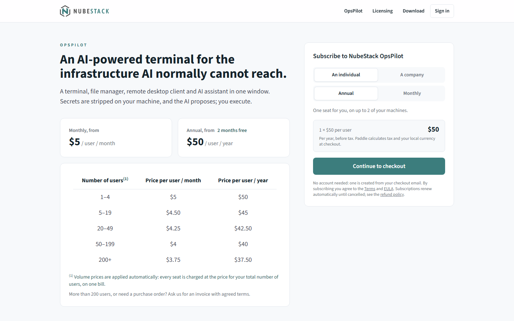
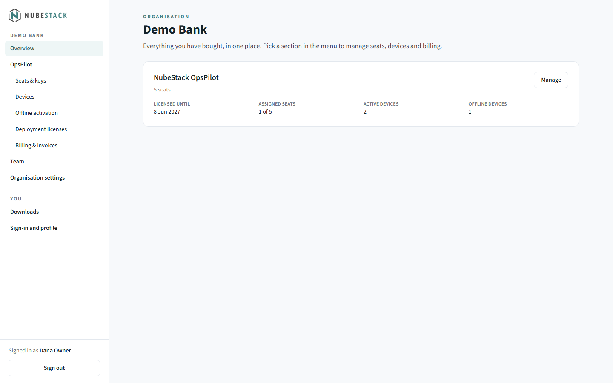
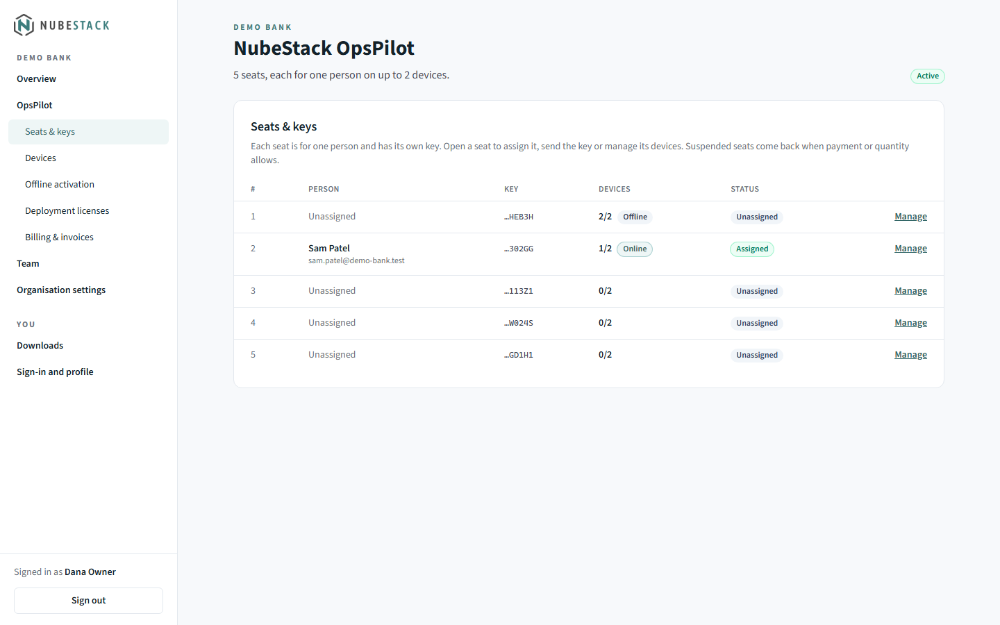
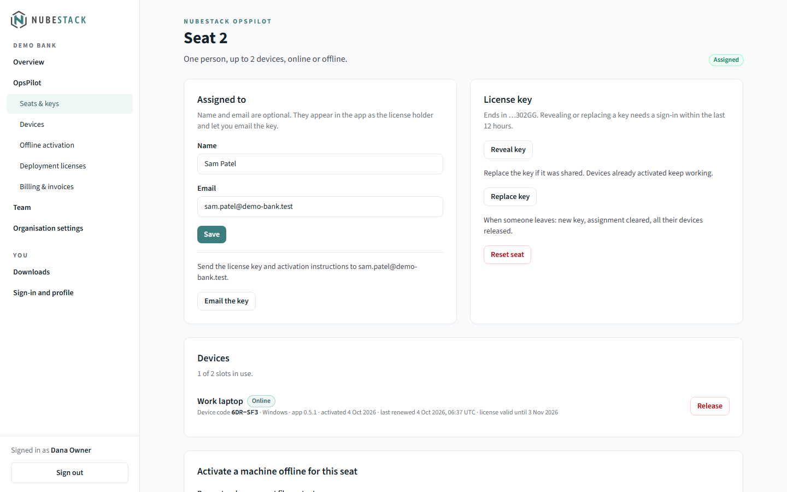
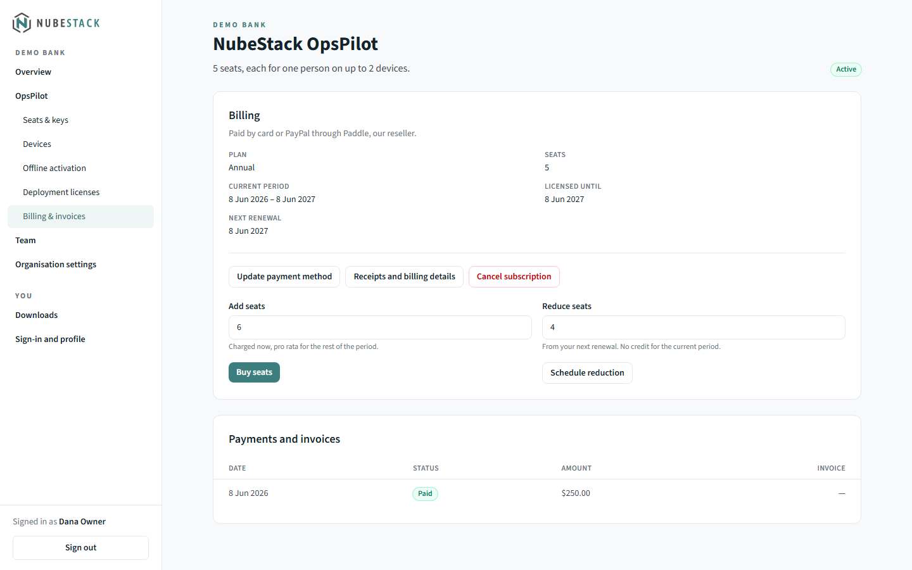

# Subscribe

You buy OpsPilot on the NubeStack subscription site, and manage seats, license keys,
devices and invoices in its customer portal. Below: buying a subscription, giving
each person their license key, and changing or cancelling it later. To put the key into OpsPilot, see [Activate OpsPilot](activation.md).

## Prices and seats

OpsPilot costs **from $5 per user per month, or $50 per user per year**. Lower per-user
prices apply automatically from 5 seats. Current prices are on the pricing page,
<https://subscription.nubestack.com/opspilot>. Prices are shown before tax; Paddle adds
tax and shows your local currency at checkout.

- **One seat is one person.** Each seat has its own license key, which works on up to 2
  of that person's devices.
- **Add seats at any time.** Fewer seats take effect at the next renewal.
- **Annual billing suits offline computers.** A license file covers the period paid for,
  so yearly billing means fewer renewed files to carry to computers without internet.

## Buy a subscription

1. Open the pricing page, <https://subscription.nubestack.com/opspilot>.

    
    _The pricing page. The table gives the price per user for each number of users; the
    panel on the right builds your order. Prices can change, so this page, not this
    screenshot, is the current price list._

2. In **Subscribe to NubeStack OpsPilot**, choose **An individual** (one seat for you)
   or **A company**.
3. Choose **Annual** or **Monthly**.
4. For a company, enter the number of **Seats**: one per person. The total shows the
   price per seat for that number of seats.
5. Choose **Continue to checkout**. Paddle's secure checkout opens on the same page.
   Enter your email address and your payment details.
6. When the payment goes through, the page shows **Welcome to NubeStack OpsPilot**:
    - With one seat, your license key, with **Copy** and **Save as a file**.
    - With several seats, a link to the portal to assign them.

    It also offers **Open the portal** and **Download NubeStack OpsPilot**.

You need no account beforehand: one is created from the email address you used at
checkout. If you are already signed in and your account has an OpsPilot subscription,
the panel says so and suggests adding seats to it instead, so you keep one bill and one
set of keys.

An email, **Your OpsPilot subscription is ready**, follows with the same details: the
license key for a single seat, or a note to assign seats in the portal. Its **Open the
NubeStack portal** button signs you in; it works once and expires after 72 hours, and
after that you sign in with your email address.

### Invoices and purchase orders

To pay by invoice, with a purchase order number, net payment terms or bank transfer, or
for more seats than the checkout allows, email support@nubestack.com with the number of
seats and your billing details. NubeStack issues the invoice through Paddle.

Paddle is NubeStack's reseller (merchant of record): it handles payment and tax, and
issues the receipts and tax invoices.

## Sign in to the portal

The portal is at <https://subscription.nubestack.com/portal>. It has no passwords.

1. Enter your **Email address** and choose **Email me a sign-in link**.
2. The email holds a sign-in link and a six-digit code. Both work once and expire in 15
   minutes.
3. Open the link and choose **Sign in**. If you read the email on another device, type
   the code in **Code from the email** on the computer where you asked to sign in, then
   choose **Sign in with the code**.

You can also choose **Continue with Google**. It works once your Google address matches
a NubeStack account; connect it under **Sign-in and profile** after an email sign-in.

## The portal

The menu on the left holds:

- **Overview**
- **OpsPilot**, with **Seats & keys**, **Devices**, **Offline activation**, **Deployment
  licenses** and **Billing & invoices**
- **Team** (company accounts) and **Organisation settings**, or **Account settings** for
  a personal account
- under **You**: **Downloads** and **Sign-in and profile**

_The Overview shows each product you have bought, how many seats are assigned and how
many devices use them. **Manage** opens the product's pages._

A single-seat purchase without a company is a personal account, called **Your
account**. To use it for a company, open **Account settings** and choose **Use this
account for a company**. A company's **Organisation settings** hold its name and legal
name.

## Give each person a license key

1. Open **OpsPilot → Seats & keys**. Each seat shows its person, the end of its key, its
   devices and its status (**Assigned**, **Unassigned**, **Deployment license**,
   **Suspended** and others).

    
    _Each seat shows the last characters of its key, how many of its 2 devices are in
    use and whether they are online or offline._

2. Choose **Manage** on a seat. Its page is headed **Seat 1**, **Seat 2** and so on.
3. Under **Assigned to**, enter the person's **Name** and **Email** and choose **Save**.
   Both are optional: the name appears in OpsPilot as the license holder, and the email
   lets you send the key.
4. Send the key in one of two ways:
    - **Email the key** sends the key and activation instructions to that address
      (up to 3 times an hour).
    - **Reveal key** shows the key with **Copy**, **Save as a file** and **Hide**, for
      you to pass on yourself.

    
    _A seat's page holds everything about one person's license: who it is assigned to,
    the key, and the devices using it, each with its device code and **Release**._

The person then activates OpsPilot with the key; see [Activate OpsPilot](activation.md).
Treat a license key like a password: anyone with it can use the seat. OpsPilot never
stores the key, and redacts one that appears in a terminal before anything reaches an
AI provider.

### Replace or reset a seat's key

On the seat's page, under **License key**:

- **Replace key** if the key was shared by mistake. Devices already activated keep
  working; the old key no longer activates new devices.
- **Reset seat** when someone leaves: the seat gets a new key, its assignment is
  cleared and all its devices are released.

Revealing, replacing and resetting a key need a sign-in within the last 12 hours. If
yours is older, the portal asks you to sign in again first.

## Change seats or billing

Open **OpsPilot → Billing & invoices**. The **Billing** card shows the plan, seats,
price, current period and when the license runs until.

- **Add seats:** enter the new number of seats under **Add seats** and choose **Buy
  seats**. The extra seats are charged now, pro rata for the rest of the period.
- **Reduce seats:** enter the new number under **Reduce seats** and choose **Schedule
  reduction**. The change applies from the next renewal, with no credit for the current
  period, and **Cancel change** withdraws it.
- **Switch to annual:** on a monthly plan, choose **Switch to annual**.
- **Update payment method** and **Receipts and billing details** open Paddle's customer
  portal.

Under **Payments and invoices**, each invoice's number opens its PDF.

_**Update payment method**, **Receipts and billing details** and **Cancel subscription**
open Paddle's customer portal. Seat changes are made here, in the NubeStack portal._

A subscription paid by invoice shows "This subscription is invoiced." instead of these
buttons; email support@nubestack.com to change its seats or billing.

## Cancel

Choose **Cancel subscription** in **Billing & invoices**. Cancelling stops the next
renewal. The license keeps working until the end of the period you paid for; after
that, OpsPilot applies the limits without a subscription and keeps your configuration
(see [Free trial and limits](trial-and-limits.md)).

Subscriptions are not refunded: the free trial is the evaluation.

## Manage licenses as a team

In a company account, **Team** lists the people who manage licenses in the portal. Use
**Invite someone** to add a colleague by email with a role, and **Make owner** to hand
the account to someone else. People who only use OpsPilot need a seat, not a place on
the team.

## See also

- [Activate OpsPilot](activation.md): put the license key or a license file into
  OpsPilot
- [Free trial and limits](trial-and-limits.md): what changes when you subscribe
- [Plans & subscription](../about/plans.md): the plans side by side
- [Licensing for IT](for-it.md): licensing many computers at once
