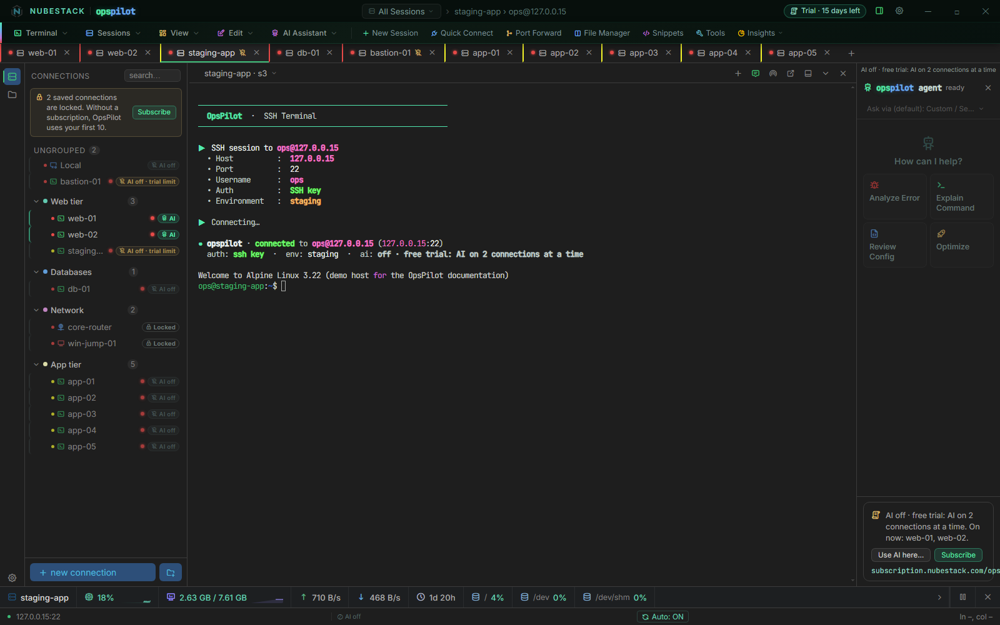
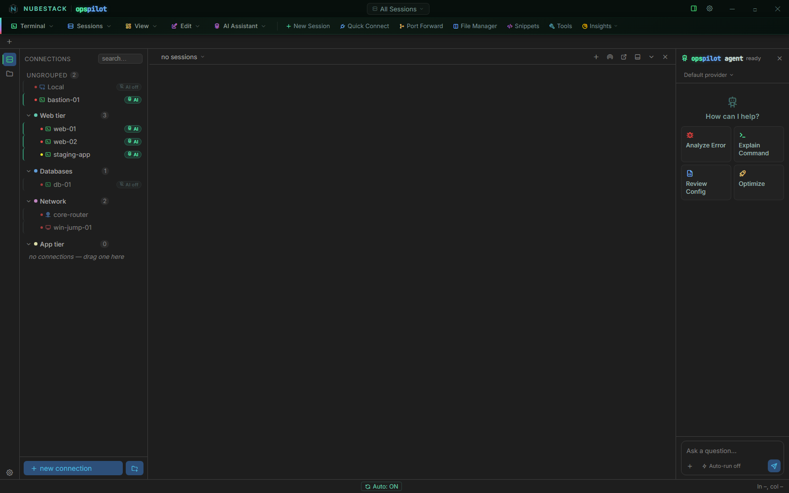

# Free trial and limits

OpsPilot starts a 15-day free trial the first time it runs. Here is what the trial
includes, the three limits that apply during it and after it, what each badge in the
side list means, and what changes when you subscribe.

| | Free trial | Without a subscription | Subscription |
|---|---|---|---|
| Sessions open at once | Up to 10 | Up to 10 | No limit |
| Saved connections you can open | Your first 10 (all are kept) | Your first 10 (all are kept) | All |
| AI | On 2 of your connections at a time, which you choose | Off | On every connection where you turn it on |
| AI Assistants and remote operation through the ChatGPT tunnel | Yes | No | Yes |
| Terminal, files, transfers, remote desktop, every connection type | Yes | Yes | Yes |

## The free trial

The trial starts on first launch. There is no account to create, no email, no card and
no activation. For 15 days you have the complete product, with the three limits in the
table above.

- **The clock must be right.** If the computer's date and time are wrong at first
  launch, the trial waits until they are corrected, so you still get all 15 days.
- **Reinstalling does not restart it.** OpsPilot keeps the trial start in a few small
  files in your user profile, which uninstalling leaves in place.
- **It needs a user profile OpsPilot can write to.** On a locked-down desktop where
  OpsPilot cannot save anything, no trial starts, because its end could never be kept.
  The terminal still works, with up to 10 sessions open at once. For an evaluation on
  such machines, ask NubeStack for an evaluation license at support@nubestack.com.

While the trial runs, the titlebar shows a chip such as **Trial · 12 days left**; it
opens **Settings → License**. In the last three days a banner below the tabs says when
the trial ends, with **Subscribe** and **Dismiss**.

_The trial chip sits at the top right. In the side list, **web-01** and **web-02** hold
the trial's two AI places, **bastion-01** and **staging-app** show **AI off · trial
limit**, and **Local** and **db-01** show **AI off** because AI is turned off for them._

**Settings → License** shows **Free trial · 12 days left**, one line with the limits
and the date the trial ends, and **What this means right now**, which lists what applies
on this computer and how many sessions are open.

_In the trial the page leads with the limits and the end date, then **1 Get a
subscription** with **Subscribe** and the address to open on another computer, then
**2 Activate this computer** for when you have a license key or file._

## AI on 2 connections in the trial

During the trial, AI can be on for 2 of your saved connections at a time, and you choose
which. Every AI capability is available for those two: diagnosis, proposals, the
approval gate, redaction, AI Providers and AI Assistants.

**The first two.** When the trial starts, the two places go to your two oldest saved
connections that have AI turned on. **Local** gets one only if you turned AI on for it,
because it starts with AI off. On a new install, they go to the first two connections
you save with AI on.

Every other connection with AI turned on shows **AI off · trial limit** in the side
list, whether it is open or not. A tab of it opens with AI off: the terminal and the AI
panel say "AI off · free trial: AI on 2 connections at a time", the AI panel names the
two connections that have AI and offers **Use AI here…** and **Subscribe**, and the tab
shows an AI-off mark.

_A third connection with AI turned on opens with AI off. The AI panel lists the
connections that have AI ("On now: web-01, web-02"); **Use AI here…** moves AI to this
connection._

### Moving AI to another connection

1. Click the connection's **AI off · trial limit** badge, or turn AI on in one of its
   tabs. You can also right-click the connection and choose **Turn AI on**.
2. If one of the two places is free, the connection takes it at once.
3. If both are taken, a dialog names the two connections that have AI, for example
   "Free trial: AI can be on for 2 connections at a time. It is on for web-01 and
   web-02." Choose **Use AI on bastion-01 instead of web-01** or **Use AI on bastion-01
   instead of web-02**. AI moves in one step and is never on for more than 2
   connections.

    
    _Each button moves AI in one step. **Cancel** changes nothing, but OpsPilot remembers
    that you want AI on bastion-01, so it gets AI when you subscribe._

Choosing a connection this way turns AI on for it, so it keeps its place when its tabs
close and when you restart OpsPilot.

The connection you take AI from keeps its own AI setting. It shows **AI off · trial
limit** and gets AI back by itself when you subscribe. If you choose **Cancel**,
OpsPilot remembers in the same way that you want AI on that connection.

When two saved connections have the same name, the dialog tells them apart by host or
group, for example **db (10.5.0.2)**.

### Freeing a place

Turn AI off for one of the two connections (with its badge, its menu or the AI switch in
its tab), or delete it. Nothing takes the free place by itself, not even a connection
you add or duplicate afterwards: choose where AI goes next. A connection that becomes
locked (see [Your first 10 saved connections](#your-first-10-saved-connections)) frees
its place too.

Moving a connection to another group never changes its AI setting or its place. The
places are kept when you restart OpsPilot.

### Tabs and unsaved connections

- **AI is on in at most 2 tabs.** If you open the same connection twice, both tabs can
  have AI. A tab of your other connection then opens with "AI off · free trial: AI in 2
  tabs at a time", and its badge says **AI off · tab limit**. Turning AI on there offers
  **Use AI here instead of Local (tab 2)** and similar buttons, which move AI from that
  tab.
- **A connection opened without saving it** (with **Save connection** turned off in the
  connection dialog) takes a free place when it connects and gives it back when you
  close its tab. If no place was free, it waits with AI off and does not take a place
  that frees up later; turn AI on in it to use AI there.
- **A saved connection deleted while a tab of it is open** leaves that tab open, as a
  tab of no saved connection. Turning AI on in it takes a free place for that tab only.
- **A disconnected tab** keeps its AI while its connection holds the place, so you can
  still ask about its last output. It says what will keep AI off when it reconnects, and
  how to reconnect: "Not connected: press Enter in the terminal to reconnect" (Ctrl+R in
  a Local Console tab).

### AI Assistants in the trial

A connected AI Assistant can open only connections that hold one of the two places, and
not while AI is already on in 2 tabs of other connections. It is told why, and the
choice stays yours in OpsPilot.

## Up to 10 sessions open at once

In the trial and without a subscription, up to 10 sessions can be open at once, with or
without AI: for example, two sessions with AI alongside eight ordinary terminals.

What counts as a session:

- every tab: SSH, Telnet, RSH and serial terminals, local shells, file browser tabs,
  remote desktops and hypervisor consoles
- a program OpsPilot starts in its own window, while it runs: Mosh, a VNC viewer, and
  remote desktop on macOS and Linux. It shows in the tab bar with a **Close** button.
  When OpsPilot hands the program to another app it cannot follow (for example remote
  desktop and Mosh on macOS, or a VNC viewer opened through a `vnc://` link), it counts
  until you close its entry in the tab bar; that does not close the program's window.

A detached window is the same session as its tab, and saved connections that are not
open never count.

Opening an 11th session shows the **Session limit reached** dialog. It says how many
sessions are open and what to close, with **Close**, **License settings** and, in the
trial or without a subscription, **Subscribe**. No tab is opened.

_With ten tabs open, the eleventh is refused. The dialog says which kinds of session
count; the tabs already open are not touched._

A tab that tries to reconnect while 10 sessions are open says, for example, "Session
limit reached: 10 of 10 open. Close a session, then press Enter." (Ctrl+R in tabs that
do not reconnect on Enter).

## Your first 10 saved connections

In the trial and without a subscription, OpsPilot opens only your first 10 saved
connections: the 10 you created first.

- **The order is fixed by creation time.** Dragging a connection in the list, editing it
  or moving it to another group does not change which ones they are. A new or duplicated
  connection is always the newest.
- **The others are locked, not lost.** They stay in the list, greyed out with a lock and
  a **Locked** badge, and a note above the list says how many are locked. They cannot be
  opened, edited, duplicated or moved, and an AI Assistant cannot open them. They stay in
  OpsPilot's data folder, so a backup of that folder includes them. When connections
  first become locked, a notice below the tabs says so once, with **Subscribe** and
  **Dismiss**.
- **You can delete any connection.** Deleting one of the first 10 unlocks the next.
- **Local always works.** The built-in **Local** connection is not one of the 10 while
  it opens a local shell. Changed into another kind of connection, it counts like any
  other.
- **Unsaved connections work.** A connection opened without saving it opens within the
  10 sessions.
- **Saving an 11th connection keeps it, locked.** OpsPilot says "Saved and locked:
  without a subscription, OpsPilot uses your first 10 saved connections."
- **Open sessions stay open.** A session whose connection becomes locked stays open and
  counts toward the 10. Once it is closed, or its connection drops, it opens again after
  you subscribe.

_With 13 saved connections, the two created last (**core-router** and **win-jump-01**)
are locked. The notice below the tabs appears once; the note above the side list stays
while connections are locked._

Opening a locked connection shows **Saved connection locked**, which says why and, in
the trial and without a subscription, offers **Subscribe**.

## After the trial

When the 15 days are up, OpsPilot keeps working and nothing is deleted.

- **The terminal keeps working**, with up to 10 sessions open at once from your first 10
  saved connections. Every connection type, the file explorer and editor, transfers, port
  forwarding, remote desktop and hypervisor consoles work as before.
- **AI is off** in every session. AI Providers, AI Assistants, command proposals and
  remote operation through the ChatGPT tunnel are unavailable until you subscribe.
- **Your configuration is kept**: saved connections, providers, Command Safety and Data
  Handling profiles, the tunnel settings and every other setting.

OpsPilot says once that the trial has ended, with **Subscribe** and **Dismiss**. After
that, the titlebar chip reads **No subscription · AI off**.

If you turn AI on in a session while your license does not allow it, OpsPilot says why
and remembers that you want AI there. The session gets AI by itself once the license
allows it.

## A paid license that lapses or has a problem

The table shows what applies when a paid license stops working. In each case OpsPilot
says why, and never asks a paying customer to subscribe.

| Situation | Titlebar chip | Sessions | Saved connections | AI |
|---|---|---|---|---|
| The subscription ended (after its grace period) | Subscription ended · AI off | Up to 10 | First 10 | Off |
| A license file, or your organisation's license, expired | License expired · AI off | Up to 10 | First 10 | Off |
| The computer's clock needs fixing | Clock problem · AI paused | Up to 10 | All | Paused |
| OpsPilot is checking this computer's identity | License check paused · AI paused | Up to 10 | All | Paused |
| The license is suspended | License suspended · AI off | Up to 10 | All | Off |
| Your organisation released this computer | Not activated · AI off | Up to 10 | All | Off |
| Licensing could not start | License check failed | No limit | All | Off |

- **Renewal due.** After the paid period ends there is a grace period with every feature
  still working: 7 days for an online activation, 14 days for a license file. OpsPilot
  shows **Renewal due** and how many days are left.
- **Paused** means AI comes back by itself once the problem is fixed. See
  [Clock problems](activation.md#clock-problems) and
  [Device identity](for-it.md#device-identity).
- **Licensing could not start.** OpsPilot runs with no session limit and nothing locked,
  and AI stays off. **Settings → License** shows **Licensing could not start** with
  **Try again**.
- **A released computer** says who released it; see
  [Released computers](activation.md#released-computers).

## Side-list badges

Next to every saved connection, open or not, the side list says what applies to it.
Point at a badge to read the full reason.

| Badge | Meaning | Clicking it |
|---|---|---|
| **AI** | AI is on for this connection (with a subscription, every connection where you turned it on; in the trial, the 2 you chose) | Turns AI off |
| **AI off** | You turned AI off for this connection | Turns AI on |
| **AI off · trial limit** | In the trial, AI is on for 2 other connections | Chooses this one, with the dialog if both places are taken |
| **AI off · tab limit** | In the trial, AI is already on in 2 other tabs | Offers to move AI from one of them |
| **AI off · no subscription** | The trial ended and there is no license | Nothing |
| **AI off · subscription ended** | The subscription for this license is not active | Nothing |
| **AI off · license expired** | A license file or your organisation's license ran out, or an online license ran out while this computer could not reach the license server | Nothing |
| **AI paused** | The clock needs fixing, OpsPilot is checking this computer's identity, or it has just started and is still reading its license | Nothing |
| **AI off · licensing problem** | Anything else, such as a suspended license or a computer your organisation released | Nothing |
| **Locked** | One of your saved connections beyond the first 10, in the trial or without a subscription | Nothing |

The badges that only say why licensing keeps AI off are not controls: the keyboard skips
them and a connection's menu does not offer them. Serial connections, which never have
AI, show no AI badge.

## What licensing never does

- **It never closes a session.** Losing a license, a connection becoming locked or the
  trial ending leaves every open session open.
- **It never cuts off an AI answer.** An answer already being written when AI turns off
  finishes. New AI requests are refused, and a command it proposes arrives expired, so
  nothing runs by itself.
- **It never deletes your configuration.**
- **It never blocks the terminal.** If licensing cannot start at all, OpsPilot runs with
  no session limit and AI off.

## After you subscribe

Activating a subscription removes every limit at once: the 10 sessions, the lock on your
saved connections and the trial's 2 AI places.

AI comes back by itself in every open session that wants it, except where you turned it
off yourself, or where the connection is saved with AI off and you did not turn AI on in
that session. That includes a connection you moved AI away from during the trial, and
one where turning AI on was refused or you cancelled the dialog. OpsPilot confirms with
"AI is on again in your open sessions, except where you turned it off."

The same happens when a lapsed subscription is renewed or a renewed license file is
imported. A deployment license or an evaluation license lifts every limit too.

_After activation the trial chip is gone. Every connection with AI turned on shows
**AI**, including **bastion-01** and **staging-app**, which waited during the trial;
**db-01** keeps **AI off** because AI is turned off for it._

## See also

- [Subscribe](subscribe.md): buy a subscription and give each person a license key
- [Activate OpsPilot](activation.md): online, offline or with a deployment license
- [Plans & subscription](../about/plans.md): the plans side by side, and prices
- [Groups & environments](../connections/organising.md): the side list and its keyboard
  use
