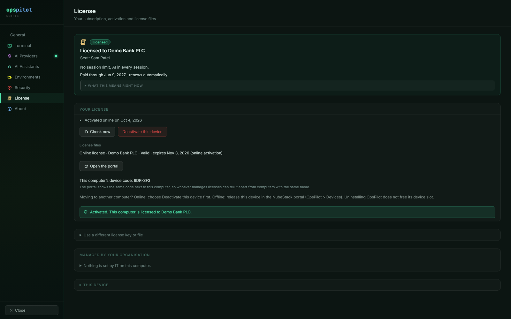

# Backup & upgrade

Your connections, profiles and settings are files on your own workstation. Nothing is
synchronised to a cloud service, so the copy you take before an upgrade is the only copy
there is. This page lists what to copy, how to install a new build, and how to keep a
license going through renewals, upgrades and new hardware.

## What to back up

Almost everything lives in one directory: the application's per-user data directory. Copy
the whole directory rather than individual files; the stores reference each other by id,
and a partial restore leaves connections pointing at groups and profiles that are no
longer there.

| Data | File |
|---|---|
| Connections | `connections.json` |
| Groups | `groups.json` |
| Environments | `environments.json` |
| Command Safety profiles | `command-safety-profiles.json` |
| Data Handling profiles | `redaction-profiles.json` |
| Application settings | `settings.json` |
| File-transfer history | `transfer-history.json` |
| Encrypted credentials | `credentials.enc.json` |
| ChatGPT tunnel runtime key | `openai-tunnel/runtime-key.enc` |
| Which 2 connections have AI in the free trial | `trial-ai-places.json` |
| License state: the online activation and imported license files | `licensing/license-state.json` |
| Trial start and clock record | `licensing/markers.json` |
| Device ID, only with `"deviceIdentity": "roaming"` set by IT | `licensing/device-id` |

`settings.json` holds the AI provider configuration — including provider API keys, which
are stored there in plain text (see [Security model](../safety/security-model.md)) — the
MCP connector state, the tunnel metadata and the display settings. What may run without a
click is not in it: each Command Safety profile in `command-safety-profiles.json` holds
its own pattern list and its three rules, **Run commands without asking me** among them.
Connection secrets are in the encrypted files.

### Licensing data outside this directory

- **Trial and clock records.** Besides `licensing/markers.json`, OpsPilot keeps the trial
  start and a clock record in small files under `NubeStack` in your user profile — on
  Windows in `%LOCALAPPDATA%\NubeStack` and `%APPDATA%\NubeStack`. Uninstalling OpsPilot
  does not remove them, so reinstalling does not restart the trial.
- **Machine-wide license files and `policy.json`.** These sit in the managed folder,
  `%ProgramData%\NubeStack\OpsPilot\` on Windows, which IT maintains. Keep them with your
  deployment tooling rather than in a user's backup.

The paths on macOS and Linux are in [Licensing for IT](../licensing/for-it.md).

### Finding the directory

Identify the directory by its contents. Look under your user profile's application-data
location — the standard per-user location for your platform — for a folder holding
`connections.json` and `settings.json` side by side, with a `licensing` folder next to
them. That folder is the one to copy. If you need the exact location confirmed for a build
you are packaging or auditing, ask support: a wrong directory produces a backup that
silently restores nothing.

## What a backup does not contain

- **The keys that decrypt your credentials.** SSH passwords, private keys, key passphrases,
  the tunnel runtime key and the secret of an online activation are encrypted through the
  operating system's own credential store before they are written. The material that
  decrypts them belongs to the OS user account on that machine. Restoring the files onto a
  different workstation, or a rebuilt one, will not give you working credentials — you
  re-enter them.
- **A license for another computer.** An online activation and an offline license file
  belong to the computer they were made for. On a different or rebuilt workstation,
  activate again (see [Moving to another computer](#moving-to-another-computer)). A
  deployment license is not tied to one computer.
- **Your license key.** OpsPilot never stores it. Keep it from the NubeStack portal or the
  email you received it in.
- **Terminal scrollback.** Session output lives in memory only and is never written to disk
  by OpsPilot. There is nothing to back up and nothing to purge.

!!! warning "Test the restore, not just the backup"
    A copy you have never restored is an assumption. Restore it onto the same machine into
    a spare directory at least once, and confirm the connections, groups and both profile
    sets come back intact.

## Before an upgrade

1. Close OpsPilot. Copying the directory while the application is writing to it can
   capture a half-written store.
2. Copy the user-data directory somewhere outside it.
3. On Windows, also quit any assistant that OpsPilot is connected to over stdio — Claude
   Desktop and VS Code both launch OpsPilot's MCP bridge using the installed executable, and
   a running bridge process can prevent the installer from replacing that executable.
4. Note the build you are on, so you know what you upgraded from. **Settings → About**
   shows it next to the product name, for example `v0.5.1`.

## Upgrading

Download the new build from <https://subscription.nubestack.com/download>, where each
installer is listed with its SHA-256 hash, and install it over the old one. OpsPilot never
updates itself: there is no in-app updater and no migration step to run.

**Verify the published SHA-256 hash of the download before you run it.**

Upgrading keeps the license. The `licensing` folder is left as it is, an online activation
carries on without activating again, and a trial in progress keeps its end date.

=== "Windows"

    The installer is an NSIS package that installs **per-machine**. Expect a UAC prompt,
    and note that you can choose the installation directory. Run it over the existing
    installation; your user-data directory is untouched by the installer.

    Every install also creates the managed folder `%ProgramData%\NubeStack\OpsPilot` and
    resets the rights on `%ProgramData%\NubeStack`: full control for Administrators and
    SYSTEM, read-only for Users. Any other write access you granted there is removed. See
    [Licensing for IT](../licensing/for-it.md).

    The Windows installer is also the only one that carries the bundled FreeRDP client, so
    an upgrade here replaces the RDP engine as well as the application.

=== "macOS"

    macOS installers are not on the download page yet. Email support@nubestack.com to hear
    when they are.

    Once they are published: builds ship as a DMG and a ZIP, for both Intel and Apple
    Silicon. Quit OpsPilot, replace the application with the new one, then launch it again.

=== "Linux"

    The download page offers a `.deb` package and an AppImage. For the `.deb`, install the
    newer package over the old one (`sudo apt install ./<new-file>.deb`); your settings
    and license stay in your home folder. For the AppImage, replace the old file with the
    new one and make it executable; nothing else on the system is modified.

## Renewing a license file

An online activation renews itself about once a day; there is nothing to do. A license
file covers the period paid for, so after each payment:

1. Download the renewed file from the NubeStack portal: **OpsPilot → Devices** for an
   offline license, **OpsPilot → Deployment licenses** for a deployment license. No new
   request code is needed.
2. In **Settings → License → Your license**, choose **Import license file** and pick the
   `.opslic` file.

A license file that IT installed in the managed folder is renewed by IT: they replace the
file in its `licenses` folder, and **Settings → License → Managed by your organisation →
Check again** picks it up at once (otherwise within 10 minutes).

## Moving to another computer

1. On the old computer, free its device slot. For an online activation, choose
   **Deactivate this device** in **Settings → License**. For a license file, release the
   device in the NubeStack portal (**OpsPilot → Devices**). Uninstalling OpsPilot does not
   free the slot.

    
    _A computer activated online. **Deactivate this device** frees its slot before you
    move; the device code below it is the one the portal shows for this computer._

2. Copy the application data directory across if you want your connections and profiles,
   then re-enter the credentials on the new computer.
3. Activate the new computer: online with your license key, or offline with its own request
   code.

A reimaged machine counts as a new computer too. If both of your device slots are taken,
release the old device in the portal; the portal shows each device's **device code**, the
same one OpsPilot shows under **Settings → License → This device**, so you release the
right one. See [Activate OpsPilot](../licensing/activation.md).

## After an upgrade

- Confirm the application launches and your connections, groups and profiles are all
  present.
- Open **Settings → About** and check the version is the one you installed.
- Open **Settings → License** and check the state card still shows your license or your
  trial.
- Open **Settings → AI Providers** and use **Test Connection** on your active provider.
- Check that both profile sets are present and still assigned to the groups you expect.
  Profiles are replacements rather than additions, so a group that has lost its assignment
  falls back to `Default` — which may be stricter or looser than what you intended.
- If you use an assistant, reconnect it and confirm it can see OpsPilot again. Claude
  Desktop and VS Code read MCP configuration at startup.

## See also

- [Install](../getting-started/install.md) — first-time installation and requirements
- [Activate OpsPilot](../licensing/activation.md) — online, offline and license files
- [Administration & rollout](administration.md) — phasing a rollout, and where profile
  configuration is held
- [Troubleshooting](troubleshooting.md) — if something does not come back after an upgrade
