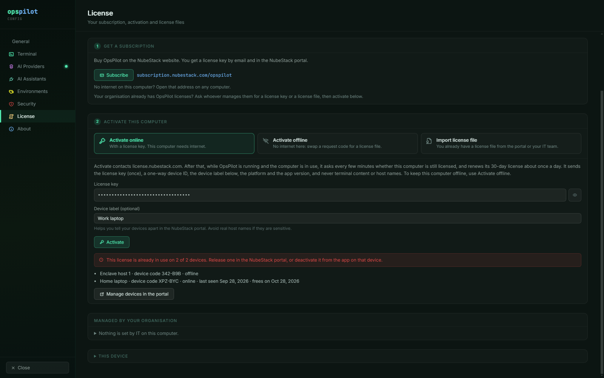

# Troubleshooting

The failures that come up most often, what to check for each one, and in what order. The
first group covers connections, providers, assistants and approvals; the second covers
the messages OpsPilot shows about its license.

## Before you contact support

Gather these first. They are what makes an issue reproducible rather than a description.

- **The version**, from **Settings → About**: it is shown next to the product name, for
  example `v0.5.1`.
- **Reproduction steps** — what you clicked, in what order, and what happened instead.
- **Which mode.** An AI Provider you configured, or an AI Assistant connected over MCP.
  The two paths are separate and the fix rarely applies to both.
- **Which connection and group**, and therefore which Command Safety and Data Handling
  profiles resolved. Profiles resolve connection → group → Default.
- **The platform.** Windows, macOS or Linux. Several behaviours below differ per platform.
- **For a licensing question**, the headline of the state card in **Settings → License**
  and this computer's device code, shown under **This device** there.

Support is at support@nubestack.com; see [Support](../about/support.md) for what else to
include.

## SSH will not connect

Confirm reachability outside OpsPilot first. If this fails, nothing in OpsPilot will fix
it:

```bash
ssh user@host
```

Then, in order:

1. **Check the VPN is up.** A connection that worked yesterday and fails now, with no
   configuration change, is usually this.
2. **Check the host and port** on the saved connection, not on the one you meant to open.
3. **Check the key format is supported.** A key your own `ssh` client accepts is the right
   test; a key in a format OpsPilot cannot parse fails at connect time rather than at save
   time.
4. **Enter the passphrase.** A passphrase-protected private key needs its passphrase
   supplied in the connection's credential fields. There is no interactive prompt for it
   mid-connect.
5. **Wait for the timeout.** OpsPilot gives an SSH connection 20 seconds to complete before
   reporting failure, so a filtered port takes that long to report.

If the terminal says **Session limit reached** or the connection is greyed out with a lock,
the cause is the license, not the network: see [Session limit
reached](#session-limit-reached) and [A saved connection is
locked](#a-saved-connection-is-locked).

## The AI panel says no provider is active

Open **Settings → AI Providers**, configure one, and use **Test Connection**.

A provider that saves but fails the test is almost always one of two things: a wrong base
URL, or an expired or revoked key. Both report at test time; a provider is not active
because its fields are filled in.

A provider being active is separate from a connection being allowed to use it. AI access is
scoped per connection, and a connection with its AI badge off is invisible to every model
and every assistant. If the panel is inert on one session but works on another, check that
connection's **Enable AI** toggle before looking any further at the provider. AI works in
SSH and Local Console tabs only.

If the panel says AI is **off** or **paused** and gives a reason — the free trial's limit,
no subscription, a license that ended, the clock — the provider is not the problem. Find
the reason under [Licensing](#licensing) below.

## Ollama is not responding

Confirm the service is running and the model is pulled, from a normal terminal:

```bash
ollama list
curl http://localhost:11434/api/tags
```

If `ollama list` shows the model and the `curl` returns a model list, the problem is the
endpoint OpsPilot is pointing at. Check it matches, **including the port**.

The test also fails if the model name configured in OpsPilot is not one of the models
Ollama has pulled — the same endpoint is used to check both, so "cannot reach Ollama" and
"that model is not here" are different messages. Read which one you got.

## Claude Desktop or VS Code does not see OpsPilot

The MCP connector must be enabled in OpsPilot **and** the assistant must be connected.
Both are required; either one alone looks identical from the assistant's side.

Both applications read their MCP configuration at startup, so after connecting them:

- **Claude Desktop** — quit and restart it. Not a new window: the process.
- **VS Code** — reload the window with `Ctrl+Shift+P` → **Developer: Reload Window**.

If it still does not appear:

1. **Look for Needs update.** **Settings → AI Assistants** shows **Needs update** when an
   assistant is set up for another copy of OpsPilot or an old token. Choose **Update**.
2. **Reconnect after a token change.** The bridge reads OpsPilot's connector port and
   token when it starts. If you regenerated the token in Settings, the assistant needs to
   reconnect.
3. **Check OpsPilot is running.** The connector lives inside the application. Nothing
   answers when OpsPilot is closed.
4. **On Windows, beware two config files.** Microsoft Store (MSIX) installs of Claude
   Desktop read a virtualised copy of their configuration, and Claude Desktop's own
   **Edit Config** button can open the non-virtualised one instead. OpsPilot writes to the
   file the sandboxed application actually reads, so the file you are looking at by hand
   may not be the file in use.

If the assistant sees OpsPilot but every tool answers with a reason starting
"OpsPilot:", see [An assistant or the ChatGPT tunnel is
refused](#an-assistant-or-the-chatgpt-tunnel-is-refused).

## The ChatGPT tunnel will not start

Use **Run Doctor** on the tunnel row. Starting the tunnel runs the same check itself and
refuses to proceed if it fails, so Doctor's output is the first thing to read either way.

Then confirm, in order:

1. **The tunnel ID begins `tunnel_`.** OpsPilot rejects anything else, including a pasted
   URL.
2. **The runtime key is current.** It is stored encrypted and is only decrypted into the
   tunnel process; a rotated key has to be re-entered.
3. **The tunnel client binary path is correct.** Either the full path to
   `tunnel-client.exe`, or `tunnel-client` when it is on your `PATH`.
4. **The license allows it.** The tunnel needs an active trial or subscription; see [An
   assistant or the ChatGPT tunnel is
   refused](#an-assistant-or-the-chatgpt-tunnel-is-refused).

If the tunnel starts and then exits, OpsPilot reports the client's own output with secrets
stripped out of it. That output is the diagnostic to send to support.

!!! note "Localhost-only forwarding is enforced"
    The tunnel only ever forwards to OpsPilot on `127.0.0.1`. The destination is checked
    before the client is launched, and any other address is refused. No public listener is
    opened in this mode.

## Commands are not auto-running

This is expected unless the session's Command Safety profile allows it. **Run commands
without asking me** is set per profile in **Settings → Security → Command Safety** (the
rows there edit the Default profile; **Manage profiles…** edits the others), and every
profile ships as **Ask me every time**: every proposal waits for you, including
<span class="tier tier-readonly">Read-only</span> ones.

The chip under the AI panel's input box shows what applies to the active tab — **Auto-run
off**, **Auto-run read-only** or **Auto-run all** — and clicking it opens **Settings →
Security**. If it shows **Auto-run off** although you changed a profile, the tab resolves
to a different one: profiles resolve connection → group → Default.

If auto-run is on for the tab and a command still waits, one of these happened:

- Under **Only read-only commands**, it was **not classified read-only** — it arrived as
  <span class="tier tier-low">Low risk</span> or
  <span class="tier tier-high">High risk</span>.
- It **counts as dangerous**: it matched a pattern in the resolved profile, or the model
  flagged it and the profile uses **The AI's warning and my list**. A dangerous command
  needs a click under every setting.

The card names which applied. A pattern match names the matched pattern and the profile it
came from; a model self-assessment says it was flagged by the AI.

## The redaction badge never appears

Either nothing matched, or the badge is switched off.

1. **Check that something was redactable.** The badge shows a 🔒 with a count only on turns
   where the redactor replaced something. A session with no credentials, keys, tokens or
   addresses in its scrollback produces no badge, correctly.
2. **Check `Show redaction badge`** in **Settings → Security**. It is a global, cosmetic
   setting.

!!! warning "Hiding the badge does not disable redaction"
    The badge is an on-screen indicator. Redaction happens on the single path every AI
    request takes, and this setting does not affect it. To confirm what a provider
    receives, turn the badge on and hover it — it names the categories that matched.

## RDP will not open

Confirm first that the target allows RDP at all and that your credentials are valid — the
same check you would make with any other client. After that, the answer depends on your
platform, because OpsPilot uses a different client on each.

| Platform | What OpsPilot launches |
|---|---|
| Windows | FreeRDP, bundled with the installer, embedded in an OpsPilot window |
| macOS | Microsoft's **Windows App**, handed a generated `.rdp` file |
| Linux | `xfreerdp` or `xfreerdp3`, as an external window |

- **Windows.** The FreeRDP client ships inside the installer, so there is nothing to
  install. If it is missing from the installation, OpsPilot falls back to the built-in
  Windows client instead of failing — a session that opens in a separate, differently
  behaved window is the symptom of that fallback.
- **macOS.** Windows App must be installed — search for it in the Mac App Store. Without
  it, the launch fails and OpsPilot says so. **Being prompted for your password by Windows
  App is expected**: OpsPilot never writes the password into the `.rdp` file it generates,
  the same rule it applies to every other credential.
- **Linux.** `xfreerdp` or `xfreerdp3` must be on your `PATH`; install it from your
  distribution's package manager. The launch also appends to `logs/xfreerdp.log` inside the
  application data directory, which is the first place to look when the window opens and
  immediately closes.

On macOS and Linux, a remote desktop in its own window counts toward the sessions open at
once during the trial and without a subscription; a refused launch says **Session limit
reached**.

!!! note "RDP certificate handling"
    Certificate handling on RDP is provisional ahead of general availability. If your
    estate requires certificate validation on RDP, confirm the current behaviour with
    support before standardising on it.

## Licensing

Licensing never closes an open session and never blocks the terminal: what it limits is
AI, the number of sessions open at once and, without a subscription, which saved
connections open. **Settings → License** — also reached from **View → License**, or by
clicking the license chip in the title bar when one is shown — always says what applies
right now and why. The limits themselves are
described in [Free trial and limits](../licensing/trial-and-limits.md).

### Session limit reached

**What you see.** A dialog titled **Session limit reached** when you open a tab, for
example: "10 sessions are open. During the free trial you can have up to 10 open at once.
Close a session to open another, or subscribe to remove the limit." A tab that tries to
reconnect says in its terminal **Session limit reached: 10 of 10 open. Close a session,
then press Enter.** (Ctrl+R in tabs that are not SSH).


_Ten tabs are open in the trial, so an eleventh is refused. The dialog says what counts
toward the limit and offers **Subscribe** with the address; **Close** leaves everything as
it was._

**Why.** In the free trial, without a subscription, and while a paid license has a problem
(the clock, an identity check, a lapse), up to 10 sessions can be open at once. Tabs of
every kind count: terminals, local shells, file browser tabs, remote desktops and consoles.
So does a program OpsPilot starts in its own window — Mosh, a VNC viewer, RDP on macOS and
Linux — which shows in the tab bar with a Close button while it counts.

**What to do.** Close a session, then open the new one again. A file browser or VNC tab
that has already disconnected still counts until you close it. For a program in its own
window, close its entry in the tab bar; where OpsPilot cannot follow the program (for
example remote desktop and Mosh on macOS), closing the entry stops it counting without
closing that window. To remove the limit, subscribe and activate — see
[Subscribe](../licensing/subscribe.md).

### A saved connection is locked

**What you see.** In the side list, a connection is greyed out with a lock and a
**Locked** badge, and a note above the list says, for example, "2 saved connections are
locked. Without a subscription, OpsPilot uses your first 10." The first time it happens, a
notice below the tabs says the same, with **Subscribe** and **Dismiss**. Opening or editing
a locked connection shows **Saved connection locked**. Saving a new connection can show
**Connection saved, but locked**.


_With 13 saved connections in the trial, **core-router** and **win-jump-01** — the two
created last — are **Locked**. The note above the list and the notice below the tabs both
say why and offer **Subscribe**._

**Why.** In the free trial and without a subscription (including a subscription or license
file that ran out), only your first 10 saved connections open — the 10 you created first.
Moving a connection to another group or dragging it does not change which 10 they are.
Nothing is deleted: the others are kept with your settings.

**What to do.** Subscribe and activate, or renew the license that ran out; every
connection then opens. Without that, delete one of the first 10 to unlock the next. The
built-in **Local** connection is not one of the 10 while it opens a local shell, and a
connection opened without saving it works within the 10 open sessions. A session that was
already open when its connection became locked stays open.

### AI off · trial limit, or AI off · tab limit

**What you see.** A badge **AI off · trial limit** next to a connection in the side list,
and in its tab "AI off · free trial: AI on 2 connections at a time". Or **AI off · tab
limit**, with "AI off · free trial: AI in 2 tabs at a time".

**Why.** During the free trial AI is on for 2 of your connections at a time, which you
choose, and in at most 2 tabs at once (one connection open twice uses both).

**What to do.** Click the badge, or turn AI on in the tab. If a place is free it is taken
at once; otherwise a dialog names the two connections that have AI and offers **Use AI on
… instead of …** (for the tab limit, **Use AI here instead of …**). Or turn AI off on one
of the two to free its place. Subscribing removes both limits. See [Free trial and
limits](../licensing/trial-and-limits.md).

### AI paused

**What you see.** The badge **AI paused**, and a title-bar chip **Clock problem · AI
paused** or **License check paused · AI paused**. Right after OpsPilot starts, **AI paused**
can also mean it is still reading its license; that clears by itself in a moment.

**Why.** Either this computer's clock is wrong, or was once set far ahead, so OpsPilot
cannot trust dates; or OpsPilot could not read this computer's identity (for example
because security software blocked the programs it uses for that). Up to 10 sessions can
be open meanwhile, every saved connection opens, and the terminal is not affected.

**What to do.**

- **Clock.** Correct the date and time; OpsPilot checks again every minute, and **Check
  again** under **Settings → License → Fix clock** checks at once. With an online
  activation, **Check now** repairs the clock record once the clock is right. With a
  license file, enter the code shown there in the NubeStack portal (**OpsPilot → Offline
  activation → Fix a device clock**) and import the clock-reset file. On a deployment
  license, IT can repair every computer of the site with one file — see [Licensing for
  IT](../licensing/for-it.md). During the trial, wait until the date it saw has passed, or
  activate online.
- **Identity.** OpsPilot tries again every few minutes. If it keeps happening, choose
  **Use this computer's current identity** in **Settings → License**. The computer is then
  a new device: activate again, and release the old device in the portal if both slots
  are in use.

### AI off · no subscription, subscription ended or license expired

**What you see.** One of these badges in the side list, with a matching title-bar chip
such as **No subscription · AI off**, **Subscription ended · AI off** or **License expired ·
AI off**. AI assistants and the ChatGPT tunnel are off too.

**Why and what to do.**

| Badge | Why | What to do |
|---|---|---|
| **AI off · no subscription** | The free trial has ended and no license is active | Subscribe, then activate in **Settings → License**. Everything comes back, with your settings |
| **AI off · subscription ended** | The subscription is not active, for example after a failed payment | The account owner updates the payment in the NubeStack portal (**Billing & invoices**). OpsPilot picks up the renewal by itself; **Check now** speeds it up |
| **AI off · license expired** | A license file ran out, or an online license could not be renewed because the computer could not reach the license server | Import the renewed file (**Import license file**), or check the network and choose **Check now**. A license installed by IT is renewed by IT |
| **AI off · licensing problem** | Anything else: a suspended license, a computer the organisation released, or licensing that could not start | Read **Settings → License**. If it says **Licensing could not start**, choose **Try again** there; until then there is no session limit and AI is off |

A paying customer is never asked to subscribe: the wording follows the cause. AI comes
back by itself once the license is valid, except where you turned it off.

### This computer was released

**What you see.** A notice below the tabs, and the same explanation in **Settings →
License**, with one of these headlines:

| Headline | What happened | What to do |
|---|---|---|
| **This computer was released from its subscription** | You, or whoever manages licenses in your organisation, released it in the portal | Activate it again with a license key |
| **This computer's license key was replaced** | Your organisation gave the seat a new key; the old one no longer works | Ask whoever manages licenses for the new key |
| **NubeStack support released this computer** | For example after it was reported lost | Ask whoever manages licenses in your organisation |
| **Released after 45 days without renewal** | The computer was switched off or offline for 45 days | Activate it again with your key |

**Why.** A computer activated online and released in the portal stops using that license
within about 5 minutes if OpsPilot is open and online there, otherwise at its next start
or connection. AI turns off unless the computer is still in its free trial or has another
license; the terminal, open tabs and settings are unchanged, and an AI answer already under
way finishes.

**What to do.** Follow the table. If the key was set by IT in `policy.json`, OpsPilot does
not use that key on this computer again until IT changes it or someone activates by hand
(a release after 45 days without renewal is the exception: that computer activates again
by itself). **Dismiss** hides the notice; the explanation stays in **Settings → License**
until you dismiss it there too.

### The policy file could not be read

**What you see.** **Settings → License** says "OpsPilot could not read the IT policy file
(…), so online activation is off until it is fixed." Under **Managed by your
organisation**, **Online activation** reads **Off (policy file could not be read)**.

**Why.** A `policy.json` exists in the managed folder but cannot be used: no permission to
read it, invalid JSON, or larger than 64 KB. OpsPilot then keeps online activation off, so
a broken file never lets licensing traffic through.

**What to do.** IT fixes the file — UTF-8 or UTF-16 both work — and then **Check again**
under **Managed by your organisation** applies it at once. Meanwhile, **Activate offline**
works. See [Licensing for IT](../licensing/for-it.md).

### An assistant or the ChatGPT tunnel is refused

**What you see.** **Settings → AI Assistants** shows "AI assistant access needs an active
trial or subscription." and the tunnel row "The ChatGPT tunnel needs an active trial or
subscription." The assistant itself gets an answer starting "OpsPilot:" with the reason
instead of a result. In the free trial, it may be told "OpsPilot: AI is not on for this
connection."

**Why.** AI Assistants and remote operation through the tunnel need an active trial or
subscription; while a paid license is paused or invalid they are paused or off too. In
the trial, an assistant works only with the 2 connections that have AI.

**What to do.** Subscribe and activate, or fix what **Settings → License** names. Your
assistant and tunnel settings are kept, and the tunnel starts again once OpsPilot is
licensed. In the trial, choose the connection in OpsPilot (click its **AI off · trial
limit** badge) before asking the assistant to use it.

### Online activation fails

**What you see.** An error under **Activate online** in **Settings → License**, or the
option says **Turned off by your IT team** or **Off: this computer has no secure storage
for it**.


_A key already in use on 2 devices is refused. OpsPilot lists both with their label,
device code and, for an online device, when it was last seen and when its slot frees;
**Manage devices in the portal** opens the page where you release one._

**Why and what to do.** The most common causes: the key is mistyped; the key is already in
use on 2 devices (OpsPilot lists them with their device codes — release one in the portal);
IT turned online activation off; or, on Linux, no unlocked keyring is available to keep the
activation secret. **Activate offline** works in every one of these cases. Each error
message, with what to do about it, is in [Activate OpsPilot](../licensing/activation.md).

## See also

- [Free trial and limits](../licensing/trial-and-limits.md) — what the trial and use
  without a subscription allow
- [Activate OpsPilot](../licensing/activation.md) — online, offline and activation errors
- [AI Assistants](../ai/assistants.md) — connecting Claude Desktop and VS Code
- [Running offline with Ollama](../ai/offline-ollama.md) — endpoints, models and what
  offline actually means
