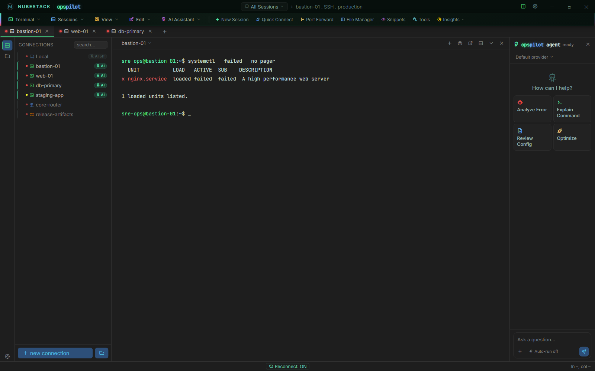

# What OpsPilot is

OpsPilot is a desktop operations workbench. It is a terminal, a file manager, a
remote-desktop client and an AI assistant in one application, and it is built
around a single idea:

!!! quote ""
    **The AI helps you operate your infrastructure. It never operates your
    infrastructure itself.**

## What you do with it

You connect to your servers, switches, storage and desktops the way you already
do — SSH, Telnet, RSH, Mosh, RDP, VNC, FTP, AWS S3, serial or a local shell.
OpsPilot follows the session alongside you. When you ask it a question, it reads
the scrollback, removes the secrets locally, sends only the redacted text to the
model you chose, and returns an explanation together with a proposed command.

That command does not run. It appears in front of you, labelled with a risk tier
and showing the exact text you are about to execute. You decide.

*One window covers the whole job. The tree on the left is saved connections,
grouped and colour-tagged by environment; the centre is the live session; the
right-hand panel is the AI. A connection without the green **AI** badge is
invisible to every model and every assistant.*

## How it differs from an AI coding tool

An AI coding or ops tool normally assumes two things: that the machine being
worked on can reach the internet, and that the model should be given a shell.
OpsPilot inverts both. Your servers can stay disconnected, because only your
workstation needs to reach the model — and with a local model, not even that. The
model is never given a shell: it can propose, and it cannot execute. Those two
inversions are what let AI into regulated banking, defence, healthcare,
industrial control and classified networks.

AI access is set per connection, by the **Enable AI** toggle in the connection
dialog. Set it deliberately and check it before you connect: a connection with AI
off is invisible to every model and every assistant.

## What it does not do

OpsPilot installs nothing on the target hosts. There is no agent, no sidecar, no
daemon, no runtime to deploy and no outbound firewall rule to request.

It has no cloud backend, no account system and no telemetry. Connections, groups,
environments and profiles live in the application's own data directory on your
workstation. Terminal scrollback is held in memory, and OpsPilot writes it to
disk only through the explicit **Save terminal output** and **Print terminal
output** actions.

!!! note "Private or VPN-only is not the same as air-gapped"
    With a cloud provider your *workstation* still reaches the internet, which is
    private or VPN-only operation. A genuinely air-gapped deployment needs a
    local or self-hosted model, after which nothing leaves the machine.

## See also

- [Why OpsPilot](why-opspilot.md) — the capabilities, and the mechanism behind
  each one
- [How it works](how-it-works.md) — the eight steps from question to executed
  command
- [Execution boundary & risk tiers](../safety/risk-tiers.md) — how a proposal
  becomes a command
- [Quickstart](../getting-started/quickstart.md) — install and try the loop
