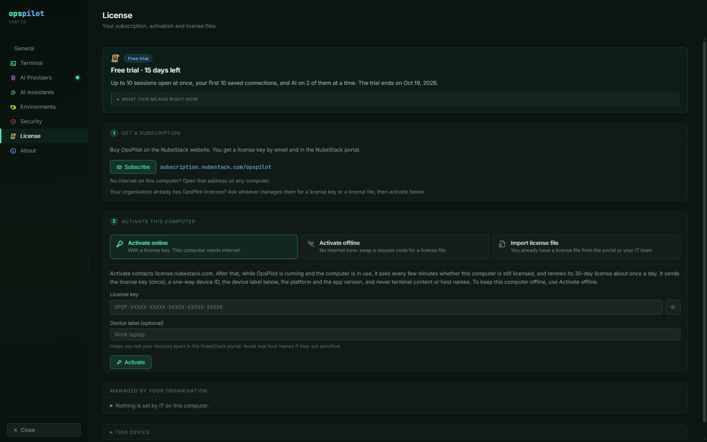

# Settings map

Where each setting lives. The settings overlay has eight pages, listed down the left
sidebar in this order. Open it with the gear in the title bar; **View → License** and the
license chip in the title bar open the License page directly.

| Page | Subtitle in the app | Groups on the page |
|---|---|---|
| General | App behaviour, fonts and layout | Appearance, Layout, Behaviour |
| Terminal | Shell appearance, scrollback and cursor | Display, Interaction, Advanced, Local Terminal |
| AI Providers | Connect Claude, ChatGPT, Gemini, Groq, Ollama and more | Provider cards, Provider Behavior |
| AI Assistants | Connect local assistants and ordinary ChatGPT chats to OpsPilot's approval-gated MCP tools | Use an AI assistant you already have, Assistant connections, Session access, Advanced |
| Environments | Add, rename, recolor or remove the environments connections can be tagged with | Environments, Add environment |
| Security | Idle timeout and session lock policy | Idle Lock, Credentials, Command Safety, Data Handling |
| License | Your subscription, activation and license files | State card, Fix clock, 1 Get a subscription, Your license, 2 Activate this computer, Managed by your organisation, This device |
| About | Product and company information | Product and version, NubeStack attribution, License row, Security guarantees |

General, Terminal and Security save with their own button — **Save General Settings**,
**Save Terminal Settings**, **Save Security Settings** — and nothing on those pages is
saved until you press it. Provider cards save with **Save & Activate** and the Provider
Behavior group with **Save Provider Behavior**. On the License page there is nothing to
save: each action takes effect when you choose it.

## General

| Group | Control | Default |
|---|---|---|
| Appearance | **Theme** | OpsPilot Dark — the only entry |
| Appearance | **Font family** | JetBrains Mono, or Menlo on macOS |
| Layout | **Left panel default width** | 260 px (160–600) |
| Layout | **Show status bar** | On |
| Layout | **Show breadcrumb bar** | On |
| Behaviour | **Confirm before closing a session tab** | On |
| Behaviour | **Reopen last sessions on start** | Off |

One theme ships and there is no theme selector, so **Theme** has a single option.

## Terminal

| Group | Control | Default |
|---|---|---|
| Display | **Font family** | As General |
| Display | **Font size** | 13 (8–32) |
| Display | **Line height** | 1 (1.0–3.0) |
| Display | **Scrollback buffer** | 10000 lines (500–100000) |
| Display | **Cursor style** | Bar (also Block, Underline) |
| Display | **Cursor blink** | On |
| Interaction | **Copy on select** | On |
| Interaction | **Right-click pastes clipboard** | On |
| Interaction | **Bell** | None (silent), Visual flash or Sound — no option is pre-selected |
| Advanced | **Minimum terminal height** | 220 px (100–800) |
| Local Terminal | **Default shell** | Filled in per platform |

Scrollback is held in memory only. OpsPilot never writes it to disk.

## AI Providers

One card per provider, ten in all, each with its own credential fields, a **Test
Connection** button and a model picker. Below the cards is a **Provider Behavior** group
whose settings apply only when you are using a pay-as-you-go provider — an assistant
connector is pull-based and is not affected by them.

What may run without a click is not on this page. The Provider Behavior group says where
it went: it is **Run commands without asking me** in **Settings → Security → Command
Safety**, set per Command Safety profile, and it covers commands from a provider and from a
connected assistant alike.

Using AI from any provider needs an active free trial or subscription; see
[Licensing](../licensing/index.md).

Full detail: [AI provider matrix](provider-matrix.md) and
[AI providers](../ai/providers.md).

## AI Assistants

The MCP connector and the external apps that use it.

| Group | Control | Notes |
|---|---|---|
| (top of the page) | License note | Shown only when the license does not allow assistants, with **License settings**. Says why, for example "AI assistant access needs an active trial or subscription." |
| Use an AI assistant you already have | **Enable connector** | Off by default. Starts the local listener |
| Assistant connections | **Claude Desktop**, **VS Code (Copilot Chat)**, ChatGPT | Each has **Connect** / **Disconnect** and a status badge: **Connected**, **Not connected** or **Needs update** (set up for another copy of OpsPilot or an old token; **Update** fixes it) |
| Assistant connections | Tunnel | **Configure** opens a panel for the tunnel ID and runtime API key. A note says when the license keeps the tunnel off; its settings are kept |
| Session access | **Allow opening/reconnecting sessions** | Off by default |
| Advanced | **Server URL**, **Access token** | Read-only, for manual or debug connections |

**Allow opening/reconnecting sessions** is the master switch for `open_session`. It
only applies to connections that also have **Let AI Assistant open this session**
turned on, which is off by default per connection. See
[MCP tools](mcp-tools.md) and [AI Assistants](../ai/assistants.md).

## Environments

Add, rename, recolour and remove the environment tags a connection can carry. An
environment is a colour-coded tag, not a workspace. See
[Organising connections](../connections/organising.md).

## Security

The page that a security reviewer reads. Four groups.

### Idle Lock

| Control | Default |
|---|---|
| **Lock after idle** | 10 minutes (1–120) |
| **Lock on window minimize** | Off |

### Credentials

| Control | Value |
|---|---|
| **Credential storage** | **OS Keychain**, shown as a badge, not a choice |
| **Clear all saved credentials** | **Clear** button. Cannot be undone |

Where each kind of secret is held:

| Secret | Where it is stored |
|---|---|
| SSH passwords, private key passphrases | `credentials.enc.json`, encrypted by the operating system |
| OpenStack passwords and application-credential secrets | The same encrypted path |
| S3 secret access keys | The same encrypted path |
| OpenAI tunnel runtime key | Its own encrypted file, decrypted only into the tunnel process |
| The secret of an online license activation | Encrypted by the operating system. Your license key itself is never stored |
| AI provider API keys | `settings.json`, in plain text |

Connection credentials are fail-closed: if the operating system cannot encrypt the
credential, saving fails rather than storing it in the clear. The same holds for an online
activation, which is refused where the secret cannot be encrypted (offline activation is
offered instead). Provider API keys take the ordinary settings path — see [Security
model](../safety/security-model.md) for what that means for a review.

**Clear** removes saved AI provider configuration, including provider API keys. It does
not remove saved connection credentials; delete the connections that hold them.

See [Credentials](../connections/credentials.md).

### Command Safety

The three rule rows here edit the **Default** Command Safety profile — the one used by any
group or connection with nothing more specific assigned. Every other profile has the same
three rows in its editor, under **Manage profiles…**.

| Control | Default | What it does |
|---|---|---|
| **Run commands without asking me** | **Ask me every time** | What may run with no click. **Ask me every time**: nothing. **Only read-only commands**: commands the AI marks read-only. **Everything except dangerous ones**: anything that does not count as dangerous |
| **What counts as a dangerous command** | **The AI's warning and my list** | **The AI's warning and my list**: dangerous if the AI says so or the command contains a word in the profile's list. **Only my list**: the list is the only judge; an AI warning is shown on the command but not applied |
| **Make me type a reason for dangerous commands** | On | On: a dangerous command needs a typed reason and a click, and the reason is kept with the command. Off: a click is enough |
| **What this means right now** | — | Plain sentences under the three rows describing what the current choices do, updated as you change them |
| **Command Safety profiles** | **Manage profiles…** | Edit the Default list, create named profiles copied from an existing one, assign per group or per connection |
| **How OpsPilot runs a command** | **Always enforced** | A badge, not a toggle |

A dangerous command always needs a click, under every combination of these rules.
Saving a profile set to **Everything except dangerous ones** or **Only my list** first
shows **Check these rules before saving**, which lists what the rules will do and asks
you to confirm. Profiles that existed before these rules were added keep their behaviour:
**Only read-only commands** if read-only auto-run was on, **Ask me every time** if it
was off.

**How OpsPilot runs a command** is reported as **Always enforced**. The model never
touches a real shell; OpsPilot's own code is what runs anything, and that boundary cannot
be changed. **Run commands without asking me** changes whether a click is needed, never
who executes.

In the AI panel, the chip under the input box shows which rule applies to the active tab —
**Auto-run off**, **Auto-run read-only** or **Auto-run all** — and opens this page when
clicked. The approval buttons on a proposal card are **approve & run** and **dismiss**.

_The Default profile's rules as they ship: **Ask me every time**, **The AI's warning and my
list**, and the typed reason on. The panel under them restates the choices in plain
sentences, and changes as you change them._

See [Command Safety profiles](../safety/command-safety-profiles.md),
[Dangerous patterns](dangerous-patterns.md) and
[Execution boundary and risk tiers](../safety/risk-tiers.md).

### Data Handling

| Control | Default | What it does |
|---|---|---|
| **Redaction** | Always on | Secrets are scrubbed from terminal output before it leaves the app |
| **Show redaction badge** | On | Purely a display choice |
| **Data Handling profiles** | **Manage profiles…** | Category toggles and custom patterns per profile |

Hiding the badge does not disable redaction. See
[Data Handling profiles](../safety/data-handling-profiles.md) and
[Redaction categories](redaction-categories.md).

## License

Your license, and the ways to activate this computer. The groups run top to bottom in this
order, and most appear only when they apply. The page has a dot in the sidebar when
something there needs attention.

_During the trial the state card gives the limits and the end date. **1 Get a
subscription** comes first, then the three ways to activate; Managed by your organisation
and This device are folded at the bottom._

### State card

| Element | What it shows |
|---|---|
| Badge | **Free trial**, **Licensed**, **Renewal due**, **No subscription**, **Clock problem**, **Checking…**, **Unavailable**, or the problem by name, such as **Subscription ended** or **License expired** |
| Headline | For example **Free trial · 12 days left**, **Licensed to Demo Bank**, **Your free trial has ended**, **This computer was released from its subscription** |
| Dates | **Paid through … · renews automatically** for an online activation, **Valid until …** for a license file |
| **What this means right now** | What this state allows: sessions open at once, which saved connections open (in the trial and without a subscription, your first 10), where AI is on, and whether AI assistants and the ChatGPT tunnel work. Folded under a one-line summary in the trial and when licensed; open in every other state |
| **Try again** | Only when licensing could not start |
| **Use this computer's current identity** | Below the card, only while OpsPilot cannot read this computer's identity. The computer then counts as a new device, to be activated again |

### Fix clock

Shown only while this computer's clock needs fixing.

| Control | What it does |
|---|---|
| **Check again** | Checks the date and time now, after you have corrected them |
| **Check now** | With an online activation: asks the license server, which repairs the clock record once the clock is right |
| Clock-reset code, **Copy**, **Save clock-reset request file**, **Import clock-reset file** | With a license file: enter the code in the NubeStack portal and import the file you get back |
| **Import clock-reset file**, **Email NubeStack support** | On a computer that has only a deployment license |

### 1 Get a subscription

Shown during the free trial and without a subscription.

| Control | What it does |
|---|---|
| **Subscribe** | Opens <https://subscription.nubestack.com/opspilot>. The address is shown as text too, to open on another computer |
| Note for organisations | Where your organisation already has licenses, ask whoever manages them for a key or a license file, then activate below |

### Your license

Shown once anything is activated or imported.

| Control | What it does |
|---|---|
| Online activation | When it was activated online. **Check now** asks the license server at once |
| **Deactivate this device** | Releases this computer's device slot, so the key can be used on another computer. Not offered when the key is set by IT |
| **Remove from this computer only** | Offered only when deactivation failed or online activation is off: removes the activation here without telling the license server. Release the device in the portal to free its slot |
| **License files** | Each license in use with its state and expiry, the online license included. Files you imported have **Remove**; the online license and files IT installed do not |
| **Import license file** | For a renewed license file |
| **Open the portal** | Opens the NubeStack portal |
| Device code | This computer's device code, such as `R59-EFG`, the same one the portal shows next to it |

_Once the computer is licensed, the state card names the organisation and seat, and
**2 Activate this computer** folds under **Use a different license key or file**._

### 2 Activate this computer

Three ways, one panel at a time. Once the computer is licensed, this group folds under
**Use a different license key or file**.

| Way | What is in it |
|---|---|
| **Activate online** | What activation sends and how often OpsPilot checks; **License key**; **Device label (optional)**; **Activate**. When it cannot be used, the choice says why: **Turned off by your IT team**, **Off: the IT policy file could not be read.** or **Off: this computer has no secure storage for it.** When the key is already used on 2 devices, lists them with their device codes and **Manage devices in the portal** |
| **Activate offline** | Three steps: the request code with **Copy** and this computer's device code; the portal step with **Open the portal**; **Import license file**. **Save request file** writes the code to a file instead |
| **Import license file** | For a `.opslic` file you already have: an offline license, a renewed file or a deployment license. **Paste license text instead** takes the file's text |

### Managed by your organisation

What IT has set on this computer, folded under one line (**Nothing is set by IT on this
computer.** when that is so).

| Row | Values |
|---|---|
| **IT policy folder** | The managed folder's path on this computer |
| **Online activation** | **Allowed**, **Turned off by IT**, or **Off (policy file could not be read)** |
| **Device identity** | **This computer**, or **Roaming (virtual desktops)** |
| **License key** | **Set by IT**, or **Released on this computer** — shown only when `policy.json` sets a key |
| **Check again** | Reads the folder now. OpsPilot otherwise reads it at start and every 10 minutes |

See [Licensing for IT](../licensing/for-it.md).

### This device

Folded by default.

| Row | Value |
|---|---|
| **Platform** | Windows, macOS or Linux |
| **Device identity** | **This computer**, **Roaming (virtual desktops)**, or **Not read yet** |
| **Device code** | Six characters such as `R59-EFG`. Not shown while OpsPilot is still checking this computer's identity |
| **OpsPilot version** | The installed version |
| Revocation list | Its number and issue date, or **No revocation list** |

### Elsewhere in the window

- **License chip** in the title bar, shown when there is something to know, for example
  **Trial · 12 days left**, **License ends in 5 days**, **No subscription · AI off** or
  **Clock problem · AI paused**. Clicking it opens this page.
- **Banner** below the tabs for the one license matter worth acting on now — the trial
  ending within 3 days, a renewal due, a released computer — with its own buttons and
  **Dismiss**. It never takes the keyboard from the terminal.

See [Activate OpsPilot](../licensing/activation.md) and
[Troubleshooting](../operations/troubleshooting.md).

## About

| Element | What it shows |
|---|---|
| Product | The OpsPilot wordmark with the version next to it, for example `v0.5.1`, and a short description |
| NubeStack | The attribution and a link to nubestack.com |
| License row | **License:** followed by the title-bar chip's text, or **Licensed**, with **Manage**, which opens the License page. Hidden while the license is still being checked |
| **Security guarantees** | The five statements listed below |
| Footer | Copyright |

The **Security guarantees** list reads:

- Terminal output is always redacted before being sent to any AI provider
- AI never executes commands directly — only user-approved actions reach the shell
- Dangerous commands always need a click; a typed reason is optional per profile
- SSH credentials are never stored in plaintext
- No telemetry. Licenses are checked on this computer; online activation is optional.

_The version sits next to the wordmark. The License row repeats the title-bar chip, here
**Trial · 15 days left**, and **Manage** opens the License page._

## See also

- [Execution boundary & risk tiers](../safety/risk-tiers.md) — what the Security
  page enforces
- [Activate OpsPilot](../licensing/activation.md) — the License page in use
- [MCP tools](mcp-tools.md) — what the AI Assistants page exposes
- [Hardening](../safety/hardening.md) — a recommended starting configuration
