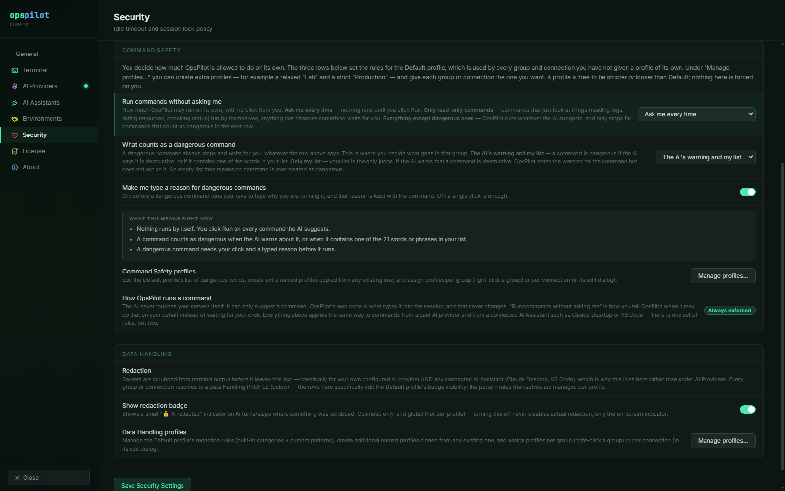
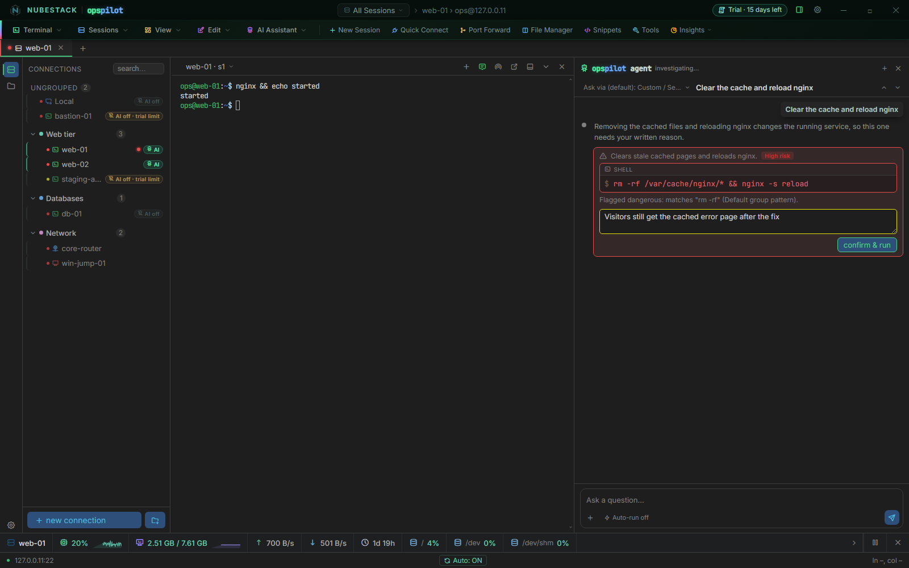

# Approvals and auto-run

Every Command Safety profile sets three rules that decide what a proposed command has to
pass through before it runs: whether it may run without a click, what counts as a
dangerous command, and whether a dangerous command also needs a typed reason. Below are
those rules, what each combination lets run on its own, and what happens while a command
waits for you.

## Where the rules live

The rules belong to a [Command Safety profile](command-safety-profiles.md), so they can
differ between a production group and a lab group. They are set in two places, with the
same three controls in each:

- **Settings → Security → Command Safety** sets the rules of the **Default** profile, which
  every group and connection uses unless it has a profile of its own. **Save Security
  Settings** saves them.
- **Manage profiles…** on the same page lists every profile. Click one to open its editor,
  which holds the same three controls above that profile's dangerous-pattern list.

Saved rules apply at once to every open session that uses the profile. No restart is
needed.

_The Command Safety group at its defaults: **Ask me every time**, **The AI's warning and
my list**, and the typed reason on. **What this means right now** restates them in three
sentences. **How OpsPilot runs a command** is a badge, **Always enforced**, not a
switch._

## The three rules

| Control | Options | Default |
|---|---|---|
| **Run commands without asking me** | **Ask me every time** · **Only read-only commands** · **Everything except dangerous ones** | **Ask me every time** |
| **What counts as a dangerous command** | **The AI's warning and my list** · **Only my list** | **The AI's warning and my list** |
| **Make me type a reason for dangerous commands** | On · Off | On |

- **Run commands without asking me** sets how much OpsPilot may run with no click from
  you. **Ask me every time** means nothing runs until you click. **Only read-only
  commands** lets commands that only look at things — reading logs, listing resources,
  checking status — run by themselves. **Everything except dangerous ones** runs whatever
  the AI suggests, and stops only for commands that count as dangerous.
- **What counts as a dangerous command** decides what goes in the
  High risk tier. With **The AI's warning and my list**,
  a command is dangerous if the AI says it is destructive or if it contains one of the
  words or phrases in the profile's list. With **Only my list**, the list is the only
  judge: the AI's warning is shown on the command but not acted on, and an empty list
  means no command is ever treated as dangerous.
- **Make me type a reason for dangerous commands** decides whether a dangerous command
  needs a typed reason as well as a click. Off, a single click is enough.

A dangerous command always stops and waits for your click, whatever the first rule says.
No setting runs a High risk command on its own.

## What runs without a click

| Run commands without asking me | Read-only | Low risk | High risk |
|---|---|---|---|
| **Ask me every time** | Click | Click | Click, and a typed reason if the profile asks for one |
| **Only read-only commands** | Runs by itself | Click | Click, and a typed reason if the profile asks for one |
| **Everything except dangerous ones** | Runs by itself | Runs by itself | Click, and a typed reason if the profile asks for one |

The Read-only tag is the model's own judgment of
its command. Your dangerous-pattern list is the independent check on it: a command that
matches a pattern is High risk, and never runs on its own, even if the model tagged it
read-only.

**Everything except dangerous ones** runs Low risk
commands too — commands that change something but that neither the AI nor your list
called dangerous. Combined with **Only my list**, a command the AI warned is destructive
runs by itself unless it matches your list; its row then carries the note that the
warning was not applied (see [Command Safety profiles](command-safety-profiles.md)).

Rules apply to every source in the same way: a proposal from OpsPilot's own AI panel and
one from a connected AI Assistant such as Claude Desktop meet the same profile.

## The summary panel

Under the three controls, a panel titled **What this means right now** restates the
current choice in plain sentences, and updates as you change a control or edit the
pattern list, before you save. For example:

| Choice | What the panel says |
|---|---|
| **Ask me every time** | "Nothing runs by itself. You click Run on every command the AI suggests." |
| **Only read-only commands** | "Commands that only look at things — reading logs, listing resources, checking status — run by themselves. Every other command waits for your click." |
| **Everything except dangerous ones** | "Every command runs by itself, with no click from you. The only exception is a command that counts as dangerous." |
| **Only my list**, with an empty list | "No command counts as dangerous. You have told OpsPilot to ignore the AI's own warnings and use only your list, and your list is empty." |

A further line says what a dangerous command needs: a click and a typed reason, or a
click only. Sentences describing a looser choice are highlighted. When **Everything
except dangerous ones** is combined with **Only my list** and an empty list, the panel is
marked in red and ends with a bottom line: every command the AI suggests will run
straight away, without asking first, including ones that delete data or shut machines
down.

## The save confirmation

Saving a profile with **Everything except dangerous ones** or with **Only my list** opens
a confirmation titled **Check these rules before saving**. It names the profile, repeats
the same sentences for every connection that uses it, and asks **Save these rules?** with
**Save rules** and **Cancel**.

It never refuses: any combination can be saved, so a throwaway lab can be run as loosely
as you choose. It makes sure a looser choice is made on purpose. **Cancel** on the
Security page saves nothing on that page.

## The auto-run chip

The AI panel's composer carries a chip that shows the rule for the session in the active
tab:

| Chip | Meaning in this tab |
|---|---|
| **Auto-run off** | Every command waits for your click |
| **Auto-run read-only** | Read-only commands run by themselves |
| **Auto-run all** | Every command runs by itself, except dangerous ones |

Two open tabs can show different chips when their connections use different profiles. The
chip only reports the rule; clicking it opens **Settings → Security**, because the rule
belongs to a profile that other connections may share.

## Choosing rules per environment

| Environment | Run commands without asking me | What counts as a dangerous command | Typed reason | Patterns |
|---|---|---|---|---|
| Production | **Ask me every time** | **The AI's warning and my list** | On | Full list |
| Staging | **Only read-only commands** | **The AI's warning and my list** | On | Full list |
| Lab / sandbox | **Only read-only commands** or **Everything except dangerous ones** | Either | Optional | Minimal |

Read-only work — tailing logs, describing resources, checking status — is where an
investigation spends most of its time, and approving a long series of commands makes it
easy to stop reading them. **Only read-only commands** removes those clicks while
anything that changes something still waits. Use it where the blast radius of a
misjudged read-only tag is one you accept.

Because the rules are per profile, these rows genuinely differ once you
[assign profiles](command-safety-profiles.md) to groups. A production tab and a lab tab
open side by side each follow their own profile, and the chip shows which.

## While a command is waiting

OpsPilot makes a pending approval visible outside its own window:

- **A count on the application icon.** On Windows this is a taskbar overlay icon showing
  the number of pending approvals; on macOS it is the dock badge. There is no icon badge
  on Linux.
- **A desktop notification** naming the session and the tier, with the start of the
  command text.
- **Clicking the notification brings OpsPilot to the foreground**, switches to the right
  session and scrolls the pending proposal into view. The window restores itself if it
  was minimised.

Inside the window, a pending proposal is shown expanded, with the full command text and
its buttons, and collapses to a single line once it has been resolved. A command that is
about to run by itself shows **will run automatically** for a moment instead of buttons.

## High risk: the typed reason

When **Make me type a reason for dangerous commands** is on for the resolved profile, a
High risk command does not offer an approve button.
It offers a reason box, and the **confirm & run** button stays disabled until you have
typed at least ten characters. The button then has to be clicked (or Enter pressed); it
does not fire the moment you cross the threshold, so it will not run mid-sentence.

Above the box, OpsPilot says why the command was flagged: the pattern it matched, or
**Flagged dangerous by the AI.** The reason you type is the confirmation — there is no
separate "type RUN to continue" step — and it is kept with the command, shown as
**Approved:** followed by your reason.

_The command contains `rm -rf`, so it is **High risk**, and the card names the pattern
and the profile it came from. The reason is typed in the box; **confirm & run** then
needs a click._

!!! note "The reason stays with the session"
    The session transcript, including the reason you type, is held in memory for the life
    of the session. If you need a durable record of what was run and why, capture it from
    your own session-recording arrangements. See [Security model](security-model.md).

With the setting off, a High risk command gets the same **approve & run** / **dismiss**
row a Low risk command gets. An explicit click is still required; only the typed reason
goes away.

## Proposals from a connected assistant

A proposal from Claude Desktop, VS Code or ChatGPT meets the same three rules as one from
OpsPilot's own panel. One thing differs: it expires. The connector waits five minutes for
a decision, then tells the assistant there was no response. The row shows **proposal
expired — no longer waiting on this**, and the assistant will usually propose it again
as a fresh turn.

A waiting proposal is also refused, and the assistant is told why, when AI goes off for
its session before you decide: the license no longer allows AI there, you moved the
trial's AI to another connection, you turned AI off, or the session closed. The row then
reads, for example, **Expired: AI is off.**

Destructive change from a phone is therefore deliberately impractical. A
High risk command needs a click at the workstation,
and a proposal does not sit waiting for an hour while you walk back to your desk. See
[Remote and mobile operation](../ai/remote-mobile.md).

## How OpsPilot runs a command

The Security page lists **How OpsPilot runs a command** with the badge **Always
enforced**, not a switch. The AI never touches a session itself. It can only suggest a
command, and OpsPilot's own code is what types it into the session — the same way for a
command you clicked and for one your profile let run by itself. **Run commands without
asking me** decides only when OpsPilot may do that on your behalf instead of waiting for
your click.

## See also

- [Execution boundary & risk tiers](risk-tiers.md) — where the tiers come from
- [Command Safety profiles](command-safety-profiles.md) — the pattern list, creating
  profiles and assigning them
- [Using the AI panel](../ai/using-the-ai-panel.md) — the approval flow step by step
- [Hardening checklist](hardening.md) — the rules a production profile should use
