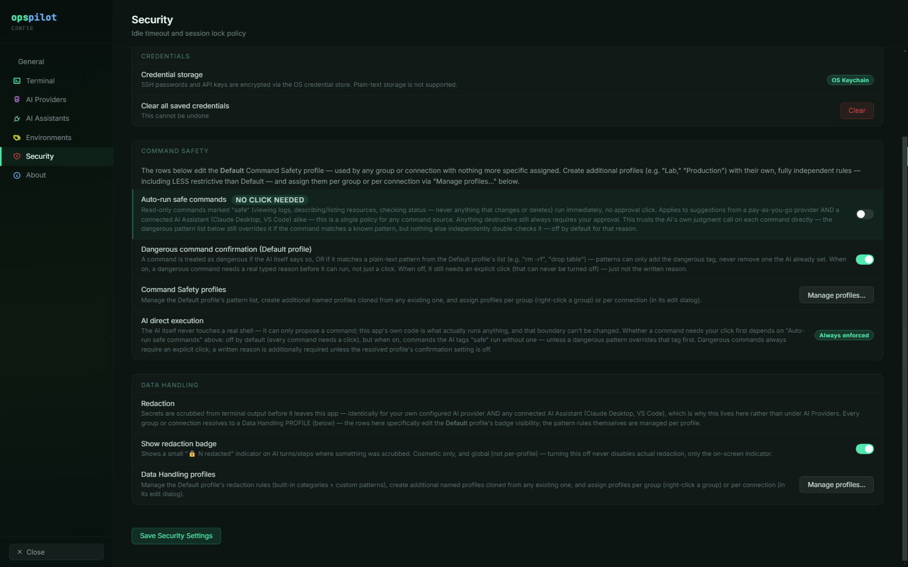

# Command Safety profiles

A Command Safety profile is the policy that decides which proposed commands are treated
as dangerous on a given session, and how much friction a dangerous one gets. Profiles are
named, assigned per connection or per group, and managed from **Settings → Security →
Command Safety → Manage profiles…**.

## What a profile defines

A profile holds exactly two things:

- **Dangerous patterns** — plain-text, case-insensitive substrings. A proposed command
  containing any of them is forced into the
  <span class="tier tier-high">High risk</span> tier, whatever the model said about it.
- **Dangerous confirmation required** — whether a High risk command needs a typed written
  justification, or just an explicit click. The click is never optional.

That is the whole surface. There is no allow list, no per-command exception and no way to
mark something safe that the model called dangerous — see
[the asymmetry](risk-tiers.md).



*The **Command Safety** group on the Security page. The rows here edit the **Default**
profile; **Manage profiles…** is where additional named profiles are created and
assigned. Note that **AI direct execution** is reported as a permanent property of the
application, not a toggle.*

## How a profile is chosen

Precedence is **connection → group → Default**:

1. If the session's connection has a Command Safety profile assigned, that one applies.
2. Otherwise, if the connection's group has one assigned, that one applies.
3. Otherwise the **Default** profile applies.

The Default profile is seeded on first read with the 21 shipped dangerous patterns and
confirmation on. It is fully editable, and it cannot be deleted — there must always be a
resolvable fallback. A profile id that no longer exists, because someone deleted the
profile a connection still referenced, is treated as unset and falls through the same
chain to Default rather than failing.

Resolution is re-read per turn rather than captured when the session opened, so moving a
connection into a different group changes the policy that applies to its open session
too.

!!! note "Profile assignment is SSH-only"
    Per-connection Command Safety and Data Handling assignment applies to SSH sessions.
    The AI path resolves sessions through the SSH session manager specifically, and the AI
    badge is not rendered for external launchers, file browsers, Telnet or RSH. A profile
    assigned to a Telnet or RSH connection therefore does nothing — not because it is
    permissive, but because no proposal can ever be made against that session. Scope your
    policy accordingly, and do not count a Telnet connection as covered.

## Profile replacement

A profile does not add its patterns to Default's; it **replaces** Default entirely. A
`Lab` profile with two patterns and confirmation off is a complete policy, and it is
*less* restrictive than Default. That is deliberate: a group profile is a policy in its
own right, so a sandbox can be governed more loosely than the estate as a whole.

!!! warning "A permissive profile on a production group is a real exposure"
    Because profiles replace rather than extend, assigning `Lab` to a production group
    silently removes every pattern in Default from every connection in that group. There
    is no warning at assignment time and no merge to fall back on. Review profile
    assignments as part of rollout, and re-review them whenever a connection moves
    between groups. [Hardening checklist](hardening.md) has this as a standing item.

## Plain substrings rather than regular expressions

Dangerous patterns are deliberately not regular expressions. Plain substrings are quicker
to write and quicker to review, and a substring match cannot hang the interface or
backtrack catastrophically.

The cost is precision. `truncate` matches any command containing the word, and `chown -r`
matches any recursive ownership change, not only the catastrophic ones. That trade is made
on purpose: over-matching costs you a typed justification, while under-matching costs you
an outage.

Custom *redaction* patterns are the opposite case — they are real regular expressions,
because a redaction pattern has to describe a data format rather than a command fragment.
Each of those is validated before it can be saved. See
[Data Handling profiles](data-handling-profiles.md).

## Building your list

The 21 shipped defaults already cover the obvious destructive commands — `rm -rf`,
`mkfs`, `dd if=`, `drop table`, `shutdown`, `reboot`, `helm uninstall`, `iptables -F` and
the rest. The full list is on
[Default dangerous patterns](../reference/dangerous-patterns.md).

Your work is therefore the tooling and the platform verbs specific to your estate, which
no shipped default can guess.

??? example "A starting list of additions beyond the defaults"
    None of these ship in the Default profile. Add the ones that apply to your estate,
    and keep them in the profile that governs production.

    ```text
    terraform destroy
    systemctl stop
    systemctl disable
    kubectl delete
    oc delete project
    openstack server delete
    openstack volume delete
    ceph osd rm
    > /dev/sd
    ```

    Notes on a few of them:

    - `kubectl delete` is broader than the shipped `kubectl delete namespace` and
      `kubectl delete pv`, and will flag routine pod deletions too. That is usually the
      right answer in production and the wrong answer in a lab — which is what separate
      profiles are for.
    - `systemctl stop` catches stopping any unit, including ones that are harmless to
      stop. Decide deliberately.
    - Add your own scheduler, storage and network-fabric verbs. A command that empties a
      switch configuration is not in any default list.

Review the finished list with whoever owns the estate, not only with whoever uses
OpsPilot, and treat a change to the dangerous-pattern list as a reviewed change.

## See also

- [Default dangerous patterns](../reference/dangerous-patterns.md) — the 21 shipped
  entries
- [Approvals & auto-run](approvals.md) — what a High risk classification costs in practice
- [Organising connections](../connections/organising.md) — groups, which is where a
  profile is usually assigned
- [Hardening checklist](hardening.md) — profile assignment as a pre-deployment gate
