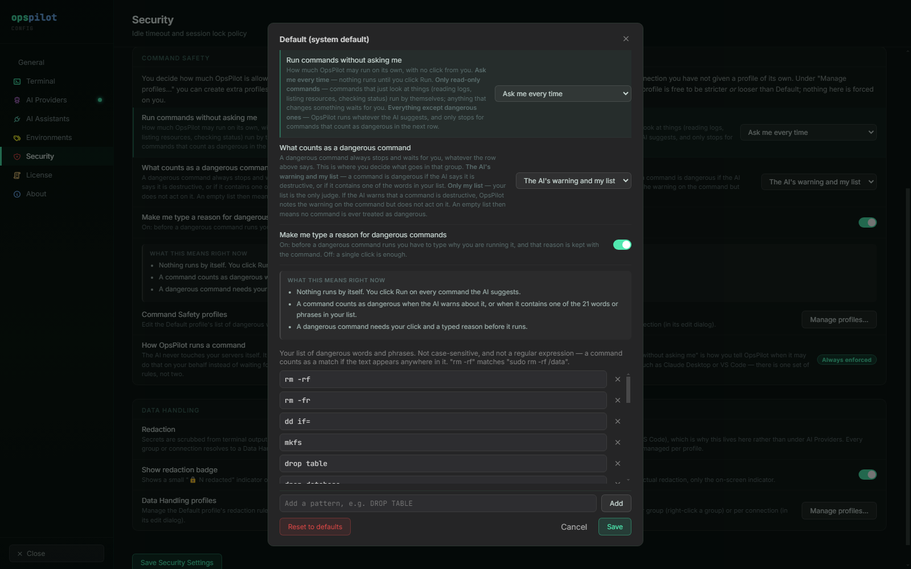

# Command Safety profiles

A Command Safety profile is the policy that decides, for the sessions it applies to, which
proposed commands count as dangerous, which may run without a click, and how much
friction a dangerous one gets. Profiles are named, assigned per connection or per group,
and managed from **Settings → Security → Command Safety → Manage profiles…**.

## What a profile defines

A profile holds four things:

- **Run commands without asking me** — **Ask me every time**, **Only read-only
  commands** or **Everything except dangerous ones**.
- **What counts as a dangerous command** — **The AI's warning and my list**, or **Only
  my list**.
- **Make me type a reason for dangerous commands** — on or off.
- **Your list of dangerous words and phrases** — plain-text, case-insensitive substrings.
  A proposed command containing any of them is
  <span class="tier tier-high">High risk</span>, whatever the model said about it.

What the three rules do, and what each combination lets run on its own, is on
[Approvals & auto-run](approvals.md). There is no allow list and no per-command
exception. The one thing no profile changes: a dangerous command always needs your click,
and the AI never runs anything itself.


_The editor for the **Default** profile. The three rules sit above the summary, which
counts the 21 words and phrases in the list below it. Add a phrase in the field at the
bottom; **Reset to defaults** restores the shipped list and the cautious rules._

## The Default profile

**Default** is the profile every group and connection uses unless it has one of its own.
On a new installation it starts with:

- **Run commands without asking me:** **Ask me every time**
- **What counts as a dangerous command:** **The AI's warning and my list**
- **Make me type a reason for dangerous commands:** on
- the 21 shipped [dangerous patterns](../reference/dangerous-patterns.md)

Its three rules are the controls on the Security page itself; its pattern list is edited
from **Manage profiles…**. Default is fully editable and cannot be deleted, because there
must always be a profile to fall back to. A profile that was deleted while a connection
still referenced it is treated as unset, and that connection falls through to its group's
profile or to Default.

## Creating and editing profiles

**Manage profiles…** lists every profile with a one-line summary of what it does, for
example *asks every time · AI + your list · 21 patterns · reason on*, so two profiles with
the same number of patterns but different rules are easy to tell apart.

- **New profile…** asks for a name and a profile to **clone rules from**. The new profile
  copies all of that profile's rules and its pattern list, not only the list.
- Click a profile to open its editor: the three rules, the **What this means right now**
  summary, and the pattern list. Add a word or phrase with **Add**, remove one with its
  ✕. The summary updates as you edit, so emptying the list under **Only my list** shows
  at once that nothing would count as dangerous.
- **Reset to defaults** restores the cautious starting point — the 21 shipped patterns,
  **Ask me every time**, **The AI's warning and my list** and the typed reason on. Nothing
  is saved until you click **Save**.
- Saving looser rules shows the **Check these rules before saving** confirmation
  described on [Approvals & auto-run](approvals.md).

## How a profile is chosen

Precedence is **connection → group → Default**:

1. If the session's connection has a Command Safety profile assigned, that one applies.
2. Otherwise, if the connection's group has one assigned, that one applies.
3. Otherwise the **Default** profile applies.

Assign a profile to a group by right-clicking the group, or to a connection in its edit
dialog. The profile choice appears for **SSH** and **Local Console** connections, the two
kinds of session the AI works on. A Local Console tab runs proposed commands on your own
workstation, so it is a good candidate for a profile of its own.

The profile is resolved again for each proposal rather than fixed when the session
opened, so moving a connection into a different group changes the rules for its open
session too. The composer's auto-run chip shows the rule for the tab in front of you.

## Profile replacement

A profile does not add its patterns or rules to Default's; it **replaces** Default
entirely. A `Lab` profile with two patterns, **Everything except dangerous ones** and the
typed reason off is a complete policy, and it is *less* restrictive than Default. That is
deliberate: a group profile is a policy in its own right, so a sandbox can be governed
more loosely than the estate as a whole.

!!! warning "A permissive profile on a production group is a real exposure"
    Because profiles replace rather than extend, assigning `Lab` to a production group
    removes every pattern in Default from every connection in that group, and can let
    commands run there without a click or switch off the AI's own warning. Nothing
    warns at assignment time. Review profile assignments as part of rollout, and again
    whenever a connection moves between groups. The [Hardening checklist](hardening.md)
    has this as a standing item.

## Only my list

By default a command is dangerous if the AI says so **or** your list matches it, so your
list can only make classification stricter: a pattern match can promote a command to
<span class="tier tier-high">High risk</span>, and nothing turns a command the AI flagged
back into a lower tier.

**Only my list** makes your list the only judge. A command the AI flags as destructive
but your list does not match is treated as <span class="tier tier-low">Low risk</span>.
The warning is not hidden: while the command is shown in the AI panel, its row carries an
amber note:

> The AI flagged this command as destructive. This connection's Command Safety profile
> only treats your own patterns as dangerous, so that warning was not applied.

Use **Only my list** where you have a complete list and the AI's caution gets in the way
— a lab where `rm -rf` on scratch data is routine, say. With an empty list it means no
command is ever dangerous, so under **Everything except dangerous ones** every proposal
runs straight away.

## Plain substrings rather than regular expressions

Dangerous patterns are deliberately not regular expressions. Plain substrings are quicker
to write and quicker to review, and a substring match cannot hang the interface or
backtrack catastrophically. Matching is case-insensitive: `rm -rf` matches
`sudo rm -rf /data`.

The cost is precision. `truncate` matches any command containing the word, and `chown -r`
matches any recursive ownership change, not only the catastrophic ones. That trade is made
on purpose: over-matching costs you a click and perhaps a typed reason, while
under-matching can cost you an outage.

Custom *redaction* patterns are the opposite case — they are real regular expressions,
because a redaction pattern has to describe a data format rather than a command fragment.
Each of those is validated before it can be saved. See
[Data Handling profiles](data-handling-profiles.md).

## Building your list

The 21 shipped defaults already cover the obvious destructive commands — `rm -rf`,
`mkfs`, `dd if=`, `drop table`, `shutdown`, `reboot`, `helm uninstall`, `iptables -F` and
the rest. The full list is on
[Default dangerous patterns](../reference/dangerous-patterns.md).

Your work is therefore the tooling and the platform verbs specific to your estate, which
no shipped default can guess. This matters most for any profile set to **Only my list**,
where the list is the only check.

??? example "A starting list of additions beyond the defaults"
    None of these ship in the Default profile. Add the ones that apply to your estate,
    and keep them in the profile that governs production.

    ```text
    terraform destroy
    systemctl stop
    systemctl disable
    kubectl delete
    oc delete project
    openstack server delete
    openstack volume delete
    ceph osd rm
    > /dev/sd
    ```

    Notes on a few of them:

    - `kubectl delete` is broader than the shipped `kubectl delete namespace` and
      `kubectl delete pv`, and will flag routine pod deletions too. That is usually the
      right answer in production and the wrong answer in a lab — which is what separate
      profiles are for.
    - `systemctl stop` catches stopping any unit, including ones that are harmless to
      stop. Decide deliberately.
    - Add your own scheduler, storage and network-fabric verbs. A command that empties a
      switch configuration is not in any default list.

Review the finished list with whoever owns the estate, not only with whoever uses
OpsPilot, and treat a change to a profile — its rules or its list — as a reviewed change.

## See also

- [Approvals & auto-run](approvals.md) — the three rules and what each lets run
- [Default dangerous patterns](../reference/dangerous-patterns.md) — the 21 shipped
  entries
- [Groups & environments](../connections/organising.md) — groups, which is where a
  profile is usually assigned
- [Hardening checklist](hardening.md) — profile assignment as a pre-deployment gate
