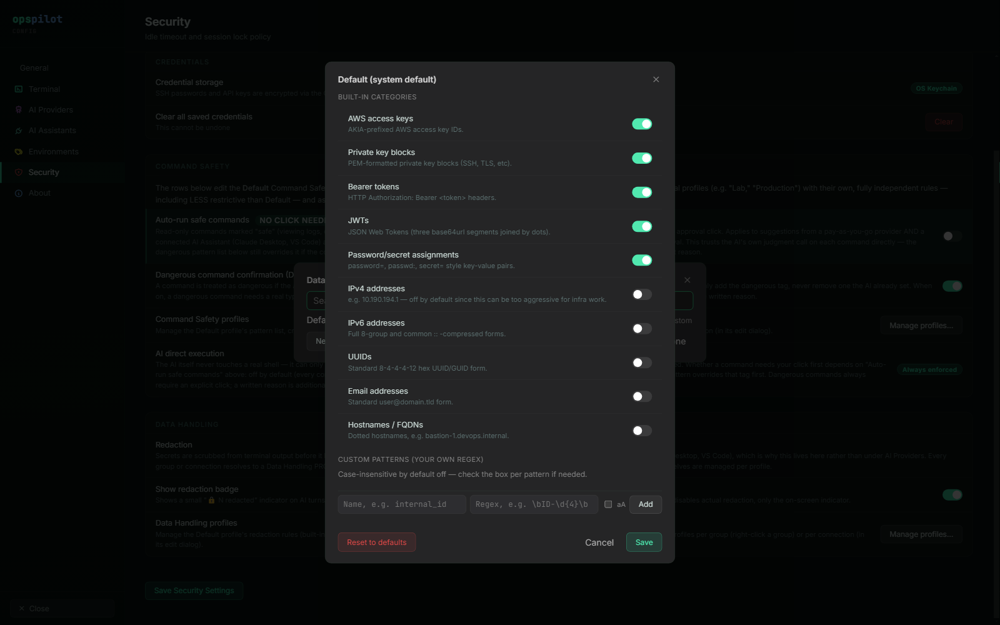

# Data Handling profiles

A Data Handling profile is the redaction policy for a session: which categories of
sensitive text are scrubbed out of terminal content before any of it reaches an AI model,
plus any regular expressions of your own. Profiles are named, assigned per connection or
per group, and managed from **Settings → Security → Data Handling → Manage profiles…**.

## The redaction choke point

OpsPilot redacts locally, before a single byte reaches an AI provider. There is exactly
one redaction entry point, and every path that can move session content towards a model
calls it the same way:

| Path | What it carries |
|---|---|
| A diagnosis request | Recent terminal output gathered for the model to analyse |
| A typed question | Output gathered for a question you asked in the AI panel |
| An approved command | The command's own output, before it feeds back into the next turn |
| An attachment | A file you attach to a turn by hand, local or remote |
| Session output read by an assistant | Scrollback requested over the MCP connector |
| A file read by an assistant | File contents requested over the MCP connector |

The executed-command loop is covered: a command's own output is redacted on the way back
into the model's context, which is where most redaction in a real investigation happens.
Content with no connection context resolves to the **Default** profile rather than
skipping redaction — a missing profile degrades to Default, never to sending raw text.

Matches are replaced with a typed placeholder naming the category, such as
`[REDACTED:aws_access_key]`, so the model can still reason about the shape of the output
and you can still see what was removed.

### Attachments resolve to Default

Attachment handling has two specifics to know before you rely on a strict profile:

- **A file attached from the remote session** is redacted with the profile that resolves
  for that connection.
- **A file attached from the local machine** has no connection or session context at all —
  it is a file picker, not a session — so it always resolves to the **Default** Data
  Handling profile. If you have a strict production profile and you attach a local copy of
  a production log, the Default profile is what scrubs it. Keep Default strict enough to
  be an acceptable floor.

Attachments are also capped at 40,000 characters. Anything longer is clipped to that
length before redaction and flagged as truncated, so the model is told it is working from
a partial file.

## The ten built-in categories

| On by default | Off by default (opt in) |
|---|---|
| AWS access keys | IPv4 addresses |
| Private key blocks | IPv6 addresses |
| Bearer tokens | UUIDs |
| JWTs | Email addresses |
| Password/secret assignments | Hostnames / FQDNs |

Each is an independent on/off toggle in the profile. What each one matches is listed on
[Redaction categories](../reference/redaction-categories.md).

*Data Handling profiles. The five credential categories are on by default; the five
structural categories are opt-in. Your own patterns go at the bottom, and each is
validated before it can be saved.*

### Credential and structural categories

The five credential categories are on because no infrastructure task needs the model to
see a live AWS key or a private key block.

The five structural categories are off because redacting every IP address and hostname
makes infrastructure diagnosis considerably harder. A diagnosis of a routing problem, a
failed health check or a TLS handshake is largely a discussion of addresses and
hostnames. Turn them on where the classification of the data requires it — production
profiles in regulated estates are exactly that case — and expect answers to get vaguer
as a result.

## Custom patterns

Custom patterns are genuine regular expressions, because a redaction pattern has to
describe a data format.

A pattern is checked when you save it. One that cannot be compiled is reported as a
syntax error, and one that would take too long to evaluate — a nested quantifier such as
`(a+)+$` is the usual case — is rejected with an explanation rather than accepted, so it
never reaches a live session. Redaction runs on a path that cannot be skipped, which is
why the check happens at save time rather than as a warning.

A pattern that compiles at save time but fails later is skipped, and every other pattern
in the list still applies. One bad entry cannot take the rest of the list down with it.

!!! note "The opposite choice from dangerous patterns"
    Dangerous patterns in a [Command Safety profile](command-safety-profiles.md) are
    deliberately *not* regular expressions — plain, case-insensitive substrings, quick to
    add and quick to review. Redaction patterns have to be regular expressions to be
    useful at all, so they are validated instead. The two lists look similar in the
    interface and are governed differently.

### Examples

| Name | Pattern | Catches |
|---|---|---|
| `internal_ticket` | `\bJIRA-\d{3,6}\b` | Ticket references |
| `employee_id` | `\bEMP\d{6}\b` | Staff identifiers |
| `internal_domain` | `\b[\w-]+\.corp\.example\b` | Internal hostnames |
| `api_key_custom` | `\bsk_live_[A-Za-z0-9]{24,}\b` | Payment keys |

Replace `corp.example` and the identifier prefixes with your own. Counts are reported
under the pattern's name, so a well-named pattern also tells you which of your own data
classes are showing up in terminal output.

## How a profile is chosen

Precedence is the same as for Command Safety: **connection → group → Default**. The
connection's own assignment wins if set, otherwise its group's, otherwise the Default
profile. A profile replaces Default rather than extending it, so a production profile has
to be complete in itself. Default is seeded with the five credential categories on, the
five structural ones off, and no custom patterns; it cannot be deleted. A profile id that
no longer exists falls through to Default rather than failing.

A category that is absent from a saved profile — because the profile was saved before that
category existed — falls back to that category's own default rather than being silently
dropped.

As with Command Safety, per-connection assignment applies to SSH sessions: the AI path
resolves sessions through the SSH session manager, and Telnet, RSH, file browsers and
external launchers have no AI path at all. A Data Handling profile assigned to one of
those connections has nothing to act on.

## One policy for every AI path

The same resolved profile applies whether the text is going to a provider you configured
with your own API key or to a connected Claude Desktop, VS Code or ChatGPT session. It is
one policy for every AI path, not a per-integration setting you have to remember to
repeat. If you tighten a production profile, you have tightened it for the MCP tools at
the same time.

## The redaction badge

Any turn or command row where something was scrubbed carries a 🔒 badge with a count.
Hovering it names the categories that matched and how many times each one did.

The badge has its own visibility setting on the Security page. It is a per-user interface
preference and is deliberately *not* stored per profile, because it is cosmetic rather
than a privacy control.

!!! warning "Turning the badge off hides the indicator only"
    Redaction still happens. The scrubbing is already done by the time the badge would be
    drawn. If the badge never appears at all, the likely cause is that nothing matched —
    see [Troubleshooting](../operations/troubleshooting.md).

## See also

- [Redaction categories](../reference/redaction-categories.md) — what each category
  matches
- [What gets sent to a provider](../ai/what-gets-sent.md) — the request a provider
  actually receives
- [Security model](security-model.md) — the threat model behind these defaults
- [Command Safety profiles](command-safety-profiles.md) — the other profile type
