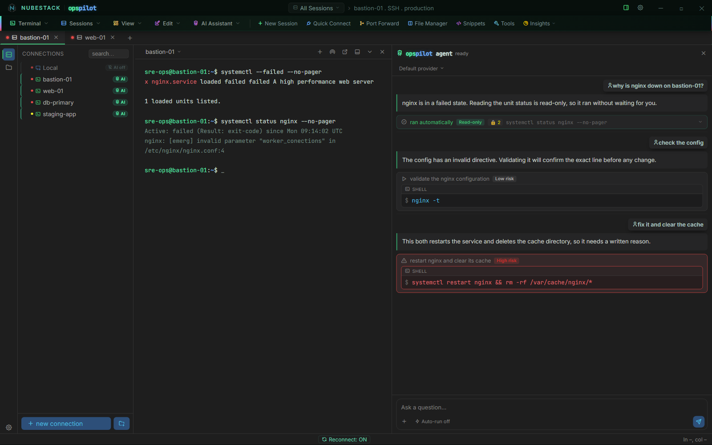

# Execution boundary and risk tiers

This page describes the boundary the product is built on, and the three tiers a proposed
command can land in. Read it before you enable AI on a connection that matters;
everything else in this section refines what is here.

## The execution boundary

The AI model has no execution capability inside OpsPilot. It has one output channel: a
*proposal*. Turning a proposal into a real command requires an explicit approval event
raised by your click. OpsPilot's own code is what runs anything against a session.

There is no configuration, provider, assistant or prompt that changes this. It is not a
toggle, and the product does not present it as one: **Settings → Security → Command
Safety** lists **AI direct execution** with the badge **Always enforced** rather than a
switch. A model that decides to run `rm -rf /` produces a card on your screen, not an
outage.

What varies between the tiers is which decision you have to make, never whether one is
required.

!!! note "This applies to assistants too"
    A proposal that arrives from Claude Desktop, VS Code or ChatGPT over the MCP
    connector goes through the same approval gate, in the same window, with the same
    tiers. There is no separate, looser path for an external assistant. See
    [AI Assistants](../ai/assistants.md).

## The three tiers

Every proposed command lands in exactly one tier, and the tier determines what it takes
to run.

| Tier | Where the tier comes from | What it takes to run |
|---|---|---|
| Read-only | The model marked the command safe | One click — or none, if you switched auto-run on |
| Low risk | Neither flag set | One explicit click, always |
| High risk | The model marked it dangerous **or** it matched one of your dangerous patterns | A typed written justification, then the click |

Read-only means viewing: reading logs, describing
or listing resources, checking status. Nothing that changes or deletes ever carries this
tag — and if a model tags something that does, your pattern list is what catches it.

A High risk command needs a real typed reason by
default. That requirement is per profile and can be turned off, in which case the command
still needs an explicit click; the click itself can never be turned off. See
[Approvals & auto-run](approvals.md).

## The asymmetry

Classification comes from two independent sources:

1. **The model's own self-assessment.** The model is asked to classify each command it
   proposes as safe, dangerous, or neither.
2. **Your dangerous-pattern list**, resolved from the Command Safety profile that applies
   to the session — plain-text, case-insensitive substrings.

They are combined with a deliberate asymmetry: **a pattern match can promote a command to
High risk, but nothing can demote a command the model
already flagged.** Classification moves in one direction only.

- **A model that misjudges a destructive command is still caught by your list.** This
  also covers the case where the terminal output itself is hostile — output containing
  injected instructions cannot talk a command down into the auto-run tier, because the
  pattern list is applied afterwards and independently.
- **A model that is over-cautious is never silently overridden.** If the model says
  dangerous and your list says nothing, the command is still
  High risk. You can approve it; you cannot configure
  the flag away.

When a command reaches the justification gate, OpsPilot says which of the two sources
flagged it — either "Flagged dangerous by the AI", or the specific pattern it matched and
the profile that pattern came from.

## One investigation, three tiers

*One investigation producing all three tiers. The read-only status check ran on its own
and carries a 🔒 2 badge — two secrets were scrubbed from its output before the AI saw
it. The config test waits for a click. The restart-and-delete command matched the
`rm -rf` pattern, so it is High risk and needs a written reason before it can run.*

The panel, read top to bottom:

1. The status check was tagged safe by the model, matched no pattern, and — because
   auto-run was on for this workstation — ran with no click. Its output was redacted
   before it went back into the AI's context, which is what the 🔒 badge counts.
2. The configuration test changes nothing but was not tagged safe, so it sits at
   Low risk and waits. One click runs it.
3. The restart-and-delete command matched a dangerous pattern. That promoted it to
   High risk regardless of what the model thought, and
   the panel shows the matched pattern along with the reason box.

## What the tiers do not cover

- They do not queue or batch. Each proposal is decided on its own.
- They do not expire on their own in the AI panel — but a proposal that arrives from a
  connected assistant does, after five minutes. See [Approvals & auto-run](approvals.md).
- They do not make a connection visible to the AI. AI access is scoped per connection by
  the **Enable AI** toggle in the connection dialog: a connection with it off is invisible
  to every model and every assistant, regardless of tier behaviour. Set it deliberately
  and check it before you connect rather than assuming a default in either direction.

## See also

- [Approvals & auto-run](approvals.md) — the settings, the defaults and the waiting state
- [Command Safety profiles](command-safety-profiles.md) — where your pattern list lives
- [Default dangerous patterns](../reference/dangerous-patterns.md) — the 21 shipped
  patterns
- [Security model](security-model.md) — the data flow this sits inside
