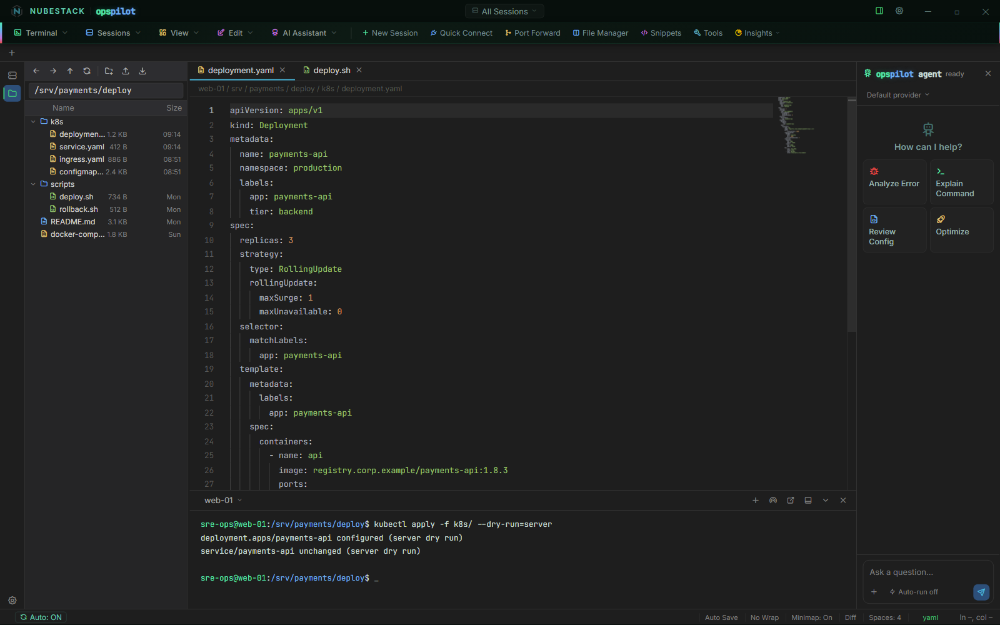

# Files and transfers

Most operational work comes down to a file: a manifest, a unit file, a config, a log.
OpsPilot browses the remote filesystem in the left panel, opens files in an embedded
editor in the middle, and keeps the terminal docked underneath, so you can change a file
and apply it without leaving the session or switching applications.

## File Explorer and editor

The **Explorer** panel appears in the activity bar once a session connects. It lists the
remote filesystem over SFTP, with an editable address bar, sortable columns and an
ordinary double-click to open. The toolbar gives you parent directory, pin this folder,
download, upload, refresh, new directory, new file and delete; right-clicking a file adds
open in editor, tail the log, cat it, grep it, rename, copy and paste, copy the name or
full path, and send the path to the terminal.

Pinning a folder scopes the explorer to that folder and its contents, which keeps you
inside one deployment directory on a busy host.

When you `cd` in the terminal, the explorer follows. That is resolved locally from the
command you typed, using the explorer's current path as the base for a relative path — no
extra command is run on the host to find out where you are.

*Editing a Kubernetes manifest over SFTP. The explorer is on the left, the file is open in
the editor with YAML highlighting, the terminal below is running a server-side dry run,
and the AI panel stays available on the right.*

### The editor

Files open in [Monaco](https://microsoft.github.io/monaco-editor/) — the editor from VS
Code — and you edit and save in place over the same SFTP connection. What you get:

- **Syntax highlighting** for a long list of languages, chosen from the file's path and,
  where the path is not conclusive, from its contents. A language button in the status bar
  lets you override the choice.
- **Multiple file tabs**, each tracking whether it has unsaved changes.
- **A minimap**, on by default and toggled from the status bar.
- **Word wrap**, off by default and toggled from the status bar.
- **A diff view** against the version currently saved on the host: side by side, the saved
  text on the left and your unsaved text on the right. If the two are identical it tells
  you so instead of opening.
- **Auto-save**, off by default. When you switch it on, a save fires two seconds after you
  stop typing.
- **Indentation** and cursor position in the status bar.

The terminal panel stays docked below the editor throughout, and is resizable. Edit a
manifest in the upper half and run the dry run in the lower half.

## File Manager

The File Manager is the two-pane view: local filesystem on the left, the filesystem of a
chosen open session on the right, with a draggable divider. Drag files across to upload
or download. A host picker above the remote pane retargets it at any other open session
that supports file access — SSH, FTP and S3 sessions all do, and the remote pane behaves
the same way for each.

Transfers show per-file progress, and can be cancelled or retried while in flight.
Downloading several files at once asks for one destination folder rather than prompting
per file.

### Transfer history

Completed uploads and downloads are recorded for **15 days** and survive restarting the
application. The record is held in OpsPilot's own storage on the workstation, capped at
2,000 entries, and it covers transfers from anywhere in the application — the File
Manager, the sidebar explorer and the quick-upload popup are all recorded the same way.
The **History** drawer filters by host, by direction and by free text.

## FTP and SFTP

SFTP is not a separate connection type: it rides the SSH session you already have, which
is why the explorer, the editor and the File Manager all work on an SSH connection with
nothing extra to configure.

**FTP** is its own connection type. Its fields are an initial path, a **Secure (FTPS —
explicit TLS)** checkbox, and — only once Secure is ticked — **Skip TLS certificate
verification**, for a server using a self-signed or internal CA certificate. It opens a
file-browser panel rather than a terminal.

!!! warning "Plain FTP is unencrypted"
    Secure is **off** by default, which matches the protocol's own default and existing
    saved connections. With it off, credentials and file contents travel in clear text.
    Tick **Secure (FTPS — explicit TLS)** where the server supports it, and prefer SFTP
    over an SSH connection where you have the choice.

## AI and files

When the assistant reads a file, the file goes through the same redaction layer as
terminal output. In the AI panel's composer, **+ → Browse remote files** opens a small
SFTP picker; when you choose a file, the reading and the redaction happen in the main
process, and the picker itself never sees the content. A `.env` file read by the AI
arrives with its secrets already stripped.

There is one path from file content to AI context and it passes through the redactor. The
Data Handling profile that applies is the one resolved for that connection — connection,
then group, then Default.

An attachment is capped at 40,000 characters. Past that it is truncated, and the model is
told that it was. Attaching a file from your **local** machine has no connection context
to resolve against, so it always uses the **Default** Data Handling profile; tighten that
profile if your local attachments need stricter treatment.

## See also

- [Object storage](object-storage.md) — the same explorer and editor, against a bucket
- [Data Handling profiles](../safety/data-handling-profiles.md) — what redaction removes
  and how profiles resolve
- [What gets sent](../ai/what-gets-sent.md) — the full picture of what reaches a provider
- [Connection fields](../reference/connection-fields.md) — every field on the FTP and SSH
  forms
