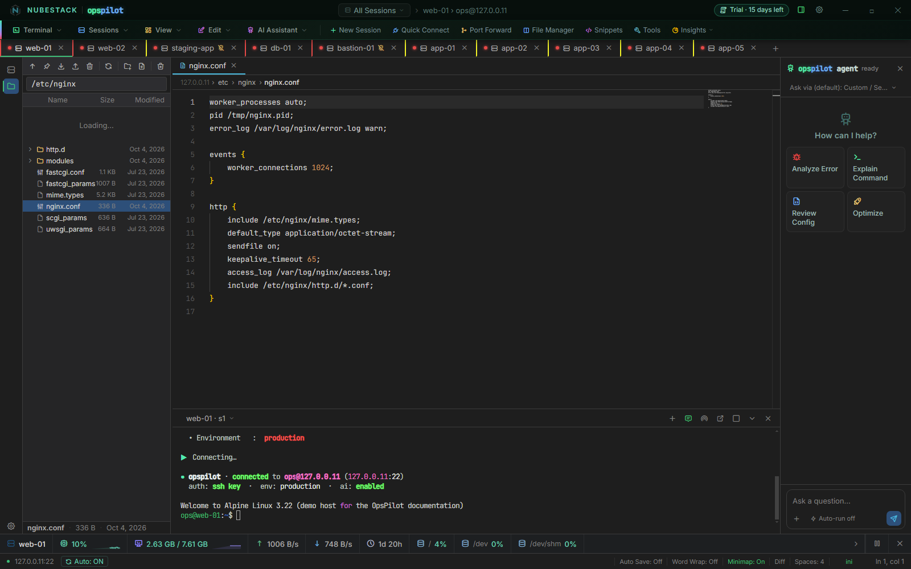

# Files and transfers

Most operational work comes down to a file: a manifest, a unit file, a config, a log.
OpsPilot browses the remote filesystem in the left panel, opens files in an embedded
editor in the middle, and keeps the terminal docked underneath, so you can change a file
and apply it without leaving the session or switching applications.

## Edit a file on a server

This walk-through uses an SSH session. The file explorer browses the host over SFTP on
the same connection, with nothing extra to configure.

1. **Connect.** Open an SSH connection. When it connects, the left panel switches to the
   **Explorer**, opened at your home directory on that host (`/root` for root,
   `/home/<username>` for anyone else).
2. **Find the folder.** Click a folder to expand it in place, double-click it to go
   into it, or click the address bar, type a path such as `/etc/nginx` and press Enter.
   The up arrow on the toolbar, or Backspace, goes to the parent folder.
3. **Open the file.** Double-click it, or right-click it and choose **Open in editor**.
   It opens in a tab above the terminal.
4. **Edit and check.** Make your change. Click **Diff** in the status bar to compare
   your text with the version saved on the host.
5. **Save.** Press **Ctrl+S**, or right-click in the editor and choose **Save File**.
   The file is written back over SFTP and OpsPilot confirms with **Saved**.
6. **Apply it.** Run the reload or dry run in the terminal below the editor.

_nginx.conf opened from the Explorer at `/etc/nginx` on web-01. The editor shows where the
file lives above its text, the terminal stays docked below, and the status bar at the
bottom right holds **Auto Save**, **Word Wrap**, **Minimap** and **Diff**._

### Upload a file

1. In the **Explorer**, go to the folder the file should land in.
2. Click the upload button on the toolbar (**Upload file here**), or right-click in the
   list and choose **Upload here**.
3. Pick the file on your computer. It is uploaded into the folder you are in, with its
   progress shown at the bottom of the panel.

You can also drag files from your desktop or file manager onto the explorer's list. To
download, select a file and click the download button (**Download selected file**), or
right-click it and choose **Download**; selecting several files asks once for a folder to
save them in.

## File Explorer and editor

The explorer lists the remote filesystem with an editable address bar and sortable
**Name**, **Size** and **Modified** columns. The toolbar gives you parent directory, pin
this folder, download, upload, delete, refresh, new folder and new file. Right-clicking a
file adds **Open in editor**, **Tail log (-f)**, **Cat file**, **Grep…**, **Rename**,
**Copy** and **Paste**, **Copy name**, **Copy full path** and **Send path to terminal**.
**Tail log**, **Cat file** and **Grep…** type the command into the terminal and run it;
**Send path to terminal** types the path without running anything.

Pinning a folder scopes the explorer to that folder and its contents, which keeps you
inside one deployment directory on a busy host.

When you `cd` in the terminal, the explorer follows. That is resolved locally from the
command you typed, using the explorer's current path as the base for a relative path — no
extra command is run on the host to find out where you are.

### The editor

Files open in [Monaco](https://microsoft.github.io/monaco-editor/) — the editor from VS
Code — and you edit and save in place over the same SFTP connection. What you get:

- **Syntax highlighting** for a long list of languages, chosen from the file's path and,
  where the path is not conclusive, from its contents. A language button in the status bar
  lets you override the choice.
- **Multiple file tabs**, each tracking whether it has unsaved changes.
- **A minimap**, on by default and toggled from the status bar.
- **Word wrap**, off by default and toggled from the status bar or with **Alt+Z**.
- **A diff view** against the version currently saved on the host: side by side, the saved
  text on the left and your unsaved text on the right. If the two are identical it tells
  you so instead of opening.
- **Auto-save**, off by default. When you switch it on, a save fires two seconds after you
  stop typing.
- **Indentation** and cursor position in the status bar.

Files are saved with Unix line endings. The terminal panel stays docked below the editor
throughout, and is resizable. Edit a manifest in the upper half and run the dry run in the
lower half.

## File Manager

The File Manager is the two-pane view: your own computer on the left (**Local**), the
filesystem of a chosen SSH session on the right, with a draggable divider. Open it with
**File Manager** on the toolbar, then drag files across to upload or download. The host
picker at the top retargets the right-hand pane at any other open SSH session.

Transfers show per-file progress, and can be cancelled or retried while in flight.
Downloading several files at once asks for one destination folder rather than prompting
per file. Dragging between the panes transfers files only, not folders.

### Transfer history

Uploads and downloads are recorded for **15 days**, with whether each one finished, and
survive restarting the application. The record is held in OpsPilot's own storage on the
workstation, capped at 2,000 entries, and it covers the uploads and downloads you start
from the explorer's buttons and menus, the File Manager, and FTP and S3 tabs alike. Click
**History** in the File Manager to open it: it filters by host, by direction and by name
or path, and **Clear history** empties it.

## FTP and SFTP

SFTP is not a separate connection type: it rides the SSH session you already have, which
is why the explorer, the editor and the File Manager all work on an SSH connection with
nothing extra to configure.

**FTP** is its own connection type. Its fields are an initial path, a **Secure (FTPS —
explicit TLS)** checkbox, and — only once Secure is ticked — **Skip TLS certificate
verification**, for a server using a self-signed or internal CA certificate. It opens as a
tab with two panes rather than a terminal: your own computer on the left and the FTP
server on the right, starting at the initial path. Drag files between them to transfer.
During the free trial and without a subscription, an FTP tab counts toward the 10
sessions you can have open at once.

!!! warning "Plain FTP is unencrypted"
    Secure is **off** by default, which matches the protocol's own default and existing
    saved connections. With it off, credentials and file contents travel in clear text.
    Tick **Secure (FTPS — explicit TLS)** where the server supports it, and prefer SFTP
    over an SSH connection where you have the choice.

## AI and files

When the assistant reads a file, the file goes through the same redaction layer as
terminal output. In the AI panel's composer, **+ → Browse remote files** opens a small
SFTP picker; when you choose a file, the reading and the redaction happen in the main
process, and the picker itself never sees the content. A `.env` file read by the AI
arrives with its secrets already stripped.

There is one path from file content to AI context and it passes through the redactor. The
Data Handling profile that applies is the one resolved for that connection — connection,
then group, then Default.

An attachment is capped at 40,000 characters. Past that it is truncated, and the model is
told that it was. Attaching a file from your own computer with **+ → Upload from
computer** has no connection context to resolve against, so it always uses the
**Default** Data Handling profile; tighten that profile if your local attachments need
stricter treatment.

## See also

- [Object storage](object-storage.md) — the same two-pane view, against a bucket
- [Data Handling profiles](../safety/data-handling-profiles.md) — what redaction removes
  and how profiles resolve
- [What gets sent](../ai/what-gets-sent.md) — the full picture of what reaches a provider
- [Connection fields](../reference/connection-fields.md) — every field on the FTP and SSH
  forms
