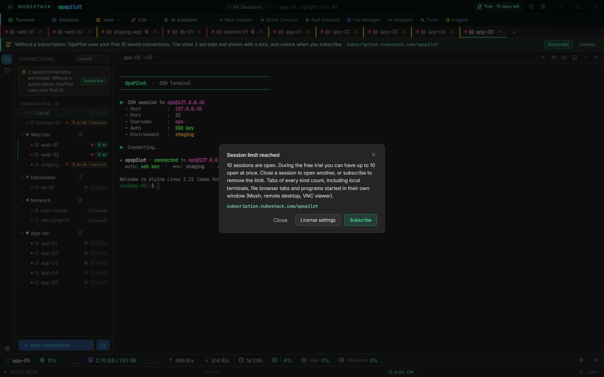

# Sessions and tabs

A *connection* is a saved definition — a host, a port, credentials, an environment and an
AI setting. A *session* is one open instance of it. Sessions run as tabs in the main
window, reconnect when a link drops, and can move into a window of their own; during the
free trial and without a subscription, up to 10 can be open at once.

## Open a session

- **A saved connection:** double-click it in the side list, press Enter on it, or
  right-click it and choose **Connect**.
- **Your own shell:** click the **+** in the terminal header and choose **Local
  Terminal**, or open the **Local** connection in the side list.
- **A host you do not want to keep:** use Quick Connect, below.

### Quick Connect

A Quick Connect session is a connection you open without saving it. Nothing is added to
the side list, and the session ends when you close its tab.

1. Click **Quick Connect** on the toolbar. The connection dialog opens.
2. Pick the type and fill in the host, port, username and password or key, as in
   [Add a connection](../connections/adding-connections.md).
3. Turn **Save connection** off.
4. Set **Enable AI** the way you want it for this session.
5. Click **connect**.

During the free trial and without a subscription, a Quick Connect session opens within the
10 sessions you can have open at once, even when your first 10 saved connections are all
in use. In the trial, with **Enable AI** on, it takes one of the two AI places while its
tab is open, if one is free. See [Free trial and limits](../licensing/trial-and-limits.md).

## Session tabs

Each session opens in a tab on the strip along the top of the window. Switch between them
by clicking a tab, or with the session dropdown in the terminal header — the control
labelled with the current session name, which lists every open session.

A tab carries what you need to know at a glance:

- its left edge in the colour of the connection's environment
- a dot showing whether it is connected
- a pin, and a lock in place of its close button, when it is pinned
- a mark when it is detached into its own window
- a crossed-out robot when you want AI there but your license keeps it off; point at it
  for the reason

Right-clicking a tab gives you the per-session actions: **Rename tab**, **Set tab
color**, **Duplicate tab**, the close operations (this tab, tabs to the left or right,
inactive tabs, all but this one, all), **Detach tab**, **Fullscreen**, **Pin this tab**,
**Save terminal output**, **Print terminal output**, font size, **Disconnect** or
**Reconnect**, **Copy hostname** and **New session**. Each has a shortcut shown beside it
in the menu; [Keyboard shortcuts](../reference/keyboard.md) collects them.

The **All Sessions** control in the title bar filters the tab strip to the sessions of one
group, and back to all of them.

The terminal header also carries a **Broadcast: send to all sessions** toggle, which
sends what you type to every open session rather than just the active one. Read the tab
strip before you turn it on.

## How many sessions can be open

With a subscription there is no limit. During the free trial and without a subscription,
up to 10 sessions can be open at once, with or without AI. Tabs of every kind count:
terminals, local shells, file browser tabs, remote desktops and hypervisor consoles. A
detached window is the same session as its tab, and a saved connection that is not open
never counts.

Opening an 11th session shows the **Session limit reached** dialog instead of a tab. It
says how many sessions are open and how many to close, with **Close**, **License
settings** and, where subscribing is the answer, **Subscribe**. Close a session you no
longer need and open the new one again.

_Ten tabs open in the free trial, and an eleventh refused. The dialog says what counts
toward the 10 and offers **Close**, **License settings** and **Subscribe**; no new tab
opens._

Licensing never closes a session. If you had more than 10 open when a subscription ended,
they all stay open, and new ones open once fewer than 10 are open. See
[Free trial and limits](../licensing/trial-and-limits.md).

### Programs in their own window

Mosh, a direct VNC viewer, and remote desktop on macOS and Linux run in a window of their
own rather than in a tab. While sessions are limited, each one counts as a session while it
runs and shows as an entry at the end of the tab strip, such as **Mosh · admin@db1**, with
a **Close** button. When OpsPilot cannot follow the program — for example remote desktop
and Mosh on macOS — the entry counts until you close it, and closing the entry does not
close the program's window. See
[Remote desktop](../connections/remote-desktop.md#desktops-in-their-own-window).

## Reconnecting

**Auto-reconnect** re-establishes an SSH session whose connection dropped. It is on by
default, and the status bar shows its state as **Auto: ON** or **Auto: OFF** — click it to
toggle.

When an SSH session that had connected at least once drops, the terminal counts down five
seconds and then reconnects. Pressing any key during the countdown cancels it. A session
you disconnected yourself, or one that never connected, gets no countdown. Reconnect those
by hand:

| Tab | How to reconnect |
|---|---|
| SSH | Press **Enter** or **Ctrl+R** in the terminal |
| Telnet, RSH, Serial | Press **Ctrl+R** |
| Local | Press **Ctrl+R**; a local shell that ended starts again, fresh |
| FTP, AWS S3, hypervisor console | Click the status line in the tab, or press **Ctrl+R** |

**Reconnect** on the tab's right-click menu does the same. While a session is connected,
Ctrl+R goes to the shell as usual, so reverse history search keeps working.

**Disconnect** on a tab's menu frees its place among the 10 and keeps the tab. A reconnect
is checked against the limit again: if 10 sessions are already open, the tab stays and
says so, for example "Session limit reached: 10 of 10 open. Close a session, then press
Enter."

## Detached windows

A session can be **detached** into a window of its own — click the **Float terminal
(detach)** button in the terminal header, or choose **Detach tab** from the tab's context
menu. This is how you get a terminal onto a second monitor while the AI panel stays on
the first. The tab stays in the strip with a marker showing it lives elsewhere, and
clicking it brings the detached window to the front. Redocking returns the session, and
its scrollback, to the main window. A detached window is the same session as its tab, so
it counts once.

A detached window is a live terminal view of a session that is already connected. The
features that act across the workbench stay in the main window: broadcast mode, the idle
lock, the working-directory sync with the file explorer, the analysis context menu, and
saving or printing terminal output. Redock the session to use any of them.

## AI in a session

Each session keeps its own AI conversation. The transcript in the AI panel belongs to the
session tab it was opened in and lasts as long as that tab does; switching tabs switches
the transcript rather than merging them. The provider choice is per session too, so you
can point a lab session at a small local model and a production session at a larger one.
**New AI session** clears the conversation for the current session only.

Sessions are kept separate. To have the assistant reason across two hosts, say so and
attach what it needs; OpsPilot does not pool the scrollback of unrelated sessions into
one context.

AI works in SSH and Local tabs. To turn it on or off for the active tab, choose **AI
Assistant → AI for This Host: toggle** in the menu bar; the connection's badge in the side
list turns it on or off for every tab of that connection. A connection whose AI is off
contributes nothing at all — no scrollback, no files, no presence.

### When AI is off in a tab

If you want AI in a tab but your license keeps it off, OpsPilot says why: in the AI panel,
with a crossed-out robot on the tab, with **⊘ AI off** or **⊘ AI paused** in the status
bar, and in an SSH session's connected banner (for example `ai: off · free trial: AI on 2
connections at a time`). During the free trial the AI panel offers the way to fix it:

- **AI off · free trial: AI on 2 connections at a time** — AI is on for two other
  connections. The panel offers **Turn AI on here** if a place is free, otherwise **Use AI
  here…**, which opens the dialog naming the two connections that have AI.
- **AI off · free trial: AI in 2 tabs at a time** — AI is already on in two other tabs.
  Turning AI on here offers to move it from one of them.
- **AI off · this saved connection is locked** — the connection became locked while its
  tab was open. An answer already under way finishes first.

_staging-app, a third connection with AI turned on during the free trial. The banner, the
crossed-out robot on its tab and the AI panel all say why AI is off; the panel names the
connections that have AI now and offers **Use AI here…** and **Subscribe**._

A disconnected tab offers no AI buttons until it reconnects, and says how: "Not connected:
press Enter in the terminal to reconnect" (Ctrl+R in a Local tab). If you turn AI on while
your license does not allow it, OpsPilot remembers that you want AI there, and the tab gets
AI by itself once the license allows it. See
[Free trial and limits](../licensing/trial-and-limits.md).

## Working across many hosts

The session tab strip, the per-connection AI badges and per-group policy are designed to
work together. A realistic production setup looks like this:

- A **Production** group with a strict Command Safety profile and a Data Handling
  profile that also scrubs hostnames and IP addresses.
- A **Staging** group with a moderate profile.
- A **Lab** group with a permissive profile and minimal redaction.

The same assistant behaves differently in each, without you changing a setting when you
switch tabs. Both profiles resolve from the connection, then its group, then the Default
profile, and which commands may run without asking you is part of the Command Safety
profile, so it changes with the tab too. See
[Groups & environments](../connections/organising.md) and
[Approvals & auto-run](../safety/approvals.md).

## See also

- [The terminal](terminal.md) — what the session's terminal itself can do
- [Groups & environments](../connections/organising.md) — groups, environments and the
  per-connection AI badge
- [Free trial and limits](../licensing/trial-and-limits.md) — the session limit and the
  trial's AI places
- [Troubleshooting](../operations/troubleshooting.md) — when a session will not come back
