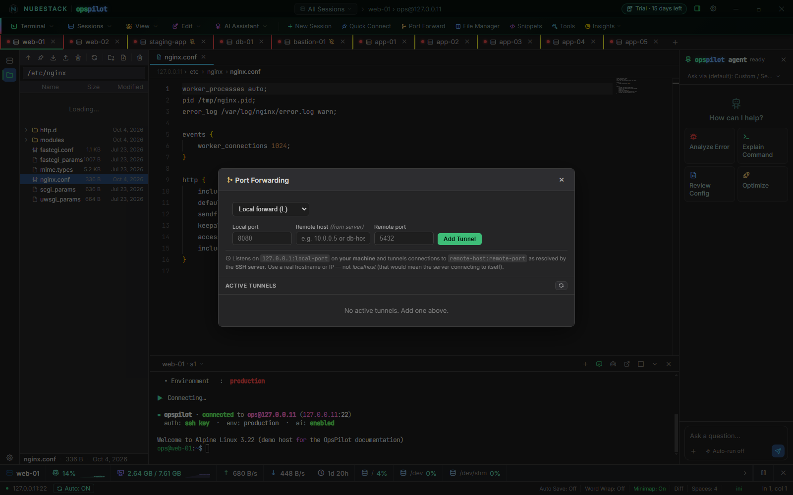
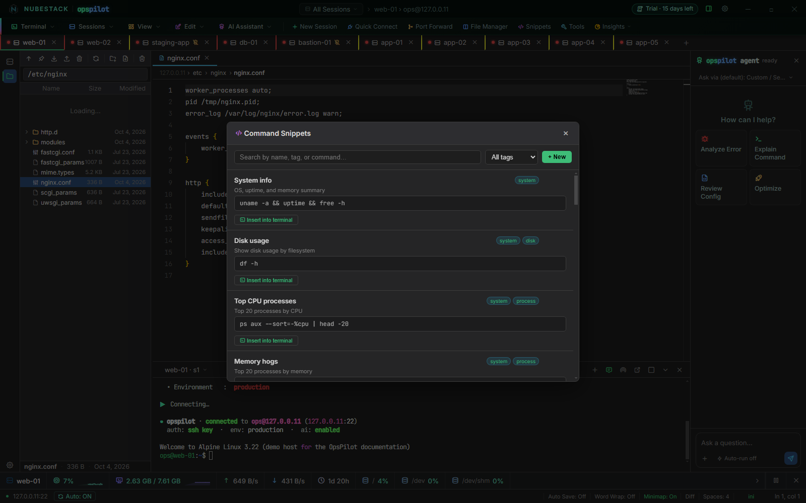
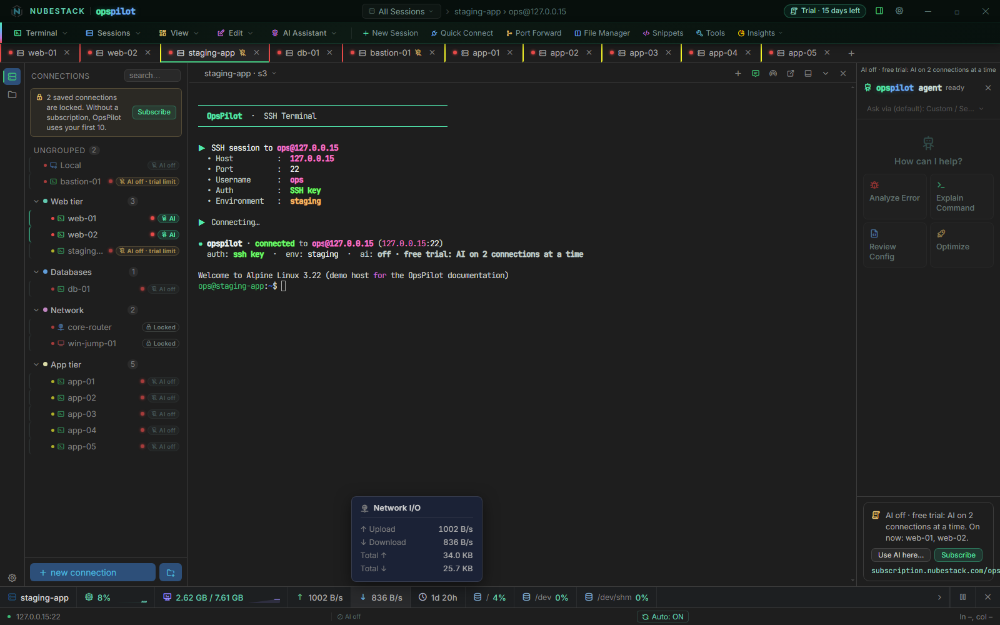
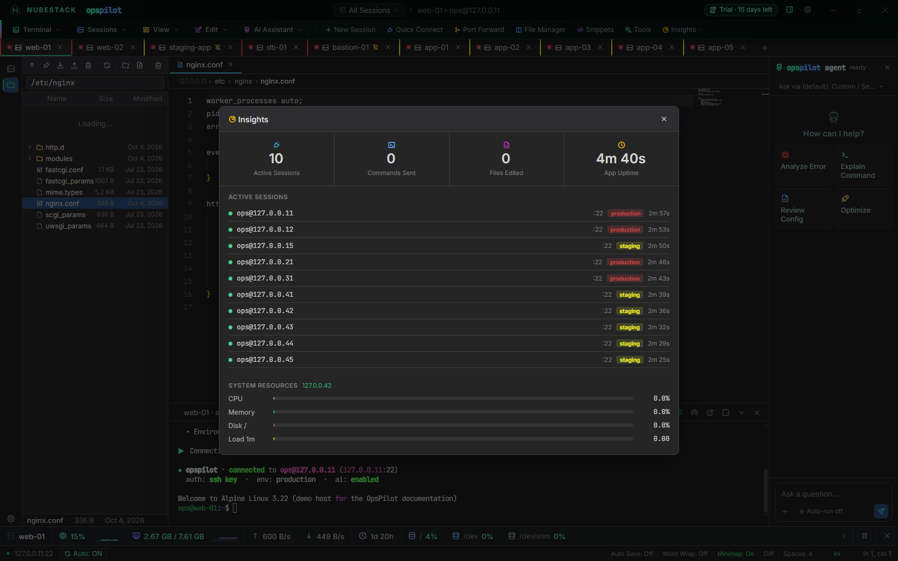
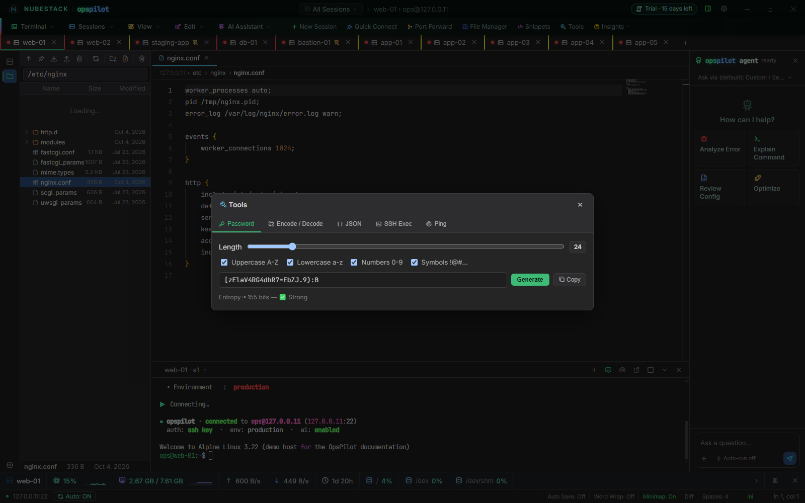

# Built-in tools

Seven tools ship inside the workbench, so the routine work that usually sends you to
another application happens in the session you are already in. None of them installs
anything on the target host. Most open from the toolbar under the menu bar.

| Tool | What it does | Where to find it |
|---|---|---|
| **Port Forward** | Local and remote SSH tunnels, managed from the UI | **Port Forward** on the toolbar |
| **File Manager** | Two-pane upload and download over SFTP, with transfer history | **File Manager** on the toolbar |
| **Snippets** | Save and re-run command templates | **Snippets** on the toolbar |
| **System Monitor** | Live resource figures for the connected host | Appears above the status bar when an SSH session connects |
| **Insights** | A summary of the current run — open sessions, counters, latest monitor sample | **Insights** on the toolbar |
| **Themes** | Terminal and UI theming, including the OpsPilot palette | Applied automatically |
| **Search** | Search within terminal scrollback | **Ctrl+F** in the terminal |

A further **Tools** button on the toolbar opens a set of small local utilities; see
[Local utilities](#local-utilities).

## Port Forward

The Port Forwarding panel creates and manages SSH tunnels on the active session, with no
`ssh -L` invocation to remember.

1. Click the SSH session's tab, so it is the active session.
2. Click **Port Forward** on the toolbar.
3. Choose **Local forward (L)** or **Remote forward (R)**. The line under the form says
   exactly what the choice will do.
4. Fill in **Local port**, **Remote host (from server)** and **Remote port**. An empty
   remote host means `localhost` as seen from the server.
5. Click **Add Tunnel**.

What the two directions do:

- A **local forward** listens on `127.0.0.1:<local port>` on your workstation and
  tunnels connections to `<remote host>:<remote port>` as resolved by the SSH server.
  The remote host is a real hostname or address from the server's point of view — not
  `localhost`, which would mean the server connecting to itself.
- A **remote forward** asks the SSH server to listen on `0.0.0.0:<remote port>` and
  forward incoming connections back to `localhost:<local port>` on your workstation.

The panel's **Active Tunnels** list shows each tunnel's direction, both endpoints, which
session owns it, its status and how many connections it is currently carrying, with a
button to remove it. Tunnels belong to a session, so the list is a view across every
session you have open.

_The Port Forwarding panel with **Local forward (L)** chosen. The line under the fields
spells out what this tunnel will do; **Active Tunnels** stays empty until you add one._

## File Manager

A two-pane transfer window: your own computer on the left (**Local**), the filesystem of a
chosen SSH session on the right.

1. Click **File Manager** on the toolbar. The right-hand pane opens on the SSH session you
   chose last time if it is still open, otherwise on the active one, at your home
   directory there.
2. To browse another SSH session, pick it from the host picker at the top.
3. Drag files from one pane to the other to upload or download them.
4. Click **History** to see past transfers.

The **History** drawer records uploads and downloads for 15 days, from anywhere in the
application rather than just this window, and it survives restarts. You can filter it by
host, by direction and by name or path, and clear it. FTP and S3 connections open as
their own two-pane tabs instead. [Files and transfers](files-and-transfers.md) covers
all of this in more detail.

## Snippets

Command Snippets are saved command templates: a name, optional tags, an optional one-line
description and the command itself. Two dozen snippets ship as a starting point, covering
system inspection, networking, logs, Kubernetes, Docker, OpenStack, Ceph and a handful of
security checks. Several contain deliberate `<placeholder>` text you are expected to edit
before running.

To use one:

1. Click **Snippets** on the toolbar.
2. Type in the search box to match a name, command or description, or pick a tag from
   **All tags**.
3. Click **Insert into terminal** under the snippet.

The snippet is typed into the active session and left at the prompt, and the panel
closes. It does not press Enter for you — you read it, edit any placeholder and run it,
the same way a proposal from the assistant works.

To add your own, click **+ New**, fill in **Name**, **Tags** (separated by spaces),
**Description** and **Command**, and click **Save snippet**. The pencil and bin icons on a
snippet edit and delete it.

Snippets are stored locally on the workstation, in the application's own storage, and are
not scoped to a connection or a group.

_Command Snippets. Each snippet shows its tags, a one-line description and the command,
with **Insert into terminal** underneath; search and the **All tags** filter sit at the
top beside **+ New**._

## System Monitor

The monitor starts by itself when an SSH session connects. It polls the host every four
seconds over a separate channel — it does not type into your terminal — and shows the
result in a bar above the status bar, for whichever SSH session is active.

The bar shows the host name with its operating system, CPU use and memory with short
history graphs, network traffic up and down, uptime, the logged-in user, and disk use per
mounted filesystem, three at a time with arrows to page through the rest. Figures turn
amber above 60% and red above 85%. Point at a figure for detail:

- **CPU** — overall use, the number of cores, the busiest core and how many cores are
  above 85%
- **Memory** — total, used, available and cached memory, and buffers
- **Network** — current upload and download rates, and the totals since the session
  opened
- **Disks** — size and use of each mounted filesystem
- **Host** — the host name and the operating system's name

It keeps about five minutes of CPU and memory history for the graphs.

- **Pause** (the button at the right of the bar) stops polling the active session, and
  resumes it.
- **Close** (the **x**) hides the bar and stops polling every session. Reopen it with the
  chart button in the status bar.
- Right-click the bar for the same two actions.

The figures come from `free`, `/proc/stat`, `/proc/meminfo`, `/proc/net/dev`,
`/proc/uptime`, `df`, `who`, `hostname` and `/etc/os-release`, so the monitor expects a
Linux-shaped host; on anything else the fields it cannot read stay empty.

_The System Monitor bar for the active session, with the network figure's detail open:
the current upload and download rates, and the totals since the session opened._

## Insights

The Insights panel is a summary of the current run of the application rather than a
historical report. Click **Insights** on the toolbar to open it. It shows:

- Cards for active sessions, commands sent, files edited and application uptime.
- **Active Sessions** — every open session with its user and host, port, environment tag,
  connected state and how long it has been up.
- **System Resources** — bars built from the most recent System Monitor sample, labelled
  with the host it came from, shown only when the monitor has data.

The counters reset when you restart OpsPilot. Nothing here is uploaded anywhere; there is
no telemetry behind it.

_Insights with ten sessions open: the four cards at the top, every open session with its
port, environment and how long it has been connected, and the resource bars from the
latest monitor sample._

## Themes

There is nothing to open: one palette ships — the NubeStack OpsPilot Infra Theme — and it
is applied when OpsPilot starts. It drives the application chrome, the terminal's ANSI
colours, the editor theme and the colourisation of otherwise-plain SSH output from a
single definition. See [The terminal](terminal.md#theming).

## Search

**Ctrl+F** with the terminal focused opens the find bar for the session's scrollback, with
case-sensitive, whole-word and regular-expression toggles. **Enter** and **Shift+Enter**
move between matches, and **Escape** closes it. See
[Search within scrollback](terminal.md#search-within-scrollback).

## Local utilities

**Tools** on the toolbar opens a panel of small utilities that would otherwise send you to
a website. Pick one from the tabs along its top:

- **Password** — a password generator. Set the length (8 to 128) and the character sets;
  a new password appears at once with an entropy estimate, and **Copy** puts it on the
  clipboard. It uses the platform's cryptographic random source.
- **Encode / Decode** — Base64, URL and hex, in either direction. Choose the **Mode**,
  paste the input and click **Convert**; **Swap** turns the output into the next input.
- **JSON** — paste JSON and click **Format**, **Minify** or **Sort keys**. A line beside
  the buttons says whether it is valid.
- **SSH Exec** — runs a command on the active SSH session through a separate channel and
  shows its output in the panel, without touching the interactive terminal. It is your
  own command, so it runs as soon as you click **Run**.
- **Ping** — runs `ping -c 4` from the active SSH server rather than from your
  workstation.

The password generator, the encoder and the JSON formatter run entirely in the
application and send nothing anywhere.

_The **Tools** panel on its **Password** tab: length 24 with all four character sets, a
generated password ready to copy, and its entropy estimate below._

## See also

- [The terminal](terminal.md) — search, copy and paste, theming and terminal settings
- [Files and transfers](files-and-transfers.md) — the file explorer, the editor and
  transfer history
- [Sessions and tabs](sessions.md) — which session a tool acts on
- [Keyboard shortcuts](../reference/keyboard.md) — how to reach these without the mouse
